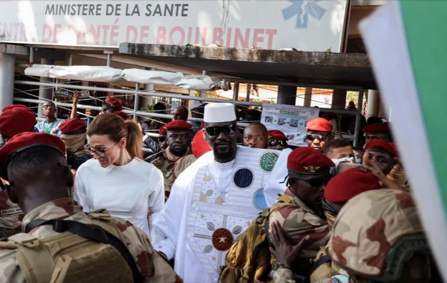

Vote counting was underway in Guinea on Monday following legislative and municipal elections seen as an important stage in the country’s ongoing political transition under President Mamadi Doumbouya.

The polls, held across the West African nation on Sunday, were part of efforts to restore constitutional governance after the 2021 military takeover that brought Doumbouya to power.

More than seven million registered voters were eligible to elect 147 members of parliament as well as local municipal representatives in a nationwide ballot closely watched across the region.

Election officials reported generally calm voting conditions in most areas, although turnout appeared lower in parts of the capital, Conakry, and the central city of Labé.

The elections came only days after the Eid al-Adha celebrations, a period when many Guineans traditionally travel to spend time with relatives and families across the country.

Many of the candidates contesting the vote were affiliated with parties supporting the presidential camp, reflecting the evolving political landscape ahead of Guinea’s broader democratic transition.

Polling stations opened early Sunday and voting proceeded peacefully in most constituencies, with electoral authorities expected to announce provisional results in the coming days.

For many younger voters, the election represented an opportunity to participate in shaping Guinea’s future political direction amid ongoing institutional reforms.

Doumbouya, who was elected president in December for a seven-year term, has repeatedly said his administration aims to strengthen state institutions, improve governance and promote national stability.

His government has also emphasized infrastructure development, public sector reforms and efforts to modernize Guinea’s economy, one of the largest mineral-producing economies in West Africa.

Regional observers and political analysts are closely monitoring the electoral process as Guinea continues its transition toward long-term political stability and democratic governance.

The legislative vote is expected to play a key role in shaping the country’s next phase of governance and defining relations between national institutions and local authorities in the years ahead.

 

**African Updates**
