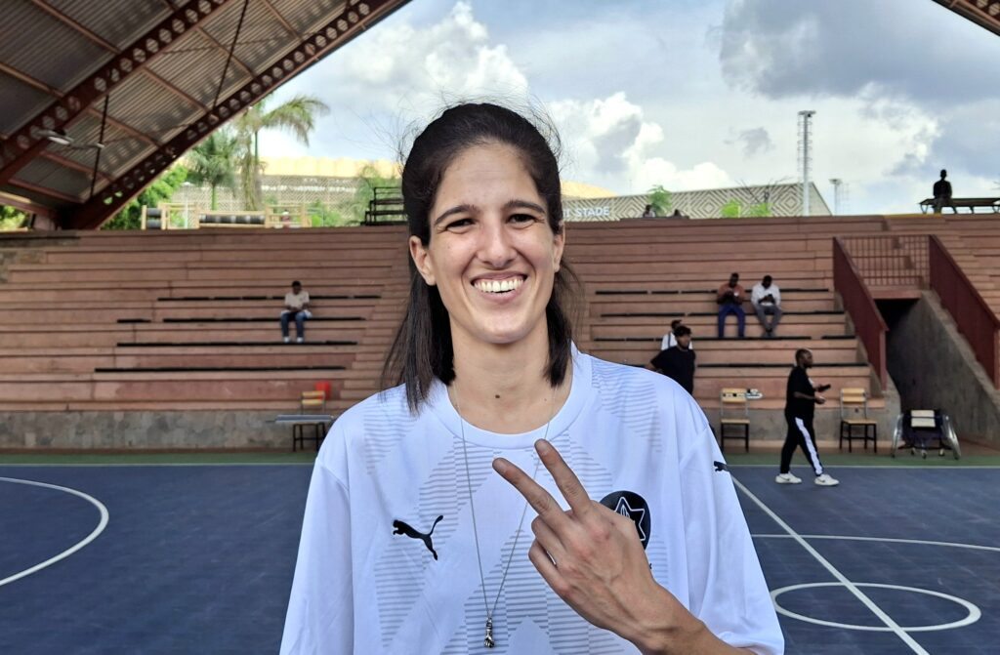
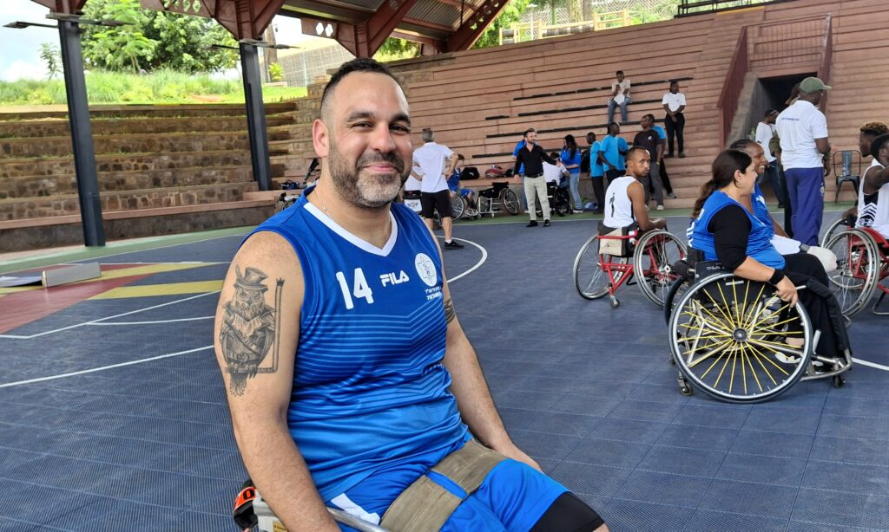
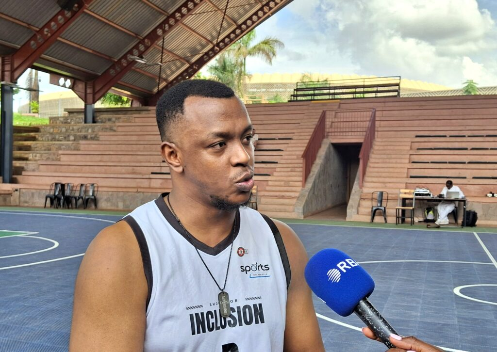
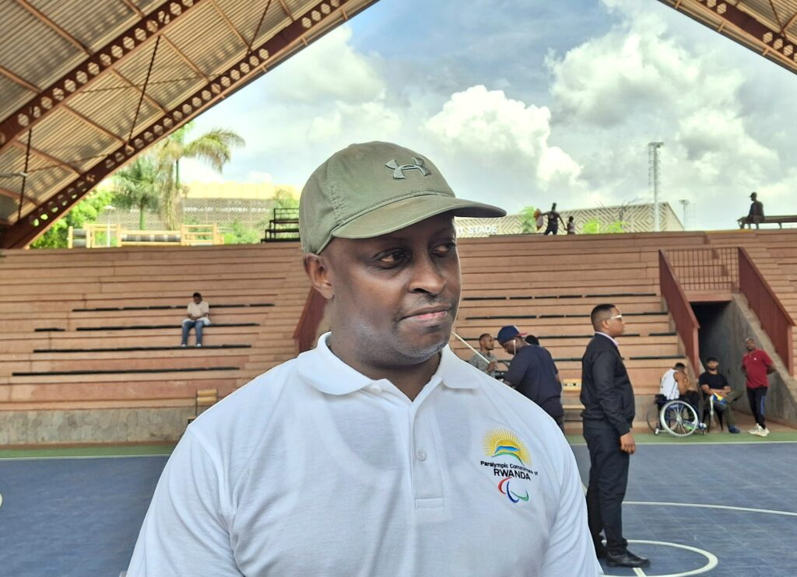
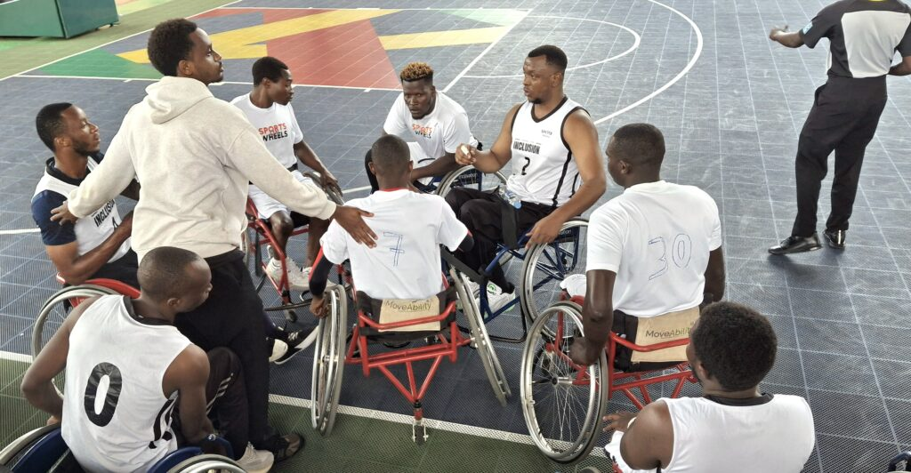
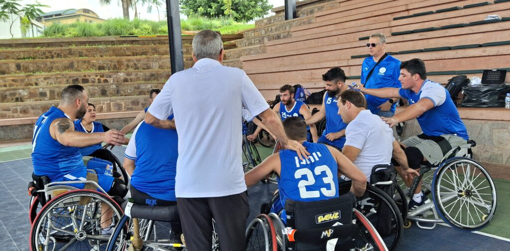
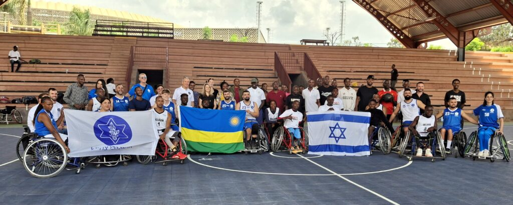
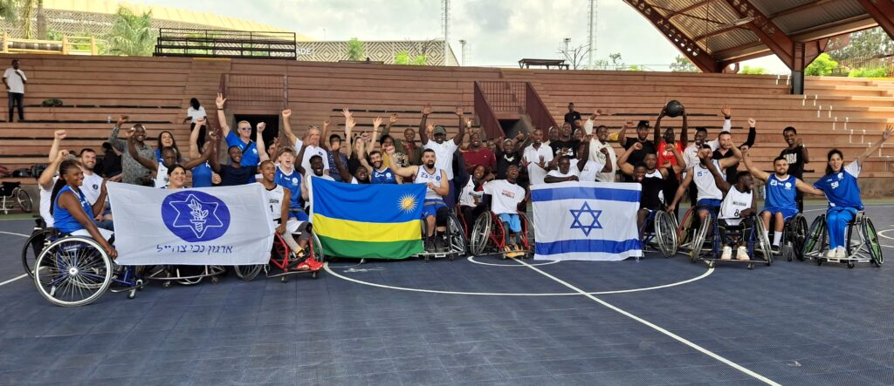

Israeli veterans and Rwanda’s ‘Sport on Wheel’ national team played a friendly game on Wednesday, November 26, 2025. This was more than a game between two countries (Israel and Rwanda) who are using adaptive sports to help people recover from trauma and rebuild their lives.

Nov Kuperstein, a 31 years old Israeli veteran, spoke plainly about the sport's life-saving impact. “Basketball saved my life, Without the basketball, I wouldn't come out of the house, I'd stay home... I have amazing friends, I'm healthy, and I have reasons to stay out of the house.” she said.

\[caption id="attachment\_42857" align="alignnone" width="1024"\] IDF veteran Nov Kuperstein, after the inspiring wheelchair basketball game in Kigali.\[/caption\]

Moti Harari, 37, another veteran, explained the deeper meaning of the sport. He called wheelchair basketball an activity that comes from the soul.

“It’s more than just a game, It’s a connection with the team, with the teammates, to understand each other, also how to play and how to give more motivation from one another.” Moti stated.

\[caption id="attachment\_42859" align="alignnone" width="1024"\] Moti Harari, injured in 2012, calling his first trip to Africa and Rwanda an incredible experience.\[/caption\]

The Israeli delegation, many of whom are dealing with severe injuries and mental health issues, found a unique bond with the Rwandan players. Ambassador of Israel to Rwanda, Einat Weiss, emphasized that the injuries these veterans carry some losing friends in battle, others losing limbs have echoes around the world.

“If you are sitting on a wheelchair, it doesn't matter where you are in the world, you have the same story. You have the same difficulties,” Ambassador Weiss said. She noted that the players immediately exchanged tips and formed fast friendships, showing that disability doesn't define anyone.

For Rwandan Captain Meshack Rwampungu, the match served as a critical learning experience and a push for wider growth across the continent. He believes Rwanda is ready to lead in this area, having many accessible facilities.

“We need to have Rwanda as a hub of wheelchair basketball in Africa, especially in East Africa,”.

He mentioned his team's recent victory against Uganda and plans to play Kenya and Congo soon, aiming to build a strong national team for international games.

Rwampungu made clear that for this growth to happen, work must begin at the very beginning. “We need to start organizing the League for the youth. I need to try to go in different schools with disabilities to develop the younger kids.”

\[caption id="attachment\_42858" align="alignnone" width="1024"\] Meshack Rwampungu outlines his vision for Rwanda to become the hub of wheelchair basketball in East Africa.\[/caption\]

However, Rwampungu pointed to a significant barrier that affects not just Rwanda, but many countries in Africa is public transport.

“One of the big challenge that we have is public transportation are not accessible,” he explained, noting how difficult it is for players to move around. This highlights a universal need across African nations to make cities truly inclusive for all citizens.

Despite the challenges, Ambassador Weiss praised Rwanda for being a leader on the continent in this respect. “I believe Rwanda is spearheading the continent in many areas, but this is a very big one that is overseen,”.

Dominique Bizimana, the president of the National Paralympic Committee (NPC Rwanda), specifically expressed a strong wish for collaboration with Israel, noting that the prospects seem promising.

\[caption id="attachment\_42855" align="alignnone" width="1024"\] Dominique Bizimana, president of the National Paralympic Committee (NPC Rwanda)\[/caption\]

**African Updates**
