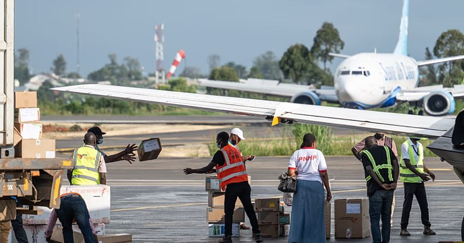

The World Health Organization has intensified emergency operations in eastern Democratic Republic of the Congo following a sharp rise in Ebola cases linked to the Bundibugyo strain, a rare variant with no approved vaccine or specific treatment.

Congolese Health Minister Samuel Roger Kamba said the outbreak has so far caused 136 deaths, while suspected infections have climbed to around 543 cases.

The epicentre of the outbreak remains in Bunia, in Ituri province near the borders with Uganda and South Sudan, where health authorities are racing to contain the spread of the virus.

As part of the emergency response, the WHO delivered 12 tonnes of medical supplies to Bunia, including protective gear, infection-control kits, tents and treatment materials for frontline workers.

More than 40 international health specialists also arrived in the city on May 19 to strengthen surveillance, case management and emergency coordination efforts.

Aid group Médecins Sans Frontières, commonly known as MSF, released footage showing emergency supplies being unloaded as humanitarian agencies increased operations in affected communities.

WHO Director-General Tedros Adhanom Ghebreyesus warned that the outbreak remains a major concern because of its rapid spread and the fragile security situation in eastern Congo.

The UN health agency has already classified the outbreak as an international public health emergency.

Health experts say the Bundibugyo Ebola strain has previously appeared in Uganda in 2007 and in DR Congo in 2012. The variant is known to have a fatality rate of between 30 and 50 percent.

WHO representative Anne Ancia said a vaccine candidate known as Ervebo is under consideration, although officials estimate it may take several weeks before doses become available.

The outbreak response has also been complicated by ongoing insecurity in eastern Congo, where armed conflict and limited infrastructure continue to restrict access to affected communities.

Medical teams in Rwampara hospital in Ituri province reported shortages of protective equipment and limited isolation capacity as patient numbers continue to rise.

Authorities confirmed that the outbreak has now spread beyond Ituri into neighbouring provinces, including North Kivu. Suspected cases have been detected in Butembo, while a confirmed Ebola case was reported in Goma.

Congolese Nobel Peace Prize winner Denis Mukwege urged M23 rebels controlling Goma to reopen the city’s airport to allow humanitarian and medical operations to continue more effectively.

Meanwhile, Uganda has confirmed two Ebola infections linked to travellers arriving from DR Congo. Germany is also preparing to receive an American doctor infected while working in the outbreak zone.

The United States has introduced airport screening measures for passengers arriving from affected regions and temporarily suspended visa services linked to the outbreak.

US Secretary of State Marco Rubio said Washington had released 13 million dollars in emergency assistance and plans to support the opening of about 50 Ebola treatment centres across DR Congo.

**African Updates**
