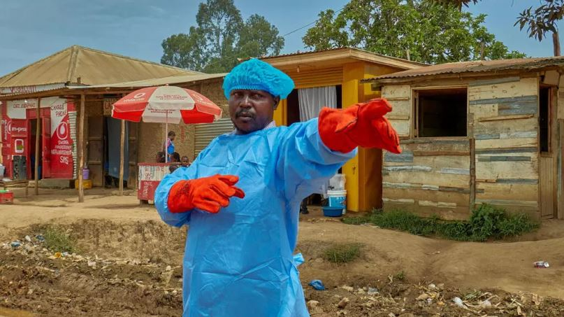
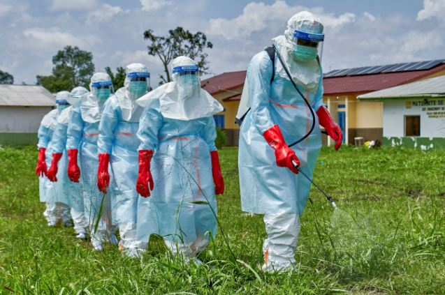

The World Health Organization has warned that escalating violence in eastern Democratic Republic of Congo is severely undermining efforts to contain a growing Ebola outbreak, raising fears of a worsening humanitarian and public health crisis.

WHO Director General Tedros Adhanom Ghebreyesus said the combination of armed conflict and disease posed a major threat in the mineral-rich eastern region of the country, where insecurity has complicated access for health workers and humanitarian agencies.

In a statement posted Wednesday, Tedros described the situation as a catastrophic collision between conflict and disease, warning that the Ebola outbreak in Ituri province was spreading faster than response efforts on the ground.

According to the WHO, at least 10 confirmed Ebola deaths and more than 220 suspected deaths have been recorded since mid-May. Health authorities have also identified around 900 suspected cases since the outbreak was officially declared on May 15.

The UN health agency believes the actual spread of the virus could be significantly wider, with experts suggesting the disease may have circulated undetected for weeks before authorities confirmed the outbreak.

The current outbreak marks the 17th Ebola epidemic recorded in Democratic Republic of the Congo. Health officials say the absence of an approved vaccine or treatment for the Bundibugyo strain of Ebola has made containment efforts especially difficult.

The WHO said ongoing clashes have forced thousands of people to flee their homes, driving potentially exposed individuals into overcrowded displacement camps while cutting off key routes needed for medical response operations.

Attacks on health facilities and insecurity around treatment centers have also complicated efforts to trace contacts and isolate infected patients.

In one incident, isolation tents established by the humanitarian organization ALIMA were reportedly burned by angry residents demanding access to the body of a person who had died from Ebola.

Aid organizations have increasingly attempted to ease tensions by allowing supervised family visits for patients receiving treatment, hoping to build trust among communities fearful of health authorities.

The WHO chief called for an immediate ceasefire to allow humanitarian teams safe access to affected communities and prevent the outbreak from spiraling further out of control.

The agency warned that without improved security and humanitarian access, efforts to contain the virus could face major setbacks as conflict continues across eastern Congo.

**African Updates**
