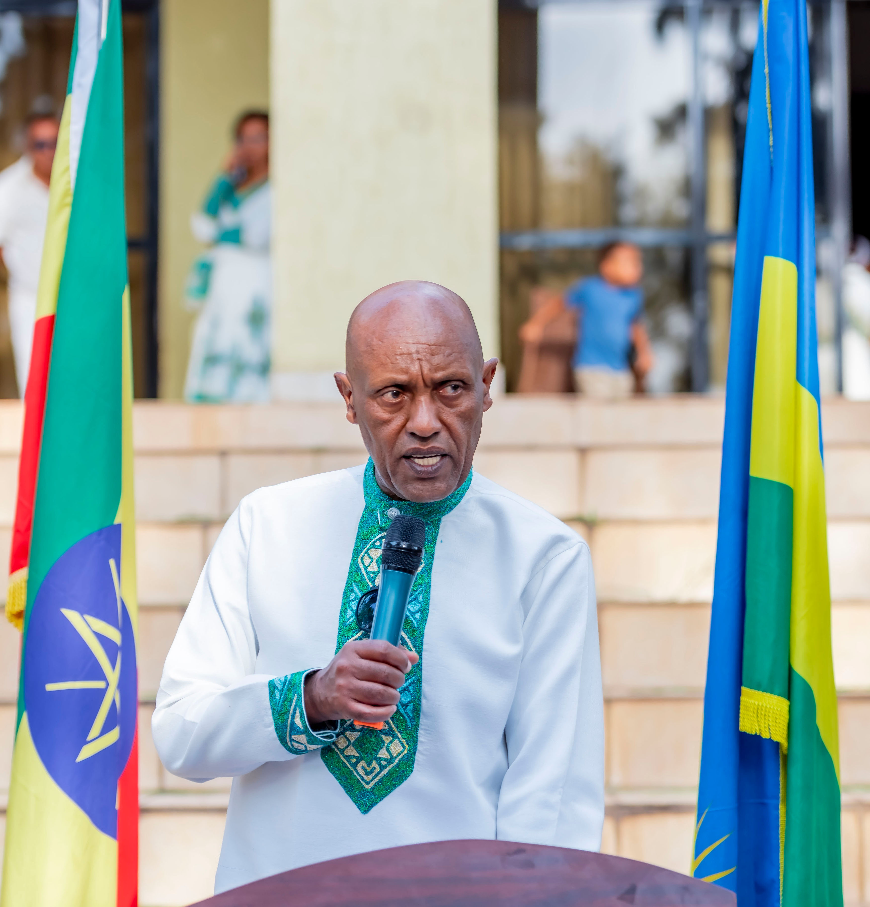
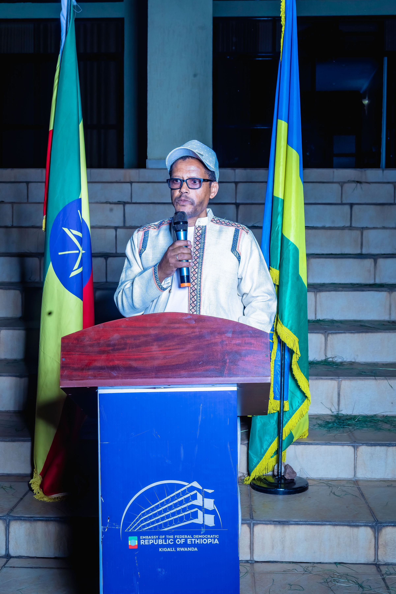
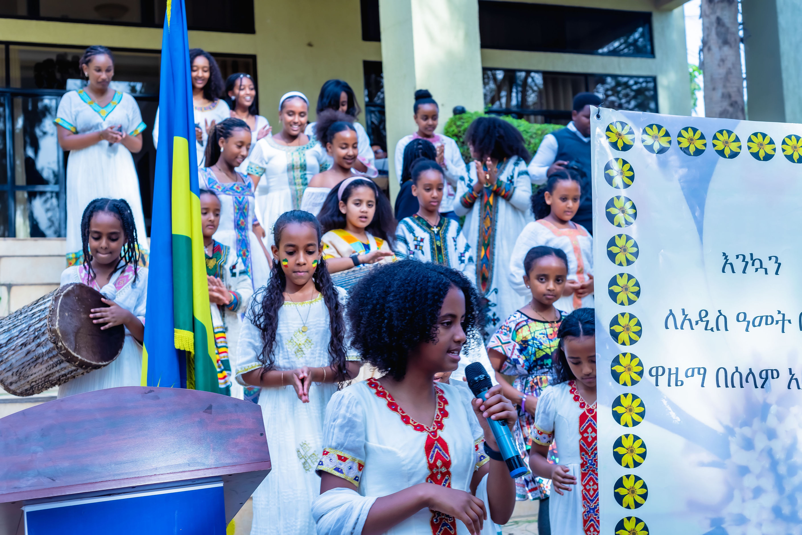
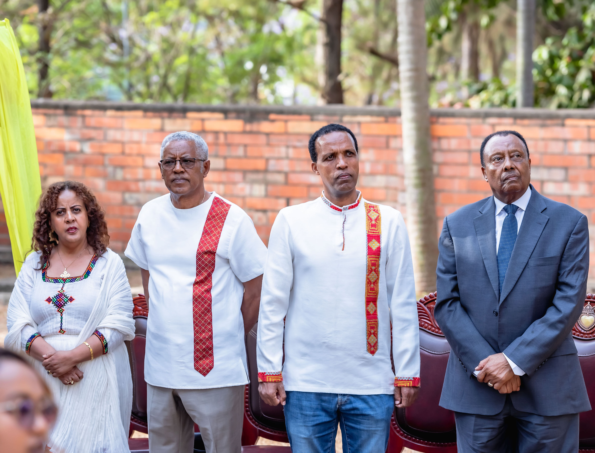
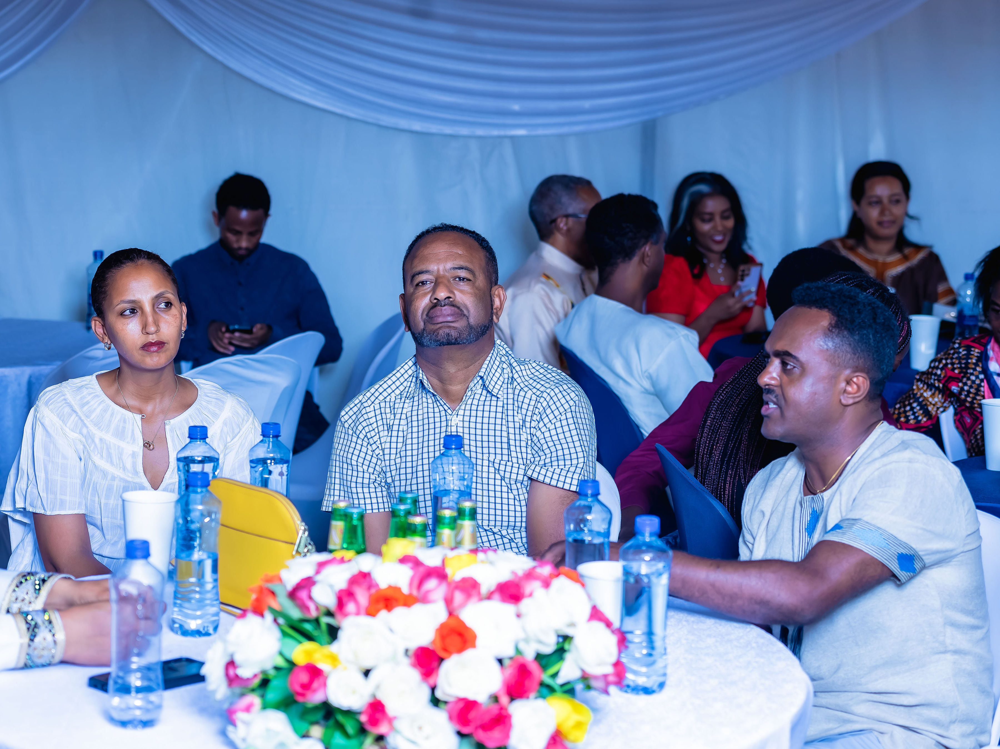
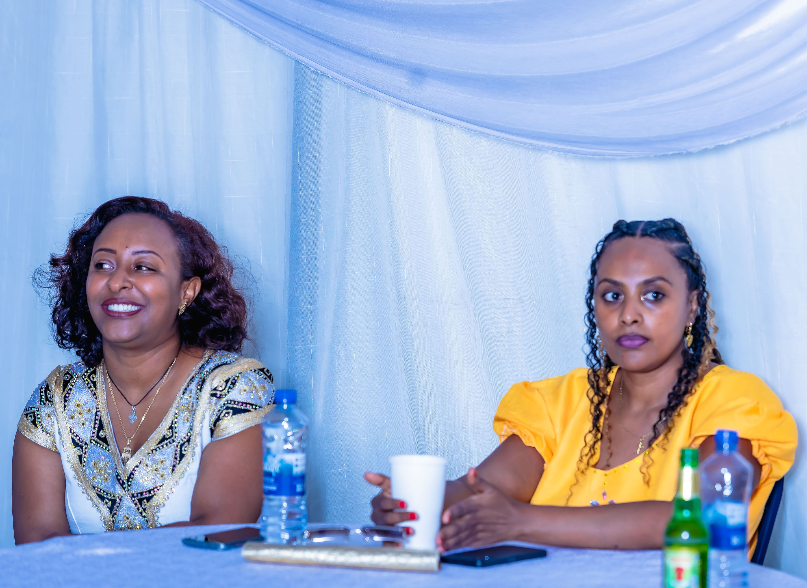
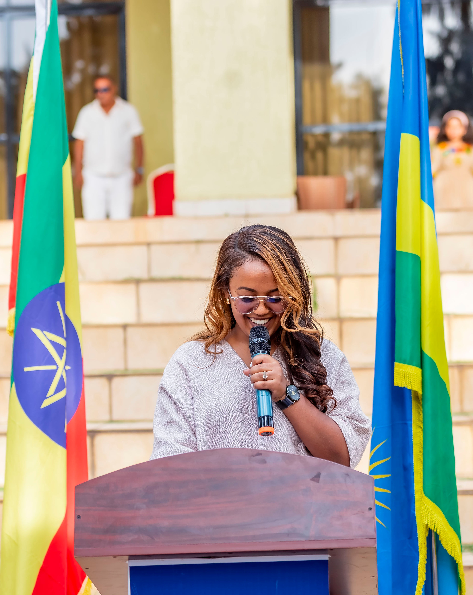
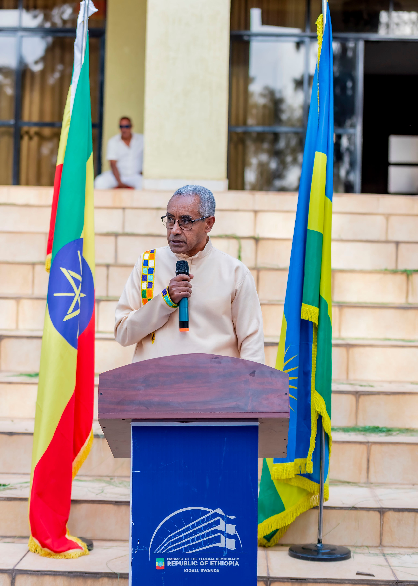
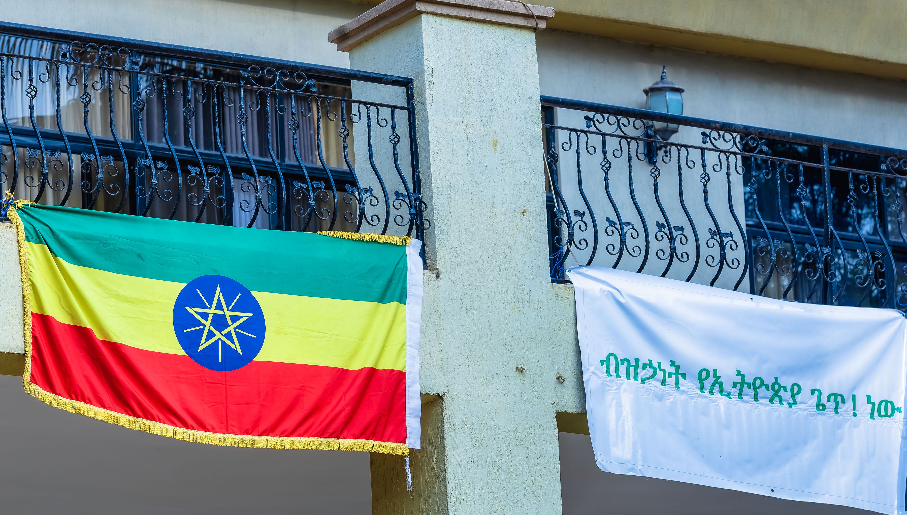

Ethiopia on Friday, September 11, welcomed 2019, marking the beginning of a new year under its own calendar, while Rwanda and most of the world remained in 2026.

The difference comes from the Ethiopian calendar, which is about seven to eight years behind the Gregorian calendar used by most countries. It has 12 months of 30 days each, followed by a short 13th month called Pagume.

Known as Enkutatash, the Ethiopian New Year is more than a change of dates. It is a celebration of history, culture, renewal and national identity.

Ethiopians living in Rwanda marked the occasion during celebrations held in Kigali earlier this week, bringing together members of the community to celebrate their heritage.

Speaking at the event, Ethiopia’s Ambassador to Rwanda, H.E. Mesfin Gebremariam Shawo, described Ethiopians as a people proud of their distinctive traditions.

 “We Ethiopians are a unique people with our own 13-month calendar and a unique counting,” he said.

The Ambassador linked Ethiopia’s achievements and historic landmarks to the unity of its people, highlighting places such as Aksum, the rock-hewn churches of Lalibela, the monasteries of Gondar and the Jegol Tower of Harar.

He also paid tribute to previous generations for preserving the country’s unity and strengthening the ties among its people.

Meanwhile, Professor Abraham, a representative of the Ethiopian community in Rwanda, said a significant number of Ethiopians are living in Rwanda and working in different professional sectors and education.

He said their presence also contributes to strengthening the relationship between the people of Ethiopia and Rwanda.

Enkutatash has roots in Ethiopia’s long history and is traditionally associated with the return of the Queen of Sheba from her visit to Jerusalem. The name is commonly translated as “gift of jewels.”

For Ethiopians, the arrival of 2019 is therefore not simply about following a different calendar. It is a reminder of a long history and a culture that continues to travel with them wherever they live.

**African Updates**
