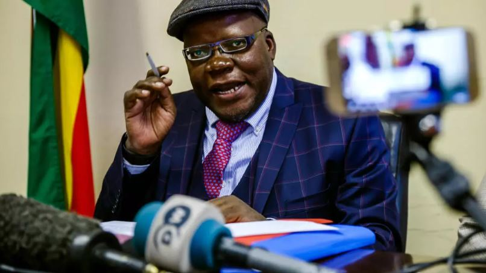

Political tensions in Zimbabwe are escalating as opposition leader Tendai Biti has been granted bail following a weekend in detention. Biti was arrested near the Mozambique border alongside a fellow activist, facing allegations of holding a public gathering without notifying authorities.

A court in Mutare ordered the release of both individuals on $500 bail, requiring them to report to police every two weeks as part of their conditions.

However, the incident reflects broader unrest across the country. Zimbabwe is currently grappling with controversy over proposed constitutional amendments that could extend President Emmerson Mnangagwa’s rule beyond 2028. The changes may also shift presidential elections from a direct public vote to a parliamentary process, sparking widespread concern.

Mnangagwa, who assumed power in 2017 following the resignation of longtime leader Robert Mugabe, is already serving his second term under the existing constitution.

Critics argue that the proposed reforms threaten democratic principles and have accused authorities of intimidation tactics, including alleged abductions and repression of dissent. Meanwhile, the ruling ZANU-PF party has rejected these claims, maintaining that its actions are lawful.

Public frustration continues to grow, with many Zimbabweans pointing to ongoing economic hardships and unresolved corruption issues. For citizens across the country, the situation goes beyond a single arrest it raises critical questions about Zimbabwe’s political future and the direction of its governance.

**African Updates**
