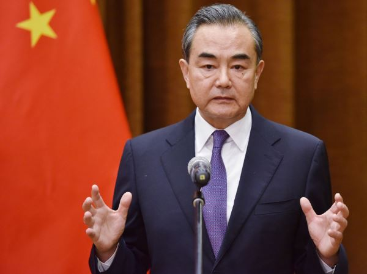

Chinese foreign minister Wang Yi  is set to visit Russia for talks on security

Today on 18th September 2023 Wang Yi  will begin a four-day visit to Russia for security talks as the latest in a series of high-level visits and phone calls between the two countries.

This comes few weeks after President Putin said he is expecting president Xi Jiping but he did not say when.

Mr. Putin has not travelled abroad since the International Criminal Court issued an arrest warrant for him over war crimes in Ukraine.

It also comes after Mr Putin welcomed North Korea's Kim Jong Un in a meeting expected to yield an arms deal, which showcased potential military ties with both countries.

Moscow said he would meet his Russian counterpart, foreign minister Sergei Lavrov, and the two would discuss "issues related to a settlement in Ukraine" and Asia-Pacific security.

