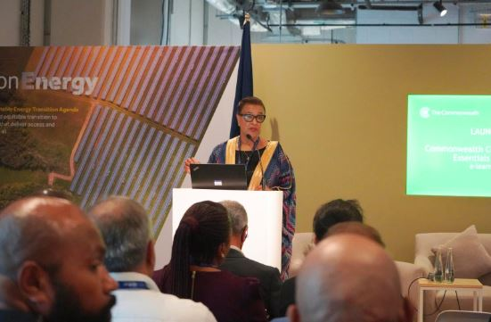

A new Commonwealth e-learning course launched on Tuesday 11th December 2023 will improve the ability of small and other vulnerable states to access billions of dollars in climate finance.

The Commonwealth Secretary-General, The Rt Hon Patricia Scotland KC, launched the ‘commonwealth climate finance Essential E-learning Course’at an event in Dubai during the United Nations Climate Change Conference (COP28).

The course builds on the extensive experience of the commonwealth climate Finance Access Hub. The hub has helped 17 small and vulnerable states in Africa, the Caribbean, and the Pacific to access more than US$322 million in climate finance for projects to mitigate and adapt to the impacts of climate change.

Government officials and experts can use the course to better understand complex areas, such as the climate finance landscape, the compliance requirements set by major funders, the financial requisites for accessing funding and the specific needs of vulnerable groups.

Crucially, the course introduces officials to the core elements needed to write a successful application for securing climate finance for projects. It also unpacks the use of innovative tools, such as earth observation data, to improve project rationale and navigate red tape.

At the 2022 Commonwealth Heads of Government Meeting, leaders urged developed countries to fully deliver on their commitment to providing US$100 billion every year in climate finance to help developing nations address challenges posed by climate change.

However, access to funding remains a barrier. Some small island developing states report spending two to three years to develop a climate project proposal. This is followed by another year of legal and implementation arrangements before governments receive funds and can start projects.

Speaking at the event, Secretary-General Patricia Scotland said:

“Despite contributing least to the problem, small and vulnerable states are bearing the biggest burden. Increasingly frequent and extreme weather events are causing widespread destruction to livelihoods and infrastructure – and destroying economies.

“While the international community is stepping in to provide support, it’s not enough. Small and vulnerable states also need to navigate the demanding conditions necessary for accessing available climate funds.

“The Commonwealth’s e-learning course is a significant step towards helping government officials better understand the complex structures of multi-billion-dollar funds and access the finance they need.”

During the event, Saber Hossain Chowdhury, Special Envoy of the Prime Minister of Bangladesh for Climate Change, drew attention to the capacity challenges faced by developing countries in accessing climate finance on time.

He specifically pointed to the prolonged approval process, citing instances where Bangladesh had to wait nearly nine years to receive funds after submitting project applications.

Mr Chowdhury said:

“The course is a great tool. All the good practices from the Commonwealth are brought together and are now available in the form of e-learning. It will help with building that capacity that is so very essential.”

Through this course, he added, countries equipped with the necessary capacity would not only have priority in accessing funds, but also ensure support reaches those most in need.

Orlando Habet, Belize’s Minister of Sustainable Development, Climate Change and Disaster Risk Management, endorsed the new course.

He said: “Climate finance is critical for small island developing states and least developed countries. We have been told that the process of finding finance takes too long. This course will assist us to cut down on that time.”

The minister also thanked the Commonwealth Secretariat for deploying a national climate finance adviser to Belize. He added that the adviser has been assisting his country in securing funding to implement the national climate plans.

The course is part of a package of resources developed by the Commonwealth Secretariat to support its 56 member countries in tackling the global climate crisis.

The Commonwealth is a voluntary association of 56 independent and equal sovereign states. Our combined population is 2.5 billion, of which more than 60 per cent is aged 29 or under.

The Commonwealth spans the globe and includes both advanced economies and developing countries. Thirty-three of our members are small states, many of which are island nations.

**African Updates**
