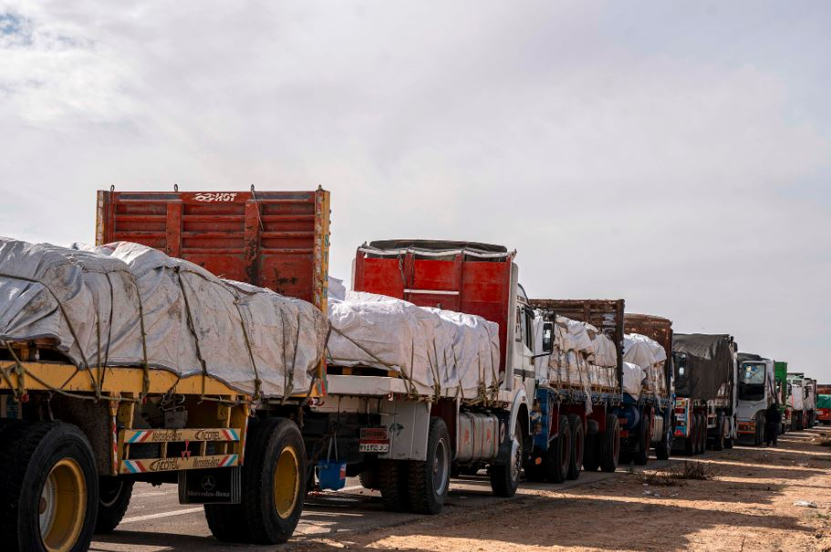

A large convoy of aid trucks has lined up on the Egyptian side of the the Rafah border crossing between between Egypt and Gaza, on standby for when a truce between Israel and Hamas begins.

Today The Egyptian Government press said that it's not yet clear what type of aid, or how much aid, will be allowed into the Gaza Strip. 

On Wednesday, Egyptian Government press office director Ayman Walash said a total of 2,222 tons of medical aid had been delivered via the Rafah crossing since the war began, in addition to 6,063 tons of food, 4,625 tons of water, and 1,407 tons of other aid.

He said 378 tons of fuel had been delivered since November 21. 

Prior to the outbreak of the Israel-Hamas war, about 455 trucks entered Gaza daily with aid supplies, according to the United Nations. While some aid has been able to trickle into enclave since the recent hostilities began, the UN has repeatedly warned the current levels are doing little to address the needs of more than 2 million Palestinians living in Gaza.

**African Updates**
