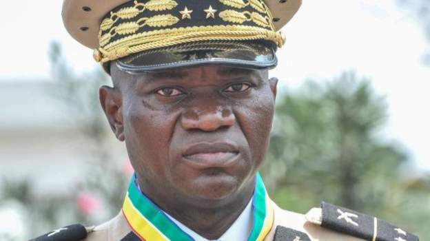

Ali Bongo release comes after his cousin General Brice Nguema Oligui sworn in as interim leader later on Monday.

Gabon’s deposed president, Ali Bongo Ondimba, has been released from house arrest and is free to leave the country for medical treatment, the military which removed him from power last month has said.

Bongo, who had been held under house arrest since a military coup on August 30, was toppled from power shortly after he was declared the winner of much-criticised elections that would have seen him exended his 14 year as president

“Given his state of health, the former President of the Republic Ali Bongo Ondimba is free to move about. He may, if he wishes, travel abroad for medical checkups,” Gabon’s military spokesman Colonel Ulrich Manfoumbi said in a statement read on national television on Wednesday evening.

The statement announcing Bongo’s release from house arrest was signed by General Brice Nguema Oligui  who had served as a bodyguard to Bongo’s late father and also headed the country’s republican guard, an elite military unit.

\[caption id="attachment\_4626" align="alignnone" width="624"\] Gen Brice Oligui Nguema\[/caption\]
