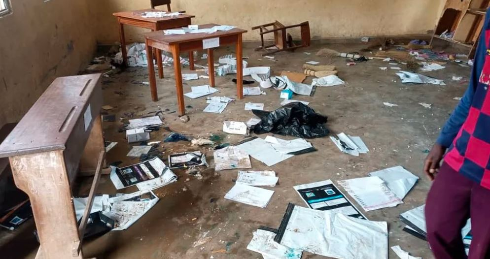
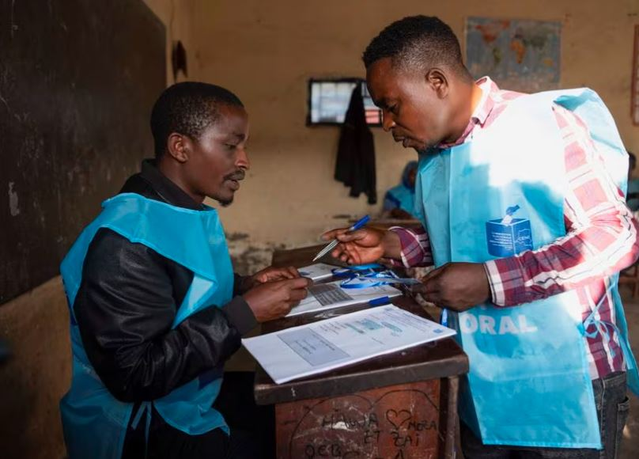

Voting in the Democratic Republic of Congo's high-stakes presidential election has been marred by lengthy delays at polling stations.

Voters waited in long queues at many polling stations in the capital, Kinshasa, and other cities as they opened about two hours late.

Ballot papers were delivered at the last minute in an election that has proved to be a logistical nightmare.

In the eastern cities like Goma and Beni, some people struggled to find their names on voter lists, which were only made available at their polling stations on Wednesday morning, according to Reuters witnesses.

In Bunia, also in eastern Congo this morning, security forces fired warning shots to disperse protesters after a voting centre was vandalised and kits destroyed, a Reuters reporter said.

A provincial election commission official told journalists that people displaced by violence in the region had protested because they could not get back to their home towns to vote.

President Félix Tshisekedi is pitted against 18 candidates.

The UN, Egypt and neighbouring Congo-Brazzaville helped fly election material to remote areas.

It is expected that 44 million people who registered to vote, following a campaign dominated by worsening insecurity in the mineral-rich east.

In the north-eastern town of Bunia, people who had previously fled the violence and couldn't travel back to their home villages to vote expressed their anger by attacking a polling station and destroying voting machines before police restored order.

DR Congo sits on vast reserves of cobalt, currently a vital part of many lithium batteries, seen as essential to a future free of fossil fuels.

Among those challenging President Tshisekedi are wealthy mining magnate Moïse Katumbi and former oil executive Martin Fayulu, who believes that he won the last election in 2018, the result of which was questioned by several international observers.

But the peaceful transfer of power, the first in the country's history, following that poll became a source of optimism that the country had turned a corner.

For the first time, Congolese nationals living in five other countries - including South Africa and former colonial power Belgium - will be able to cast their ballots.

As before, the winner will be the candidate with the most votes, with no run-off if they fail to cross the 50% mark. The large number of challengers to Mr Tshisekedi could work to his advantage, as it may divide opposition support.

Voters are also choosing parliamentary, provincial and municipal representatives - with about 100,000 candidates in total - in this huge country, which stretches some 2,000km (1,400 miles) west to east.

There are more than 175,000 polling booths. The electoral commission, with the help of UN peacekeepers, began delivering voting material in far-flung areas about two months ago because of the poor transport network.

**African Updates**
