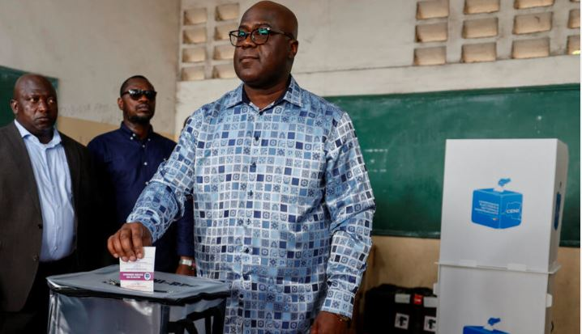

Congo's President Felix Tshisekedi won reelection with more than 70% of the vote, the country's election commission said Sunday.

The preliminary results of the 20th Dec 2023 election were announced in the capital, Kinshasa, amid demands from the opposition and some civil society groups for the vote to be rerun due to massive logistical problems that put the validity of the outcome into question.

Tshisekedi was followed by businessman Moise Katumbi, who received 18% of the vote, and Martin Fayulu, who received 5%. Nobel Peace Prize winner Denis Mukwege, a physician renowned for treating women brutalized by sexual violence in eastern Congo, got less than 1%.

The election had more than a 40% turnout with some 18 million people voting. The results will be sent to the constitutional court for confirmation, election chief Denis Kadima said.

Opposition candidates opposing the results have only two days to submit their claims, and the constitutional court then has seven days to decide. The final results are expected on January 10, and the president is scheduled to be sworn in at the end of that month.

Congo has a history of disputed elections that can turn violent, and there’s little confidence among many Congolese in the country’s institutions. Before the results were announced Sunday, opposition candidates, including Katumbi, said they rejected the results and called on the population to mobilize.

**African Updates**
