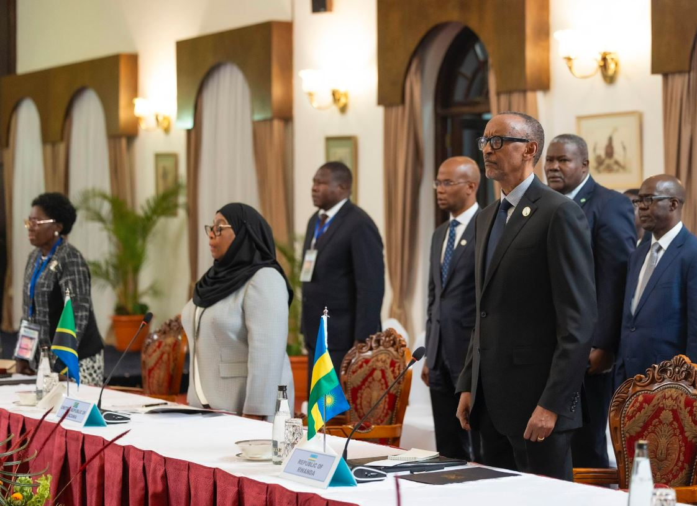
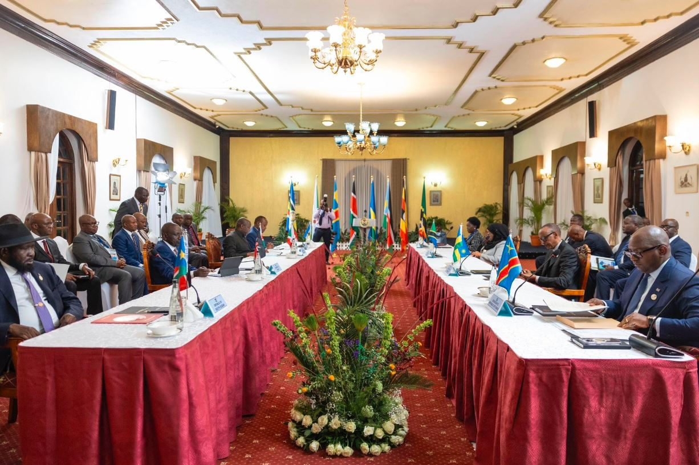
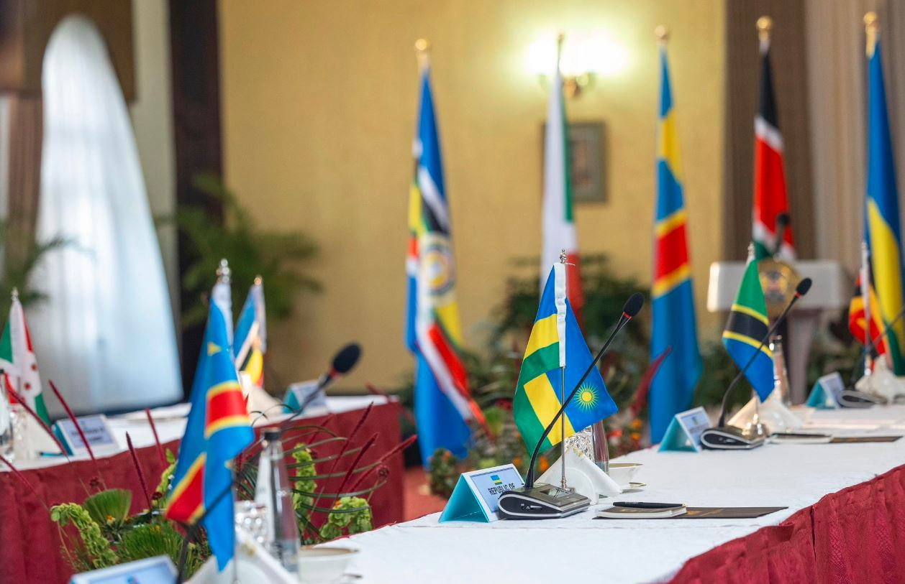
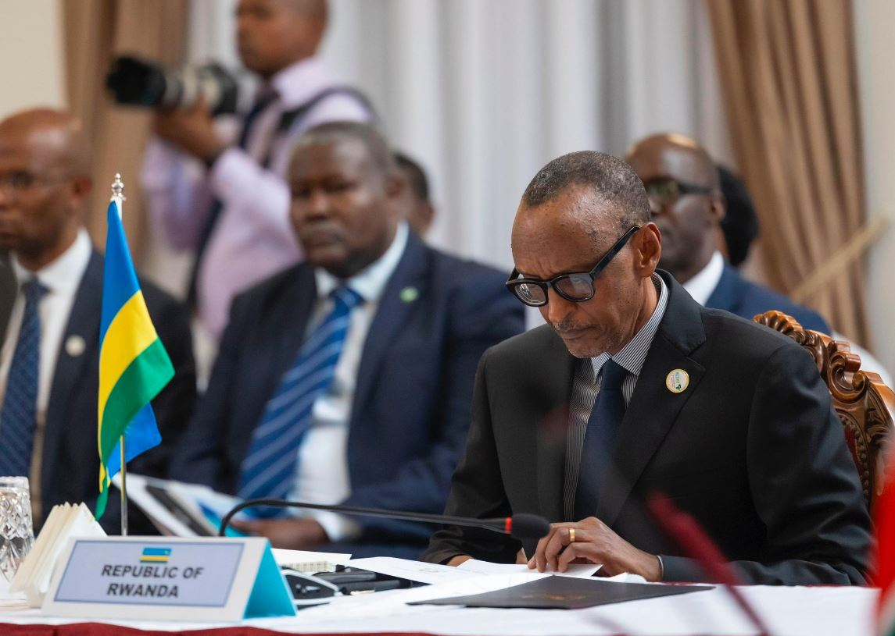

East African Community (EAC) Heads of State on Tuesday extended the mandate of its regional force in the Democratic Republic of Congo (DRC) by a further three months to December 8 this year.

The decision arose after the leaders gathered in Nairobi, Kenya, for the 22nd Extra-ordinary Summit of the Community, agreeing that three extra months will bring certainty to the security situation as further discussions go on about the actual plan for the troubled eastern DRC.

A communique shared by the EAC Secretariat said the extension will be followed by an evaluation report of the force by the regional bloc's council of ministers.

The meeting was attended by Presidents Évariste Ndayishimiye (Burundi), William Ruto (Kenya), Salva Kiir (South Sudan), Samia Suluhu (Tanzania) and Paul Kagame (Rwanda).

DRC Prime Minister Jean Michel Sama Lukonde represented President Felix Tshisekedi at the meeting, while Uganda’s First Deputy Prime Minister and Minister for EAC Affairs, Rebecca Kadaga, represented President Yoweri Museveni.

This is the second such extension for the regional force since it began its operations in eastern DRC in November last year.

The heads of state met in May and resolved to extend the mission's mandate by six months effective from March. The initial mandate was six months from November, but leaders said in May that a longer stay will help consolidate the gains made.

EACRF has been credited for helping the region achieve a return to normalcy by facilitating a months-long ceasefire between the local army FARDC and the dominant rebel group M23.

But Kinshasa had also been critical of EACRF for not attacking M23 whenever it violates the security measures. According to the mandate, however, EACRF is supposed to be a buffer force preventing clashes while encouraging dialogue.

“The Heads of State took note of the operational milestones achieved by the EAC regional force towards restoration of security in the Eastern DRC, pursuant to previous directives of the EAC-Nairobi process,” the communique issued on Tuesday stated, adding that the African Union Commission had made a $2 million contribution to the force.

One of the needed duties now, as directed by leaders since May, is for EACRF to sustain the orderly withdrawal of the M23 and other armed groups from the areas they were still occupying, into cantonment areas to be agreed on by Kinshasa.

 

