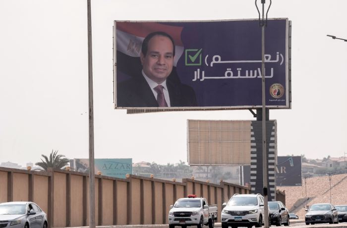
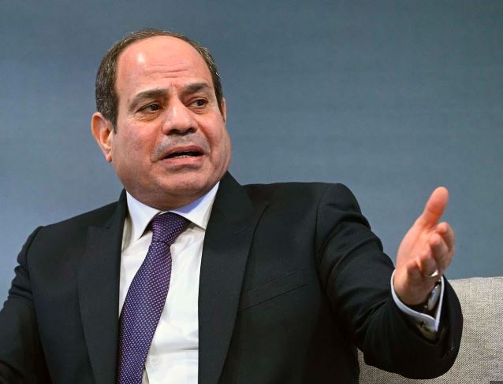

Egypt's presidential election will take place in December, rather than in the spring of 2024 as the Constitution allows, a deadline shortened by economic considerations in the country caught between inflation and devaluation, according to observers.

"Egyptian voters will cast their ballots throughout the country on December 10, 11 and 12," announced the head of the Electoral Commission, Judge Walid Hassan Hamza, on Monday. And "the final results with the name of the elected president will be published in the official gazette on December 18", he added.

He also gave a detailed timetable for the vote: candidacies must be submitted in October, the election campaign will run from November 9 to 29, and Egyptian expatriates will vote from December 1 to 3.

The election was initially scheduled for the spring, the maximum period stipulated by the Constitution, but many observers have been saying for weeks that it will take place in December, due to economic considerations in a country regularly forced to devalue its currency, which risks exacerbating social anger.

This presidential election, the third in which current president Abdel Fattah al-Sissi could compete, is already shaping up to be a tense affair for the head of state, who came to power by deposing the Islamist Mohamed Morsi in 2013 before being elected very comfortably in 2014 and then re-elected in 2018 against a single candidate who claimed to be his supporter.

Mr. Sissi has not yet officially announced his candidacy, but is expected to do so soon, experts assure us.

He will be running at a time when purchasing power is steadily eroding in this country of 105 million inhabitants: inflation is running at 40%, the 50% devaluation in recent months has pushed up the price of goods - virtually all of which are imported into Egypt - and the recent bonuses and increases announced by the President for civil servants and pensioners have had little effect.

The economic question will be the main issue at stake in the December elections, for which, so far, only one candidate has entered the campaign: Ahmed al-Tantawi.

For months now, this former member of parliament known for his outbursts in parliament has been denouncing "crimes" committed by the "security forces" against his teams and supporters.

At least 35 of them have been detained, and Mr. Tantawi revealed that his phone had been tapped since September 2021, after the University of Toronto's Citizen Lab established the presence of spyware on it.

Another opponent, Hicham Kassem, head of the Free Current, a coalition of liberal parties, was recently sentenced to six months' imprisonment, a sentence that effectively deprives him of any participation in the campaign and the election.

