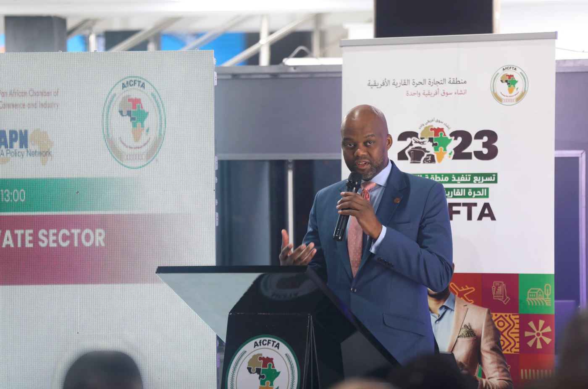
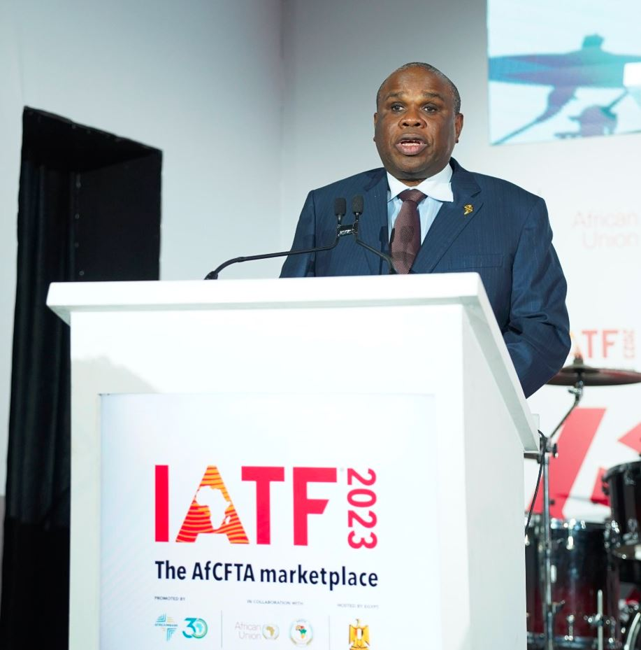

On Monday 13th Novermber 2023 in Cairo, the African project was launched, which will enable to begin the journey of Using vast arable land and water resources to feed africans while openning multibillion US dollar business opportunities in food and agribusiness on the continent.

It was a ceremony that was attended by the heads of states including the President of the Arab Republic of Egypt Abdel Fattah El-Sisi, Zimbabwe's Emmerson Mnangagwa and Malawi's Lazarus Chakwera, H.E. Wamkele Mene Secretary General of AfCFTA Secretariat, Olusegun Obasanjo who once lead Nigeria and is currently an advisor on intra-Africa trade,  and other representatives of their respective countries. Rwanda was represented by the Minister of Trade and Industry Dr. Jean Chrysostome Ngabitsinze.

The President of Egypt said that his country is ready to exploit the opportunities in agriculture and its products.

The management of Afrexim bank that initiated the project, asked for the cooperation of other countries, saying that they will also contribute to the implementation of the African continental Free Trade Area agreement

H.E. Wamkele Mene Secretary General AfCFTA Secretariat Emphasised the role of African citizen in the implementation of AfCFTA agreement adding that the collaboration of african union, Afreximbank and AfCFTA made a remarkable progress in short time

‘When we as African collaborate work together we can acheive more’  H.E. Wamkele Mene

Mean while 60% of uncultivated land is on the African continent and 35% of Africa's GDP comes from agriculture.

