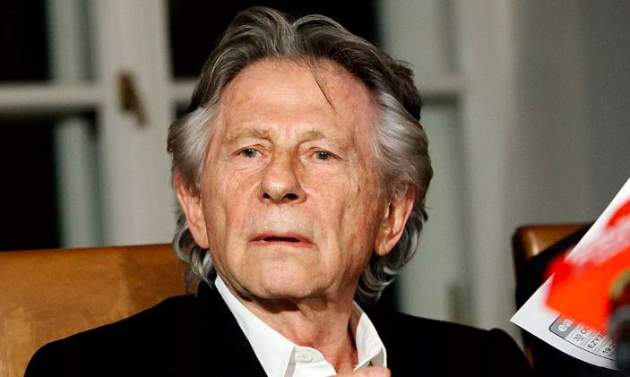

Roman Polanski goes on trial in France on Tuesday over allegations he defamed a British actress who accused him of sexual abuse in the 1980s. A Veteran Franco-Polish filmmaker who is 90-year-old is wanted in the United States over raping 13-years-old in 1977 and faces several other accusations of alleged sexual assault dating back decades and past the statute of limitations though he has rejected all claims. Polanski who won Oscar-winning films "Rosemary's Baby", "Chinatown" and "The Pianist" fled to Europe in 1978.

\[caption id="attachment\_4816" align="alignnone" width="1106"\] Roman Polanski\[/caption\]

His lawyers have said Polanski will not appear in court, But His accuser, Charlotte Lewis who is 56 years-old today, is expected to be present. in 2010 she accused Polanski of sexually assaulting her "in the worst possible way" as a 16-year-old in 1983 in Paris after she travelled there for a casting. She appeared in his 1986 film "Pirates". In 2010, Lewis said she decided to speak out to counter suggestions from Polanski's legal team that the 1977 rape case was an isolated incident. She spoke in the Los Angeles offices of Gloria Allred, a high-profile attorney who has also represented women accusing US producer Harvey Weinstein, sit-com star Bill Cosby and former US president Donald Trump. The France-born filmmaker retorted that it was a "heinous lie" in a 2019 conversation with the Paris Match magazine.

**African Updates**
