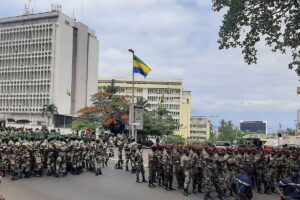

The head of the military junta in Gabon, Gen Brice Oligui Nguema, is due to be sworn into office as the interim president of the country today.

\[caption id="attachment\_4626" align="alignnone" width="300"\] Gen Brice Oligui Nguema\[/caption\]

The army toppled President Ali Bongo on Wednesday few hours after he was declared winner of a disputed election.

It is expected that Supporters of the military leadership in Gabon are attending the inauguration of Gen Nguema.

The mood in the country is calm but with heightened security especially in the capital city Libreville.

The coup leader is said to be the cousin of ousted President Ali Bongo, raising doubts about whether this marks an end to the 56-years of Bongo dynasty.

\[caption id="attachment\_4627" align="alignnone" width="300"\] President Ali Bongo\[/caption\]

Gen Nguema has said he won’t rush to return the country to civilian rule, to avoid past mistakes asThe opposition has warned that the military shows no sign of handing back power.

Gabon is the sixth Francophone country to fall under military rule in the last three years as former colonial power France struggles to maintain its influence on the continent.

\[caption id="attachment\_4628" align="alignnone" width="300"\] Soldier in capital city Libreville\[/caption\]
