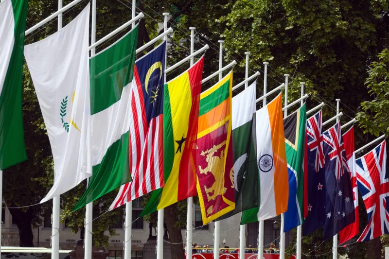

The 63rd  Commonwealth Ministerial Action Group /CMAG met in New York this week on the sidelines of the United Nations General Assembly to discuss developments in member states.

Held on Monday 18 September 2023, the meeting was chaired by the Hon Fiamē Naomi Mata’afa, Prime Minister and Minister for Foreign Affairs, Trade and Tourism, of Samoa. Ministers from Barbados, Canada, Ghana, Mauritius, and Rwanda, and representatives of Belize, Malaysia and Malta, were in attendance.

Ministers expressed the collective concern of the Commonwealth on the political situation in Gabon, strongly condemned the unconstitutional removal of the elected government from office and called for the restoration of democracy. Ministers commended the Secretary General’s prompt assessment of the situation and technical assistance to the transition processes.

The Group thanked the Secretary-General for her Good Offices in seeking a democratic solution to the situation in Gabon. In accordance with the steps set out in the Millbrook Commonwealth Action Programme on the Harare Declaration, the Ministers decided to partially suspend Gabon from the Commonwealth pending the restoration of democracy. This partial suspension entails suspension from the Councils of the Commonwealth, and the exclusion of Gabon from all Commonwealth intergovernmental meetings and events, including ministerial meetings and CHOGM.

Further, Ministers determined that if acceptable progress is not made within two years, consideration will be given to fully suspending Gabon from membership of the Commonwealth. The Ministers urged the Secretary-General to continue her Good Offices engagement with Gabon, including providing technical assistance, with a view to redressing the situation and facilitating Gabon’s return to democracy.

The Group called upon Gabon as a Commonwealth member, to uphold the values and principles of the Commonwealth and to hold credible elections as soon as possible and within a maximum of two years from 30 August 2023.

The Group called upon Gabon to guarantee the personal integrity, safety, health and human rights of former President Ali Bongo Ondimba, his family members and members of his Government."

CMAG meetings are convened by the Commonwealth Secretary-General with the Commonwealth Secretariat providing secretarial support.

Gabon and Togo Was Admitted  as 55th and 56th members of commonwealth respectively at the Commonwealth Heads of Government meeting in Kigali, Rwanda in June 2022.

