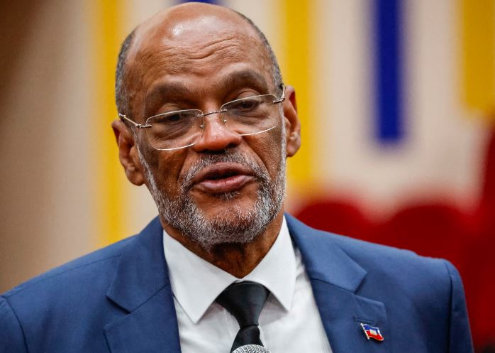
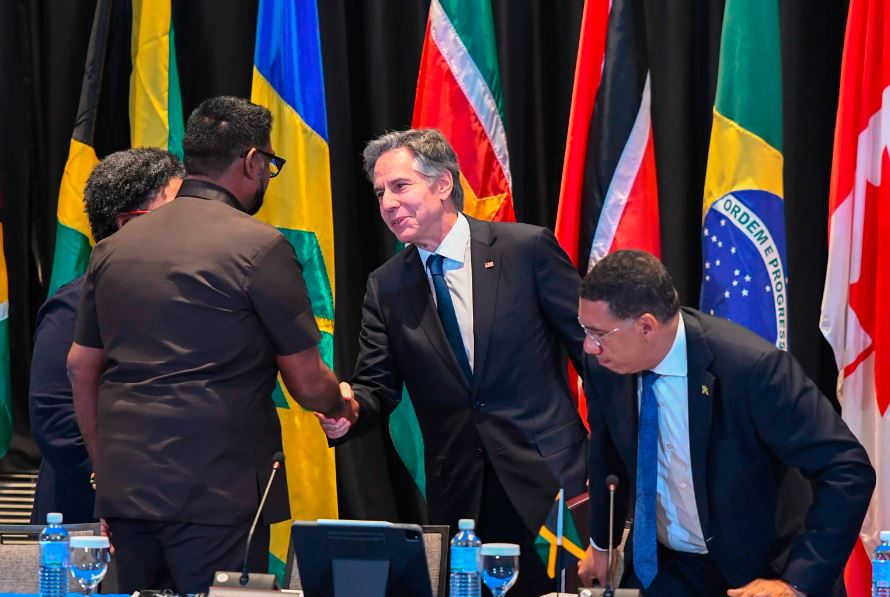

Haiti’s PM Ariel Henry has tendered his resignation following an emergency meeting of regional nations and appealed for calm as the country descends into chaos.

Regional leaders of the Caribbean Community have held the emergency summit to discuss a framework for a political transition, which the US had urged to be “expedited” as armed gangs wreaked chaos amid repeatedly postponed elections.

Haiti is facing escalating turmoil as criminal gangs tighten their grip on Port-au-Prince, controlling up to 90% of the capital.

This follows a gathering of Caribbean nations, UN representatives, and delegates from countries like France and the United States in Jamaica, aiming to find a solution to Haiti's pressing issues. However, Henry found himself stranded in Puerto Rico, unable to return to Port-au-Prince, where he engaged with Caricom members remotely.

On Monday, US Secretary of State Antony Blinken said the US would contribute an additional $100m to an international security force and $33m in humanitarian aid, bringing the US total pledge to $300m.

Haiti's political landscape has been marred by instability since the assassination of President Jovenel Moïse in 2021, with no subsequent elections held since 2016. Henry, appointed by Moïse, was slated to step down in early February, further exacerbating the leadership vacuum.

Despite efforts to address the crisis, including Henry's agreement in Nairobi to deploy Kenyan police officers to Haiti, the situation remains precarious. Diplomatic discussions in Kingston sought to formalize a proposal urging Henry to transfer power to a transitional council representative of Haitian civil society.

In a statement prior to his resignation, Henry affirmed the government's commitment to establishing a transitional presidential council, highlighting plans for members to be selected in consultation with various sectors of national life.

**African Updates**
