On 31st January, 2024 a historic milestone to boost trade in Africa has made as South Africa started exporting under the African Continental Free Trade Area (AfCFTA).

H.E. Wamkele Mene, Secretary General of the African Continental Free Trade Area (AfCFTA) highlited the results of South African industry and innovation.

“we are forging a path of mutual growth and shared prosperity. This is a powerful instrument to promote meaningful, impactful trade that benefits all corners of our continent.” H.E. Wamkele Mene said.

President Cyril Ramaphosa said the shipment demonstrated that AfCFTA had become a reality.

“We are in the port city of eThekwini taking forward the dream of an ever larger and ever stronger Africa. African countries trade with the rest of the world but we have limited trade among ourselves,” Ramaphosa said.

\[caption id="attachment\_4784" align="alignnone" width="1280"\]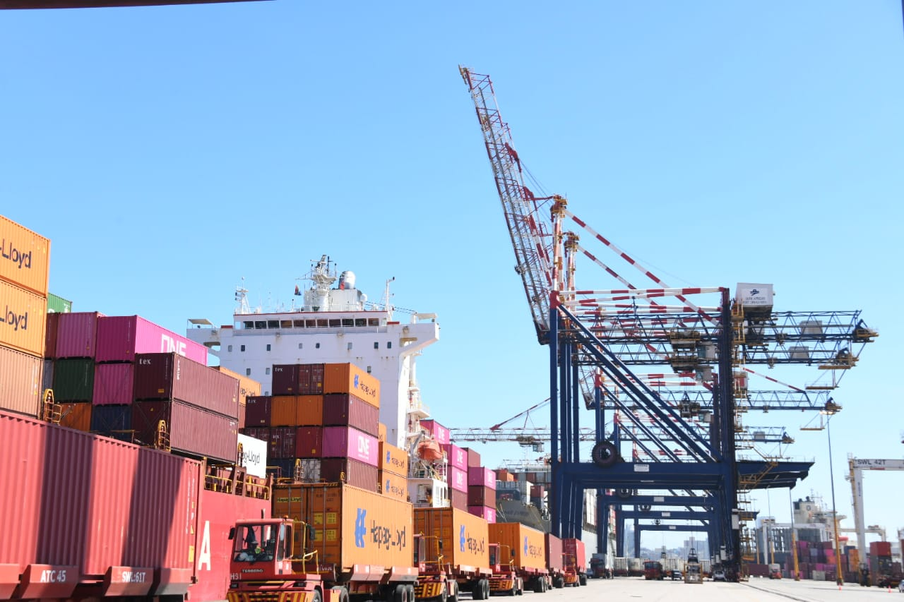 Port of Durban, South Africa on Wednesday 31st January, 2024\[/caption\]

\[caption id="attachment\_4786" align="alignnone" width="1280"\]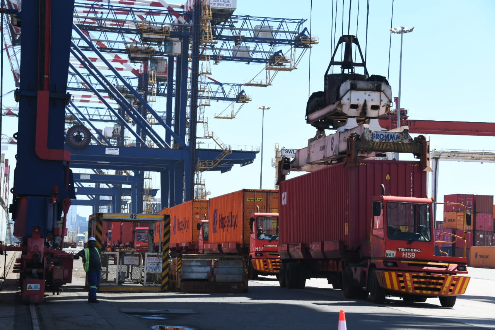 South Africa's first shipment of goods under the African Continental Free Trade Area (AfCFTA) agreement from the Port of Durban\[/caption\]

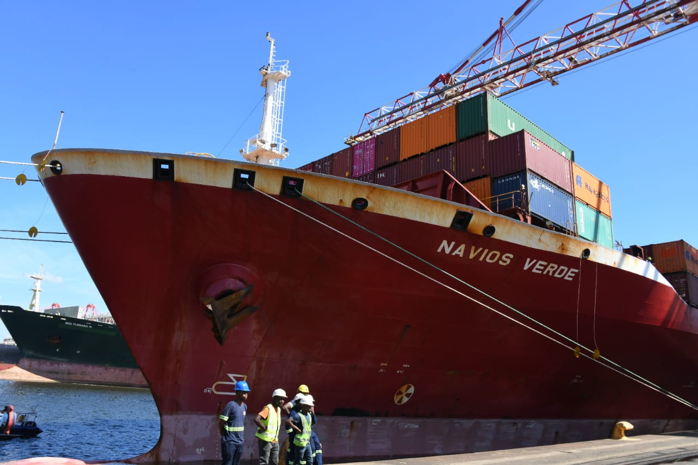

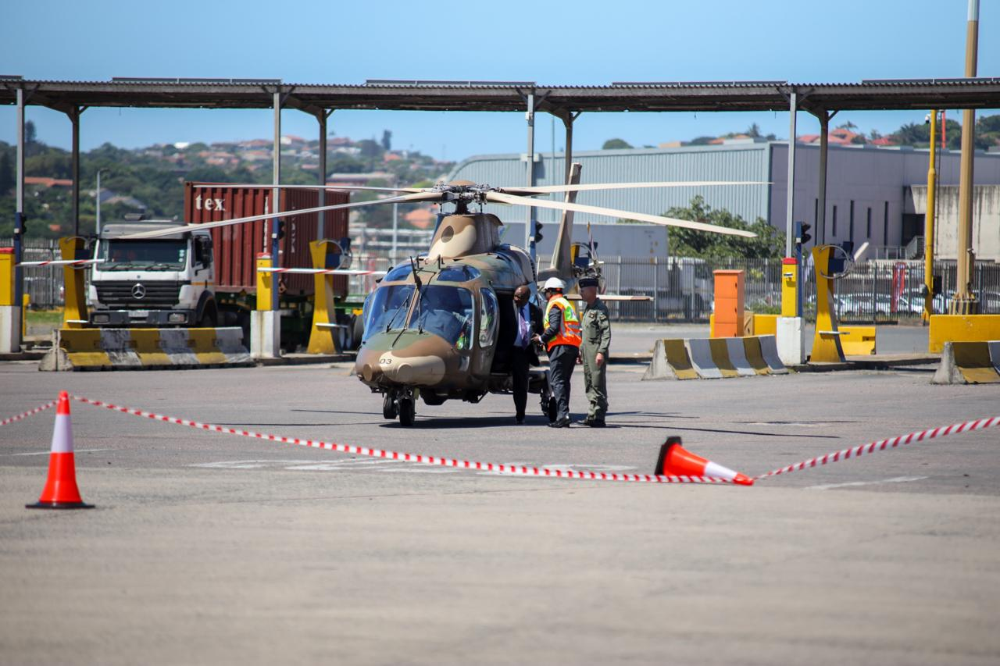

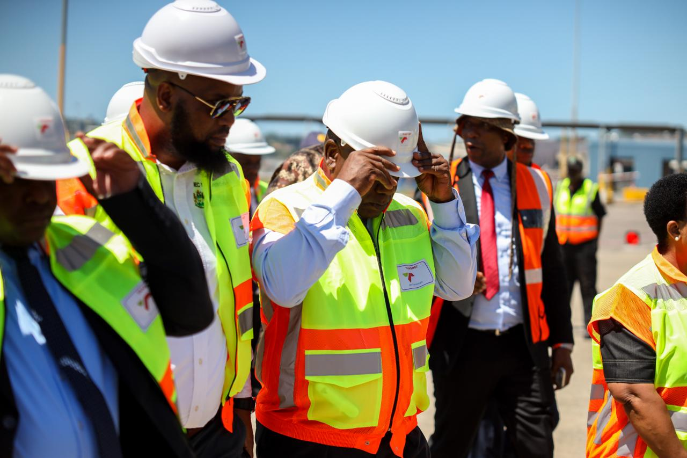

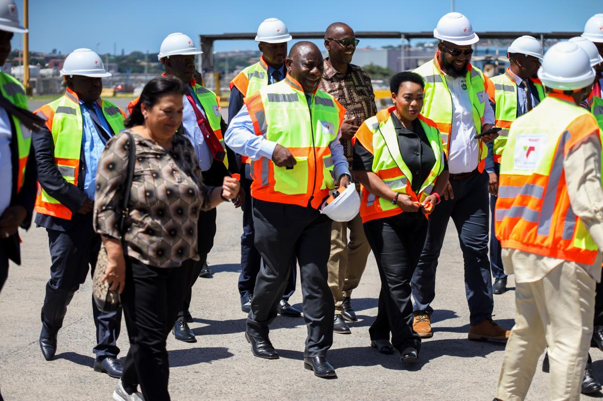

\[caption id="attachment\_4794" align="alignnone" width="1600"\]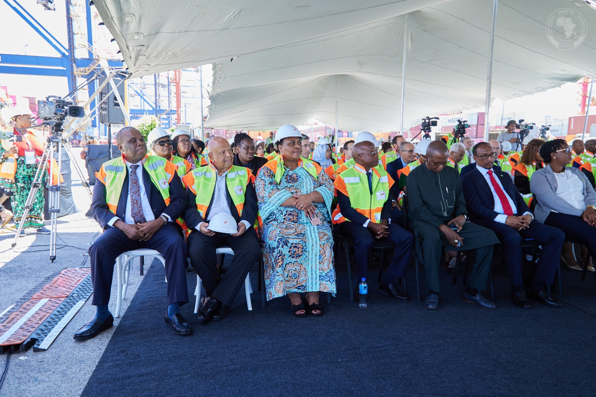 Delegates from 40 African countries in Durban, South Africa\[/caption\]

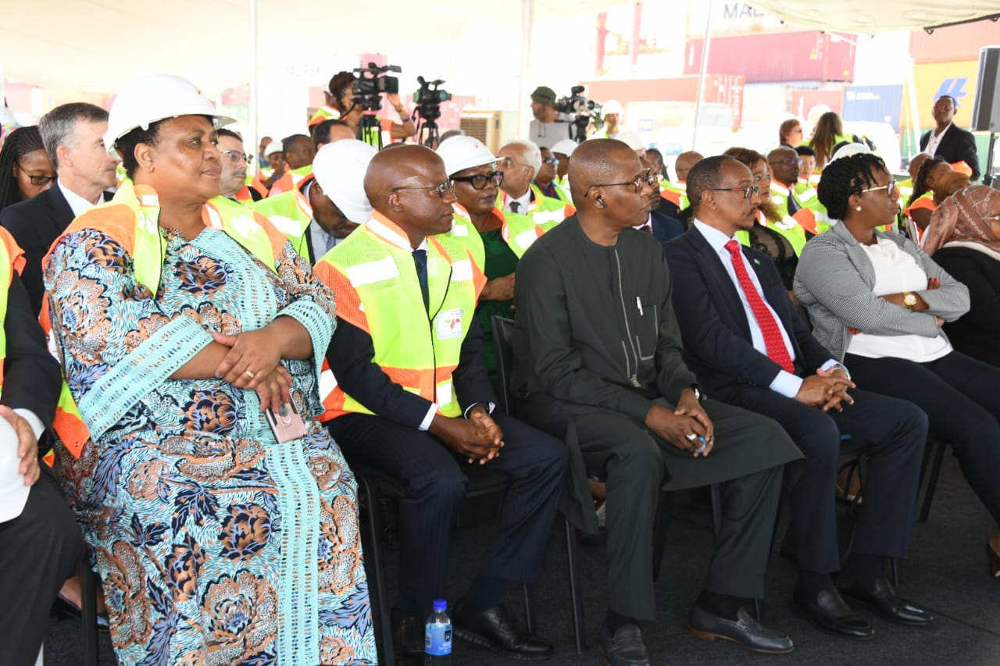

\[caption id="attachment\_4797" align="alignnone" width="1280"\]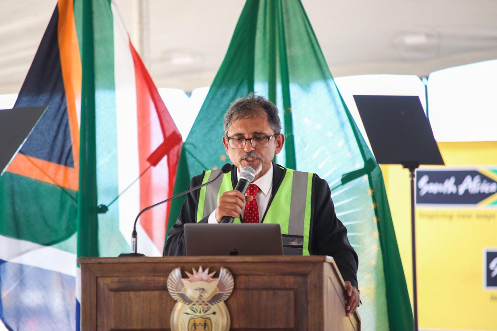 Ebrahim Patel, Minister of Trade and Industry of South Africa\[/caption\]

\[caption id="attachment\_4791" align="alignnone" width="1600"\]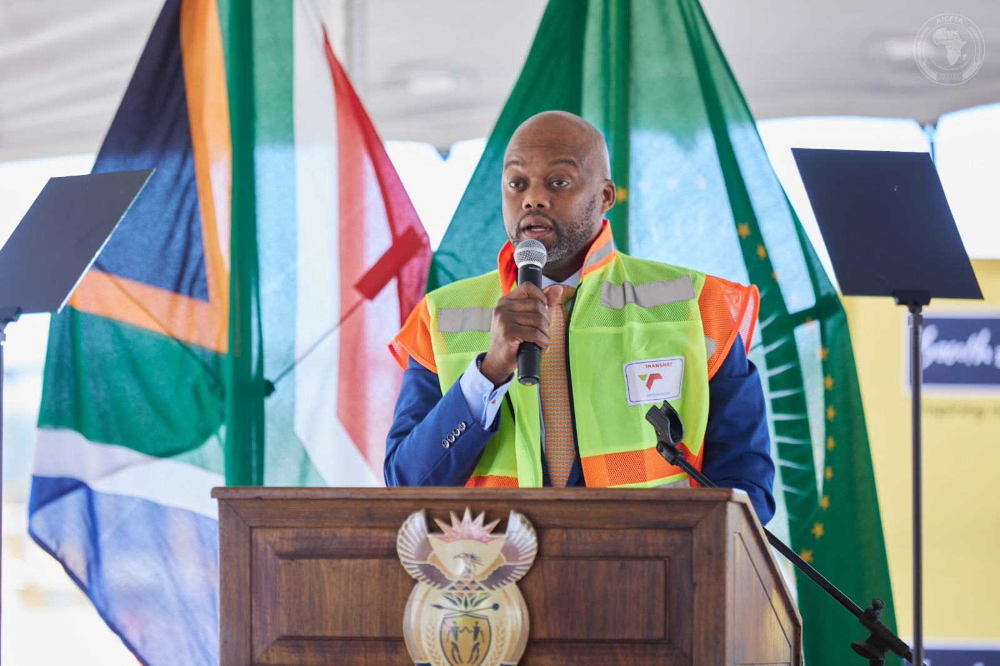 H.E. Wamkele Mene, Secretary General of the African Continental Free Trade Area Secretariat (AfCFTA)\[/caption\]

\[caption id="attachment\_4792" align="alignnone" width="1280"\]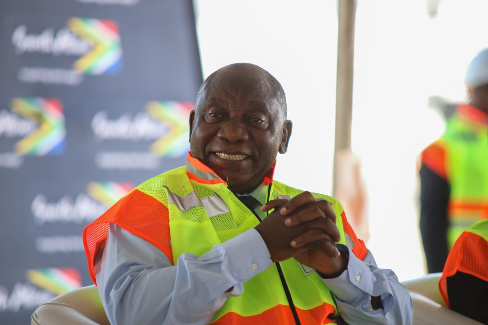 President of South Africa, Cyril Ramaphosa 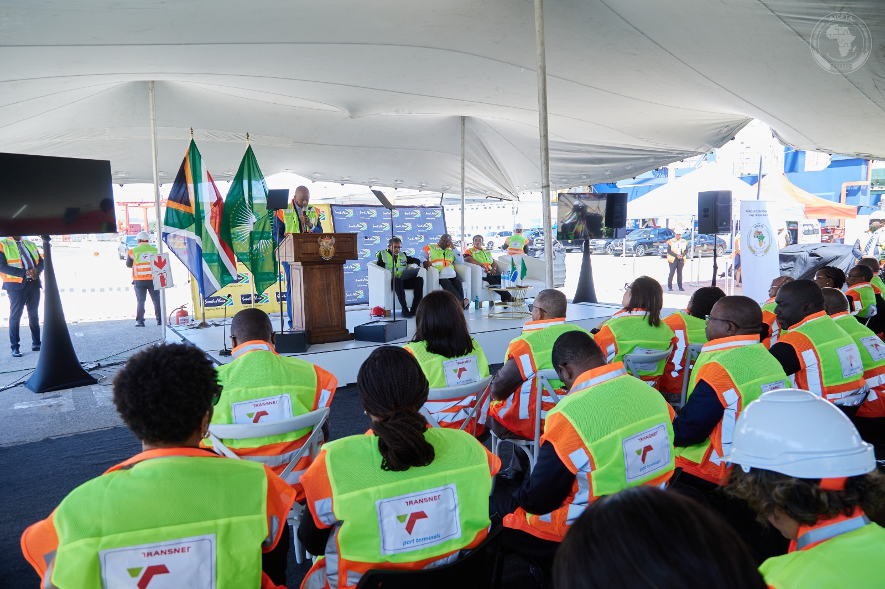 \[/caption\]

**African Updates**
