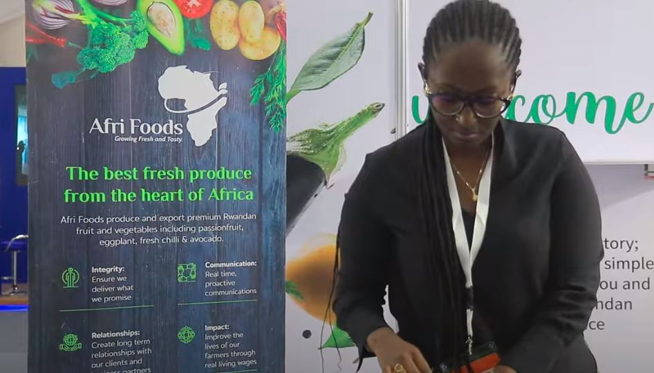
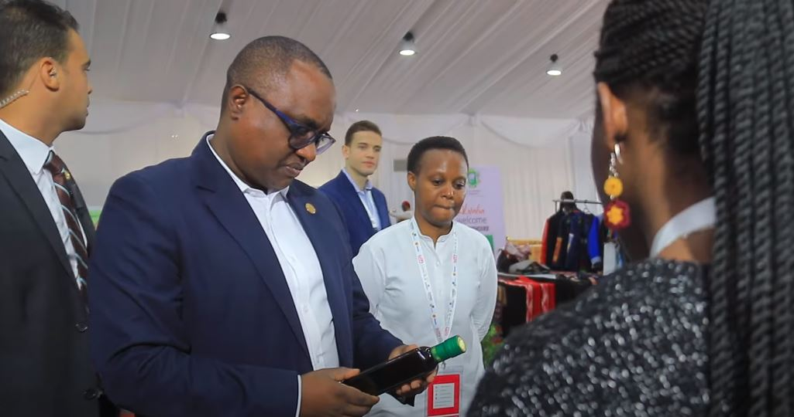
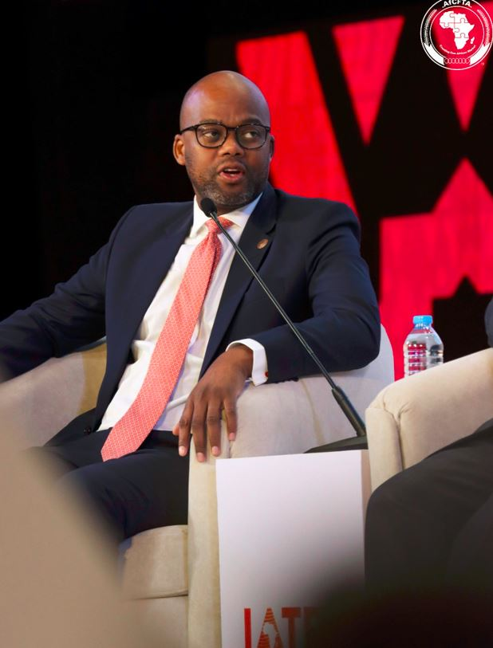
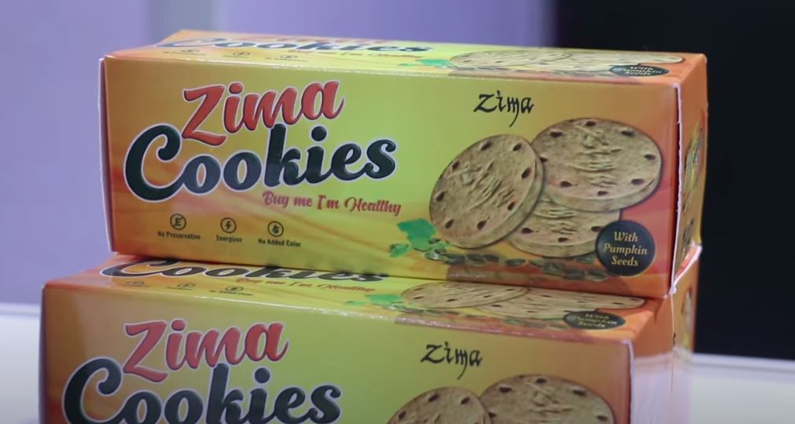
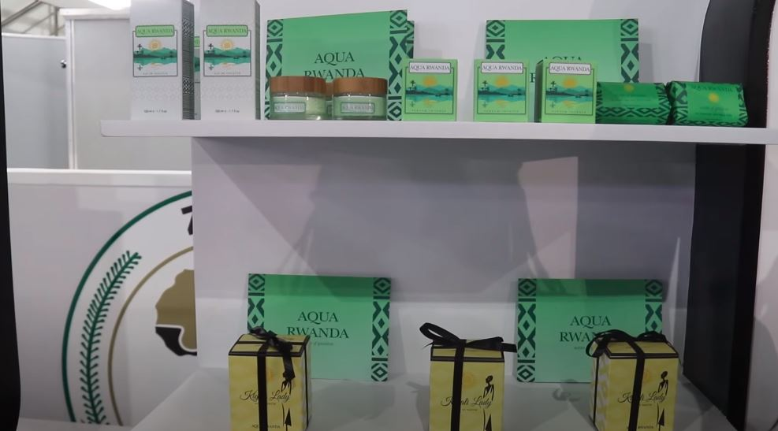
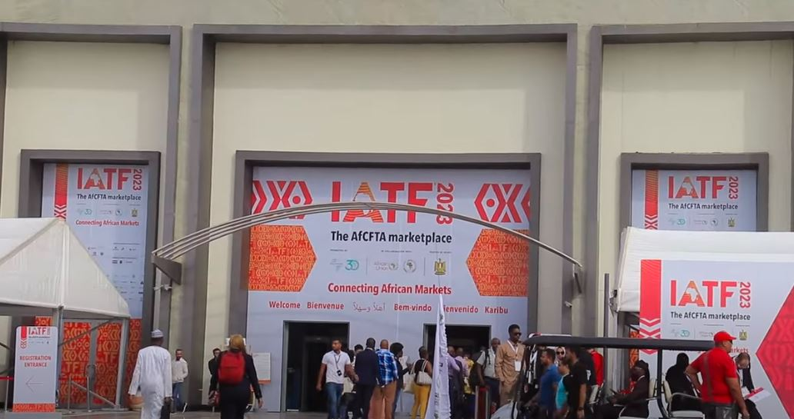

While Rwanda is one of the seven countries that have started to implement the African free trade program, there are some producers who say that they are still facing challenges in finding packaging for their products, such that they find themselves using expensive packaging or not meeting the international standards.

These are what some of the participants of the intra Africa trade fair that was held in Egypt from 9-15 November 2023 had to say:

_"You find that when we take our product to the market, it is more expensive than those of others, people like it yes but they can't afford it because it is expensive... The cost of production would have gone higher because of the packaging"._ Marie Immacule Sales officer at Zima healthy group

However, this problem is not unique to Rwanda but also in other African countries, as was repeated by the participants of the trade fair from different African countries.

And these challenges they face are adding up to the wrong mindset of some African retailers in general, both of which make their products not to move which leads some to consequently close their businesses so soon.

The minister of trade and industry of Rwanda Dr Jean Chrysostome Ngabitsinze acknowledges that that problem exists and that a solution is being sought although it is not specified when or how it will be done.

The Secretary General of the African Continental Free Trade Area AfCFTA Mr. Wamkele Mene, says that taking care of the packaging is important, but there is a need for the participation of countries and cooperation in establishing policies that facilitate industrialists to achieve it.

He said:

"_As AfCFTA we recommend that the countries continue to work together and facilitate the manufacturers and those who wish to invest especially in the packaging industry, that would be the answer to this problem__"._

Currently, in Rwanda, non-environmentally friendly materials such as single-use non biodegradable straws and plastic bags are not allowed. However, in various cases, the challenges of the higher price for the approved packaging and their insufficient supply on the Rwandan market have been often noted.

Those who observe and analyse business closely say that if nothing is done about it, this will continue to negatively affect the industrial owners and they may find themselves behind in the African free trade program.

 

**African Updates**
