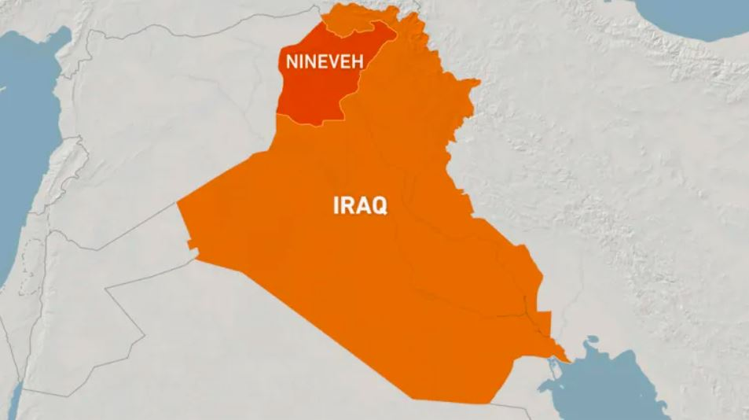
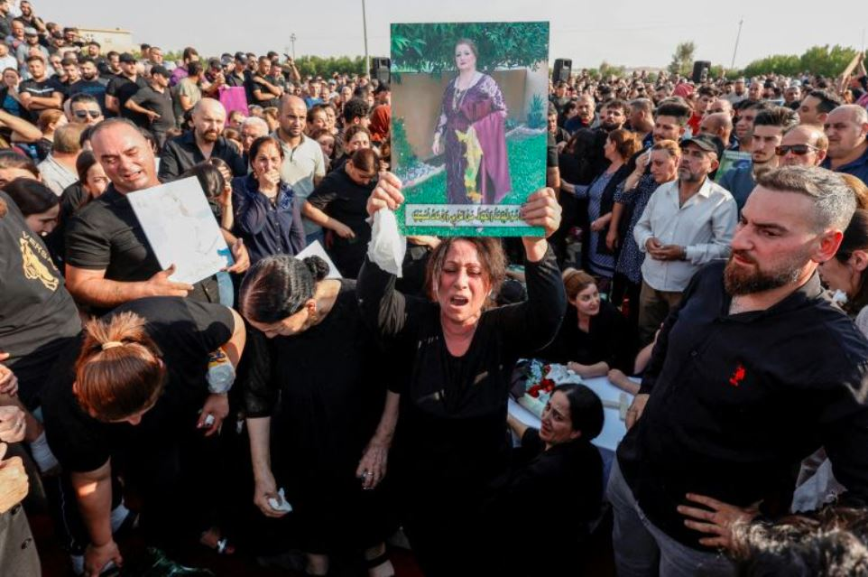

At least 113 people have been killed and more than 150 injured in a fire that ripped through a wedding celebration in Iraq’s northern Nineveh province, local officials said.

Nineveh Deputy Governor Hassan al-Allaq confirmed the death toll, which may yet rise. The fire was reported to have started at approximately 10:45pm local time (19:45 GMT) on Tuesday night.

The fire engulfed a wedding hall in Nineveh’s Hamdaniya district, where the celebration was taking place. Hamdaniya, also known as Qaraqosh, is a majority Christian town, and is located outside of the northern city of Mosul, some 400km (about 250 miles) northwest of the capital Baghdad.

“All efforts are being made to provide relief to those affected by the unfortunate accident,” Iraq’s health ministry spokesman Saif al-Badr said.

On Wednesday, funerals were already taking place for the victims of the fire, as mourning relatives gathered outside a morgue in Mosul.

“This was not a wedding. This was hell,” said Mariam Khedr, crying and hitting herself as she waited for officials to return the bodies of her daughter Rana Yakoub, 27, and three young grandchildren, the youngest aged just eight months.

Iraq’s civil defence said initial reports indicated that fireworks may have been the cause of the fire. “Preliminary information indicates that fireworks were used during a wedding, which triggered a fire in the hall,” civil defence authorities said in a statement early on Wednesday.

Iraq’s ministry of health said that “medical aid trucks” have been dispatched to Nineveh from Baghdad and other provinces.

