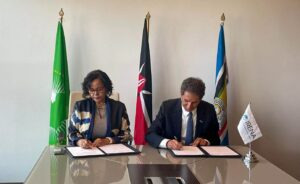

The African Union Development Agency (AUDA-NEPAD) and the International Renewable Energy Agency (IRENA) signed an agreement today aimed at supporting African countries in their efforts to achieve the African Union’s Agenda 2063 and the UN-Sustainable Development Goal 7 to ensure access to affordable, reliable, sustainable and modern energy for all.

The agreement was signed on Monday 4th September 2023 by AUDA-NEPAD CEO Nardos Bekele-Thomas and IRENA Director- General Francesco La Camera on the margins of Africa Climate Week in Nairobi.

AUDA-NEPAD CEO Ms. Nardos Bekele-Thomas underscored the findings of the Continental Power Systems Masterplan (CMP), designed to provide a strategic roadmap for connecting Africa’s five power pools, emphasising the critical need for immediate and proactive measures in Africa's electricity sector.

" the current business as usual trajectory falls significantly short of achieving universal electricity access by 2040, necessitating a substantial increase in investments to elevate the continent's installed capacity from 266GW to approximately 1,218GW. To realize this ambitious target, an estimated USD 1.29 trillion in cumulative investments will be essential, potentially culminating in the establishment of a robust continental electricity market valued at USD 136 billion by 2040. It is imperative to take urgent and strategic actions to accomplish these transformative goals." Said Ms. Nardos Bekele-Thomas CEO of AUDA-NEPAD

Since 2021, IRENA, in partnership with other organisations, has supported AUDA-NEPAD and African stakeholders in developing the CMP through modelling activities and a series of capacity-building activities related to energy planning in the region. The CMP aims to establish a long-term, continent-wide planning process for power generation and transmission that involves all five African power pools.

It maps out how to best to utilise the vast renewable energy resources across the continent, supporting national power strategies that consider cross-border interconnections as a vital component.
