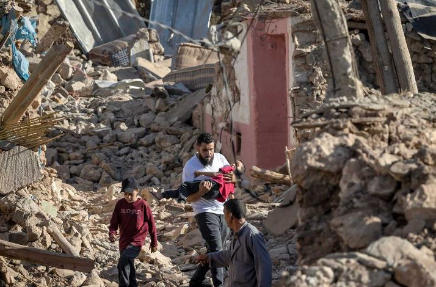
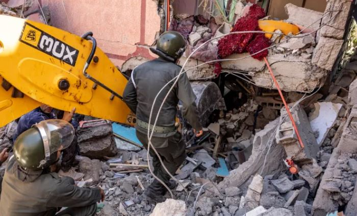

The 6.8 magnitude quake that struck a mountainous area southwest of Marrakech has claimed more than 2,100 lives and injured over 2,400, many of them seriously according to the most recent report.

In Moulay Brahim, a remote village located close to the quake’s epicentre, dozens of people have been confirmed dead and many more are still missing.

Moroccan rescue workers, backed by foreign teams, continued Monday in a race against time to find survivors and provide assistance to hundreds of homeless people whose homes were razed to the ground, more than 48 hours after the earthquake that killed more than 2,100 people.

Morocco announced on Sunday evening that it had responded favorably, "at this stage", to offers from four countries "to send search and rescue teams": Spain, Great Britain, Qatar and the United Arab Emirates.

These teams have been in contact with their counterparts in Morocco with a view to coordinating their efforts, the Interior Ministry said in a statement.

Spain said it had already sent 86 rescue workers to Morocco, accompanied by dogs specialized in searching for victims, while a Qatari humanitarian flight took off on Sunday evening from the Al-Udeid air base on the outskirts of Doha.

Other offers could be accepted in the future "should needs evolve", the ministry added.

Numerous countries, from France to the United States and Israel, had offered to help Morocco in the wake of the devastating earthquake, which left 2,122 people dead and 2,421 injured.

Pending the deployment of foreign rescue teams on the ground, the Moroccan authorities have begun to erect tents in the High Atlas, where villages have been completely destroyed by the earthquake.

Rescue workers, volunteers and members of the armed forces are working to find survivors and pull bodies from the rubble, particularly in villages in the province of Al-Haouz, the epicenter of the quake south of the tourist city of Marrakech in central Morocco.

Not far away, Moroccan security forces are digging graves for the victims, while others are setting up yellow tents for earthquake survivors left homeless.

Faced with the scale of the destruction, solidarity is being organized in Marrakech, where many residents have rushed to hospitals to donate blood for the victims.

