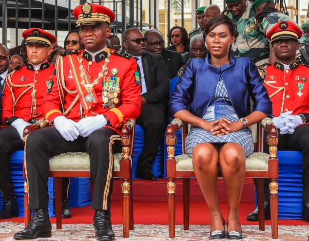
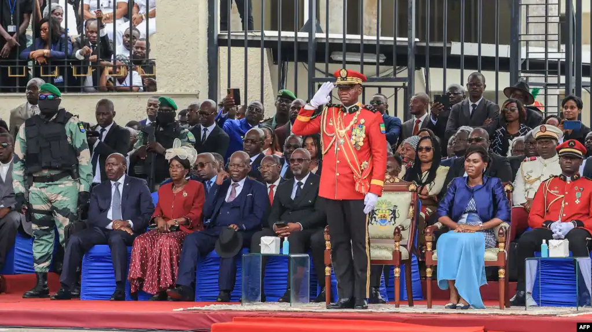

Gabon's transitional president, received a show of support from Republic of Congo after he met his counterpart Sunday, aiming to improve relations and ease Gabon's isolation.

General Brice Oligui Nguema transitional president of Gabon met President Denis Sassou Nguesso in a work visit on this Sunday which was aimed at improving the ties and easing Gabon's international isolation following the coup.

"I have come to consult, to discuss, to exchange with (the president), who for us is a key in the region, who can relay to global authorities what we have done," Oligui said after holding talks with Congo President Denis Sassou Nguesso.

The talks were held near Oyo, in central Congo.

Gabon was suspended from the African Union and the Economic Community of Central Africa States (ECCAS) after the change of government.

ECCAS has also ordered the immediate transfer of its headquarters from Gabon's Libreville to the Equatorial Guinea capital Malabo.

The Congo president did not address reporters after the talks, but his Foreign Minister Jean-Claude Gakosso hailed Oligui as "a man of humility and reconciliation."

"I think that the Gabonese should support him and aside from the Gabonese, the Congolese. Also, our brothers in central Africa", he told reporters.

He added "The Congo and Gabon are in reality the same country. We have to work tirelessly, have good relations,".

General Brice Oligui Nguema overthrew Ali Bongo Ondimba, 64, who had ruled Gabon since 2009, few hours after he was announced as the winner in a presidential election in late August.

Under the presidency of Ali Bongo, relations between Gabon and neighbouring Congo were notoriously tense.

The visit marked the second overseas trip by Oligui, who was sworn in last month as Gabon's interim president.

