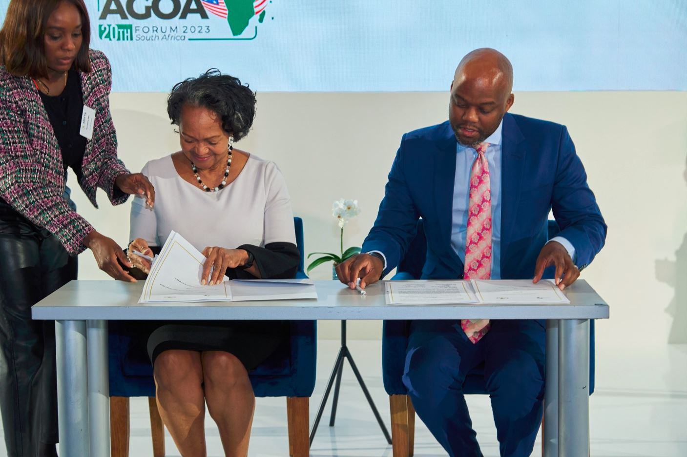

On 1st November 2023 The AfCFTA secretariat and Corporate Council for Africa has signed an MoU with the objective to promote partnerships between U.S. and African companies that build on provisions of the African Continental Free Trade Agreement to achieve the shared goal of increasing private sector support for and involvement in realizing the goals of the AfCFTA.

The MoU signed is articulated around different sectors such as transportation and logistics, vaccine manufacturing, health sector productive capacity, trade and investment, the automotive sector, agriculture and agroprocessing and women and youth in Trade.

The implementation of this MoU through the intensive workplan developed will contribute to strengthening trade and investment ties between the African continent and the United State.

