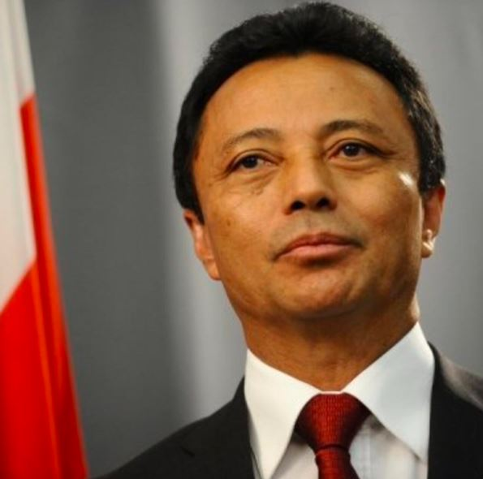

President Andry Rajoelina Of Madagascar announced he will run for re-election in November.

Rajoelina made the announcement on this Wednesday at a grand ceremony held in the biggest stadium on the large Indian Ocean island, which is due to hold the presidential vote on November 9.

He first took power in 2009 on the back of a coup that ousted former president Marc Ravalomanana.

After not contesting in the 2013 election due to international pressure, Rajoelina was voted back into power in 2018.

\[caption id="attachment\_4668" align="alignnone" width="639"\] President of Madagascar Andry Rajoelina\[/caption\]

he said he was ready to represent people "throughout Madagascar, and to be the president of all Malagasy people,".

"The Constitution allows me to run for a second term" President Andry Rajoelina

Addressing thousands of supporters, clad in the party colours of orange and white, at the Barea stadium where a dozen people died in a stampede at the end of August, Rajoelina highlighted the infrastructure built over the last five years.

Proclaiming himself to be a "builder president," he listed schools, courts and even prisons that had been built during his presidency.

"Many things have been done to prevent me from moving forward but this encourages me to do more" Rajoelina said, promising victory.

The head of state has in recent months been facing questions over his dual French nationality.

The information was disclosed through media reports at the end of June.

He seized power from Ravalomanana in 2009, with the implicit support of the army. The international community condemned the coup d'état.

Ravalomanana, a 73-year-old millionaire who made his fortune in the agri-food industry, has still not come to terms with his ouster and in July announced his candidacy for the upcoming presidential election.

\[caption id="attachment\_4669" align="alignnone" width="595"\] Former President of Madagascar Marc Ravalomanana\[/caption\]

Madagascar. which is often hit by devastating storms. is one of the poorest countries on the globe despite its vast natural resources. Some 80 percent of the population of 28 million lives on less than 1.92 dollars per day.
