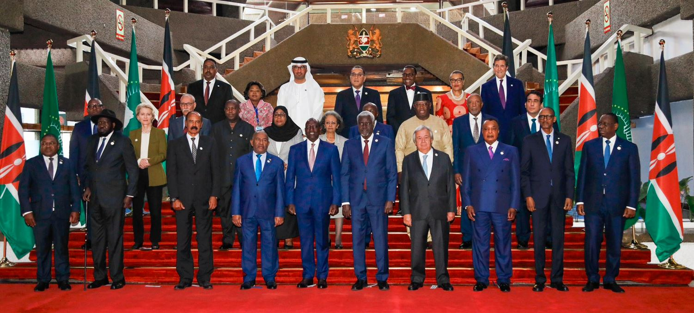
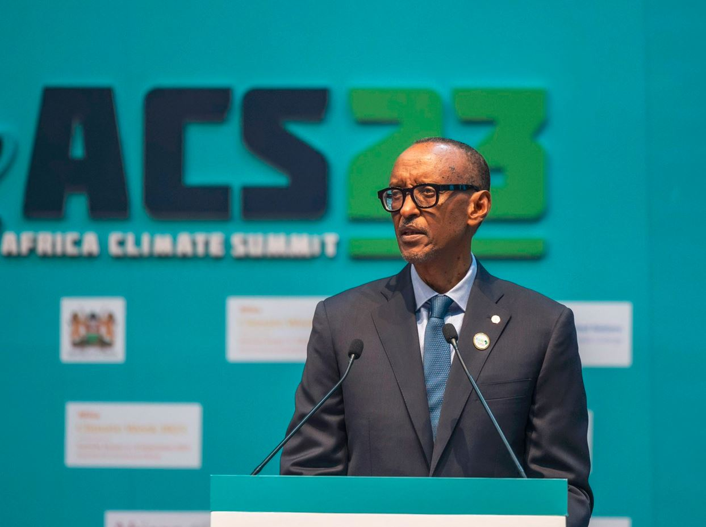
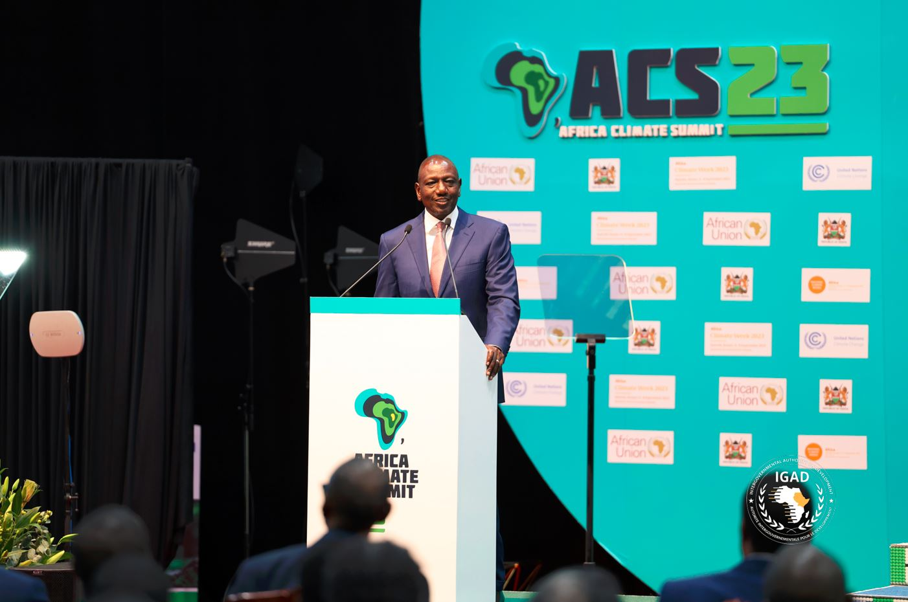
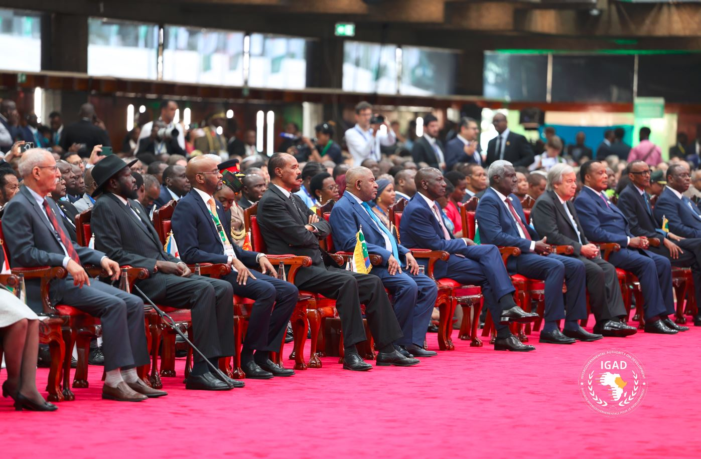

On Tuesday -5th September 2023, President of The Republic of Rwanda Paul Kagame is in Nairobi, Kenya, where he attended the maiden Africa Climate Summit, co-hosted by the African Union Commission and the Government of Kenya, alongside African leaders, heads of Regional Economic Communities, and distinguished representatives from international organizations.

The three-day Summit, which is concurrent with Africa Climate Week, one of four regional climate weeks, and is held under the theme “Driving Green Growth and Climate Finance Solutions for Africa and the World,” seeks to address the growing vulnerability to climate change and its effects in Africa and around the world.

President Kagame empasised on quick action.

"Africa continues to carry the burden of rising temperatures, despite contributing the smallest share of global greenhouse gas emissions. We cannot just keep talking about it without doing what is required to fix the problem. This is unfair, but in the long run, playing the blame game is not the answer. A more pragmatic approach is for Africa to be a key player in the search for global climate solutions. Africa stands united and should stay so in this and in its position." President Kagame

\[caption id="attachment\_4639" align="alignnone" width="1243"\] President Paul Kagame Of Rwanda\[/caption\]

To date, the Rwanda Green Fund has invested in 46 green projects across the country and the institution’s Ireme fund launched at COP27 has mobilized close to 200 million USD. Rwanda is also the first African country to reach an agreement with the IMF on support from the Resilience and Sustainability Trust which will finance projects tackling climate change challenges.

President of Kenya William Ruto declared that Climate change is “relentlessly eating away” at Africa’s economic progress and it’s time to have a global conversation about a carbon tax on polluters.

The rapidly growing African continent of more than 1.3 billion people is losing 5% to 15% of its GDP growth every year to the widespread impacts of climate change, according to Ruto. It’s a source of deep frustration in the region that contributes by far the least to global warming.

The African continent has 60% of the world’s renewable energy assets, and more than 30% of the minerals key to renewable and low-carbon technologies. One goal of the summit is to transform the narrative around the continent from victim to assertive, wealthy partner.

The summit’s opening speeches included clear calls to reform the global financial structures that have left African nations paying about five times more to borrow money than others, worsening the debt crisis for many.

This summit will increase momentum for COP28 and enable African nations to create comprehensive plans, push for changes to the global financial system, and exchange information and useful strategies.

