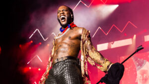
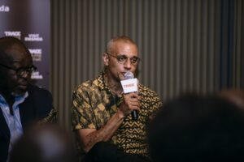

The first Trace Awards and festival in Africa will be held in Kigali, Rwanda on October 21 at the BK Arena, and the Trace Awards and Festival will be presented by Visit Rwanda and Martell. The awards will be broadcast live to some 500 million people in 190 countries as a global TV spectacular that celebrates the creativity, talent and influence of African and Afro-inspired music and artists.

The awards will celebrate genres such as Afrobeats, dancehall, hip hop, mbalax, amapiano, zouk, kizomba, genge, coupé décalé, bongo flava, soukous, gospel, rap, rai, kompa, R&B and rumba.

Competing in 22 award categories are platinum-selling artists from more than 30 countries in Africa, South America, the Caribbean, the Indian Ocean and Europe. The winners’ trophy was designed by acclaimed Congolese sculptor and designer Dora Prevost.

Leading the nominees are West African artists, particularly Nigerian musicians, who underscore the global popularity of Afrobeats with more than 40 nominations in total – including multiple nods for Burna Boy, Ayra Starr, Davido, Wizkid, Tiwa Savage, Yemi Alade, Fireboy DML, Rema and others.

\[caption id="attachment\_4602" align="alignnone" width="300"\] Popular Nigerian Artist are expected in kigali for the Trace Award and Festival\[/caption\]

\[caption id="attachment\_4603" align="alignnone" width="300"\] Female singer Tiwa Savage is expected in Kigali for the Trace Award and Festival\[/caption\]

According to Olivier Laouchez, chairman and co-founder of Trace, most of the artistes nominated for the Trace Awards are expected to attend and perform during the show that will take place in Kigali.

"The Trace Awards nominations celebrate the achievements and excellence of more than 150 performers, producers, DJs, writers, composers, directors, established artists and rising stars, as well as their management and labels. We congratulate all the nominees, most of whom will be attending and performing in Kigali on 21 October. It will be an unmissable experience for lovers of African and Afro-inspired music," Laouchez said in a statement released by Trace on Monday, August 21.

\[caption id="attachment\_4604" align="alignnone" width="300"\] Olivier Laouchez, chairman and co-founder of Trace\[/caption\]
