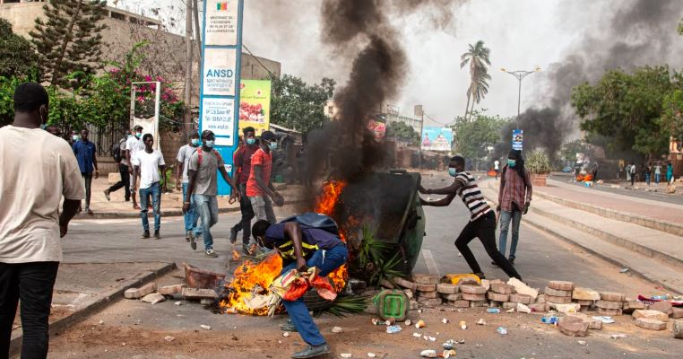
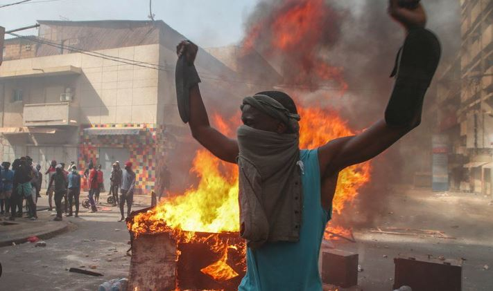

Today Members of parliament in Senegal will meet to consider the postponement of presidential elections announced by President Macky Sall, a move that has plunged the country into crisis.

Opposition leaders have used the term "constitutional coup" to describe the current situation, which they say is an assault on democracy.

Protesters in Dakar decry Senegal's Macky Sall for postponing presidential election, saying they will vote.

It is expected that deputies will vote on a proposal to postpone the presidential poll which was previously set on 25th February, 2024 for up to six months.

Given the political row that Sall's decision has caused and the street protests on Sunday, the proposal does not appear to be a done deal.

Sall said Saturday he delayed the vote because of a dispute between the National Assembly and the Constitutional Court over the rejection of candidates.

"I will begin an open national dialogue to bring together the conditions for a free, transparent and inclusive election," Sall added, without giving a new date.

The international community has reacted with concern to Sall's decision to put off the vote.

The United States, European Union and former colonial ruler France have all appealed for the vote to be rescheduled as soon as possible.

The chairman of the African Union commission, Moussa Faki Mahamat, urged Senegal to resolve its "political dispute through consultation, understanding and dialogue".

Faki called on the authorities to "organise the elections as quickly as possible, in transparency, in peace and national harmony" in a post Monday on X, formerly Twitter.

It is the first time since 1963 that a presidential vote has been postponed in Senegal, one of the few African countries never to have experienced a coup.

However, Some protesters on the streets Sunday feared something might come up.

 

**African Updates**
