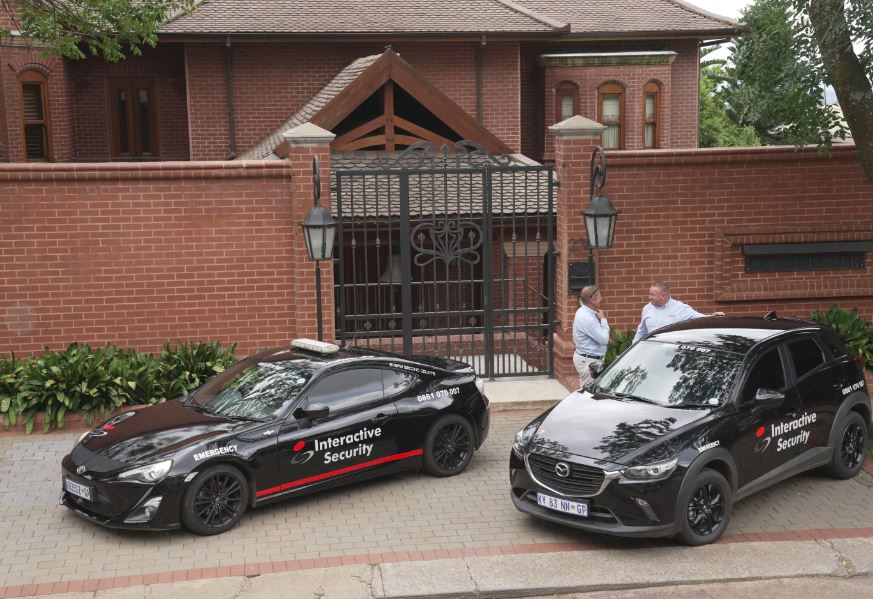

South African athlete Oscar Pistorius has been released from prison on parole after serving nearly nine years in prison for killing his girlfriend and is now at home, South Africa´s Department of Corrections said Friday.

The department gave no more details of Pistorius´ release. The announcement came at around 8:30 a.m., indicating corrections officials had released the world-famous double-amputee Olympic runner from the Atteridgeville Correctional Center in the South African capital, Pretoria.

Pistorius has served nearly nine years of his 13 years and five months murder sentence for killing girlfriend Reeva Steenkamp on Valentine´s Day 2013. He was approved for parole in November.

Pistorius has maintained that he shot Steenkamp, a 29-year-old model and law graduate, by mistake. He testified that he believed Steenkamp was a dangerous intruder hiding in his bathroom and shot through the door with his licensed 9 mm pistol in self-defense. Prosecutors said he killed his girlfriend intentionally during a late-night argument.

\[caption id="attachment\_4772" align="alignnone" width="1130"\] Oscar Pistorius at the Pretoria Magistrates court June 4, 2013.\[/caption\]

\[caption id="attachment\_4771" align="alignnone" width="998"\] Oscar Pistorius leaves the High Court in Pretoria, South Africa, on June 14, 2016\[/caption\]

The Department of Corrections said in a two-sentence statement announcing Pistorius' release that it was "able to confirm that Oscar Pistorius is a parolee, effectively from 5 January 2024. He was admitted into the system of Community Corrections and is now at home."

Pistorius was expected to initially live at his uncle's mansion in the upscale Waterkloof suburb of Pretoria, and a police van was seen parked outside of that house.

\[caption id="attachment\_4773" align="alignnone" width="873"\] Oscar Pistorius Uncle's home in pretoria,South Africa on 5th january 2024\[/caption\]

Department of Corrections officials had said Pistorius' release time would not be announced in advance and he would not be "paraded" because they hoped to keep him away from the media glare that has trailed him since he shot Steenkamp multiple times through a toilet door at his home in the predawn hours of Feb. 14, 2013.

He will live under strict parole conditions until the remainder of his sentence expires in December 2029.

Steenkamp's mother,  said in a statement earlier Friday that she had accepted Pistorius' parole as part of South African law.

**_"Has there been justice for Reeva? Has Oscar served enough time? There can never be justice if your loved one is never coming back, and no amount of time served will bring Reeva back,"_** June Steenkamp said.

**_"With the release of Oscar Pistorius on parole, my only desire is that I will be allowed to live my last years in peace with my focus remaining on the Reeva Rebecca Steenkamp Foundation, to continue Reeva´s legacy."_**

\[caption id="attachment\_4774" align="alignnone" width="497"\] A mourner carries a program at the funeral for Reeva Steenkamp, in Port Elizabeth, South Africa on Feb. 19, 2013.\[/caption\]

The Department of Corrections has emphasized that the multiple Paralympic champion's release - like every other offender on parole - does not mean that he has served his time.

Some of Pistorius´ parole conditions include restrictions on when he´s allowed to leave his home, a ban on consuming alcohol, and orders that he must attend programs on anger management and on violence against women. He will have to perform community service.

Pistorius will also have to regularly meet with parole officials at his home and at correctional services offices and will be subjected to unannounced visits by authorities. He is not allowed to leave the Waterkloof district without permission and is banned from speaking to the media until the end of his sentence. He could be sent back to jail if he is in breach of any of his parole conditions.

South Africa does not use tags or bracelets on paroled offenders so Pistorius will not wear any monitoring device, Department of Corrections officials said. But he will be constantly monitored by a department official and will have to inform the official of any major changes in his life, such as if he wants to get a job or move to another house.

Serious offenders in South Africa are eligible for parole after serving at least half their sentence.

\[caption id="attachment\_4775" align="alignnone" width="1132"\] Oscar Pistorius and his girlfriend Reeva Steenkamp in Johannesburg on January 26, 2013.\[/caption\]

**African Updates**
