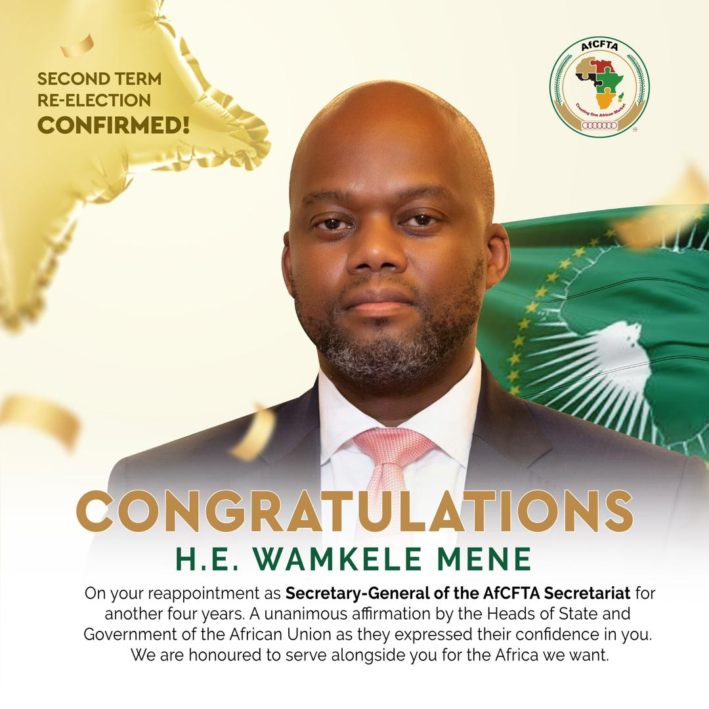

Mr Wamkele Mene has been reappointed as the Secretary-General of the African Continental Free Trade Area Secretariat (AfCFTA)

Mr Mene got appointed for a second four-year term during the 37th Ordinary Session of the Assembly of Heads of States and Government of the AU in Addis Ababa, Ethiopia.

Mr Wamkele Mene is the Secretary-General of the African Continental Free Trade Area (AfCFTA), His responsibilities include coordinating and facilitating implementation of the AfCFTA agreement among African states. His role are to promote the AfCFTA and undertake activities to enhance intra-African trade.

The AfCFTA was established in 2018 and has 43 parties plus 11 signatories, making it the world's largest free trade area by number of countries.  Its goals are to increase socioeconomic development, reduce poverty, and make Africa more competitive globally.

Its goals are to increase development, reduce poverty and make Africa more competitive globally.

The AfCFTA agreement was brokered by the African Union and signed by 44 of its 55 members in 2018.

\[caption id="" align="aligncenter" width="760"\] Swearing in of the Secretary General of the African Continental Free Trade Area (AfCFTA) Secretariat in March-2020 | African Union\[/caption\]

 

**African Updates**
