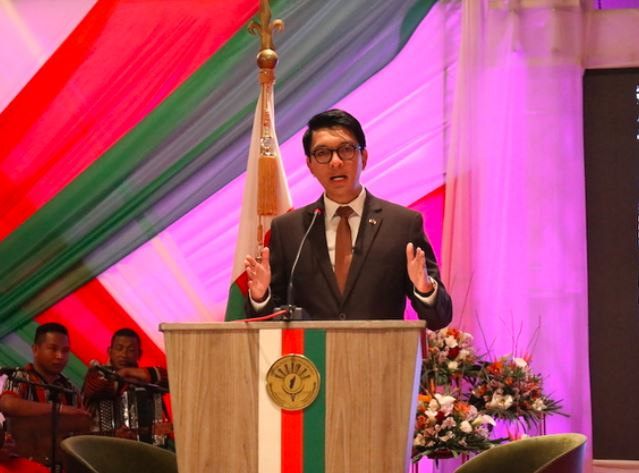
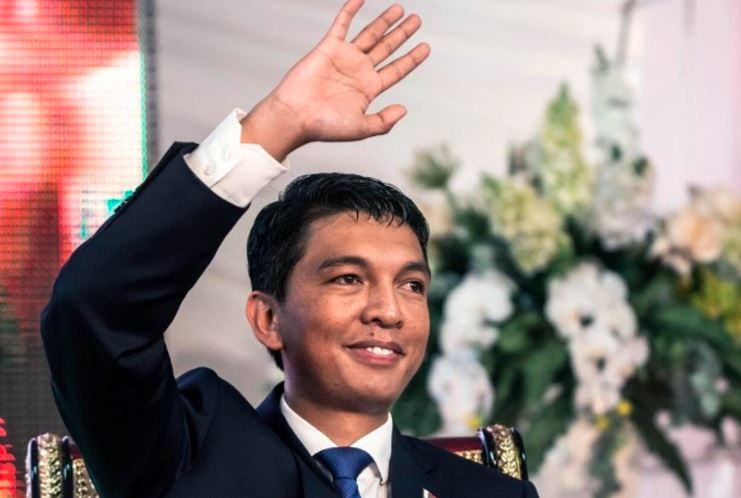

Andry Rajoelina, the president of Madagascar, has resigned from his post after being officially confirmed as one of the candidates in the upcoming presidential elections scheduled for November.

Madagascar's constitution requires a sitting head of state who wants to contest a presidential election to first resign.

Rajoelina sent his resignation letter to the court on Saturday following confirmation of his candidature in the elections, the High Constitutional Court said in a statement late on Saturday.

The president of the senate is supposed to assume presidential powers when the head of state resigns but the court said the senate head, Herimanana Razafimahefa, had declined to take over.

"For personal reasons, he will not be able to fully exercise the responsibilities that the office of Head of State requires," the court said referring to Razafimahefa.

Instead, the court said, presidential power would now be exercised by the government collectively with the prime minister as the head.

Rajoelina’s decision to run for re-election has sparked controversy and criticism from some of his opponents, who accuse him of violating the political agreement that ended the crisis in 2018. The agreement, mediated by the African Union and the United Nations, stated that neither Rajoelina nor Ravalomanana would run for president in 2018 or 2023.

However, Rajoelina has argued that the agreement was not legally binding and that he had the right to run for office as a citizen of Madagascar. He has also defended his record in office, citing his achievements in infrastructure development, health care, education and security.

Also on Saturday, Madagascar's High Court published the official list of presidential candidates. Of the 28 contenders, 13 were selected, including Rajoelina and two former presidents Marc Ravalomanana and Hery Rajaonarimampianina.

Madagascar is hoping for its third peaceful election since the upheaval of 2009, when Rajoelina ousted President Marc Ravalomanana in a coup, prompting an exodus of foreign investors from the Indian Ocean island.

