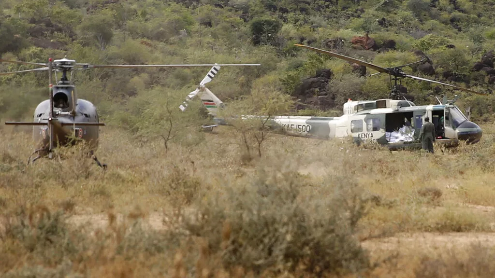

Impanuka yindege ya kajugujugu muri kenya yahitanye abagera ku 8.

Ni impanuka yabereye hafi numupaka wa Somalia na kenya . kuri uyu wa kabiri minisiteri y’ingabo muri kenya yemeje ibyayo makuru nubwo hataramenyekana icyayiteye.

Iyo kajugujugu ya gisirikare ngo yahanutse ubwo yari mu bikorwa byo kurinda umutekano muri ako gace kari hafi yumupaka wa Somalia amakuru akavuga ko abai bayirimo bose bahise bapfa.

Kuri ubu hatangiye iperereza icyakora biracyekwa ko yaba yahanuye nabarwanyi bo mu mutwe wa Al shabab ishami rya Al-Qaeda rimaze igihe rihungabanya umutekano muri Somalia na kenya.

Muri ibi bihe bya vuba kandi umutwe w’iterabwoba wa Al shabab wongereye ibitero muri Kenya bya hato na hato.

