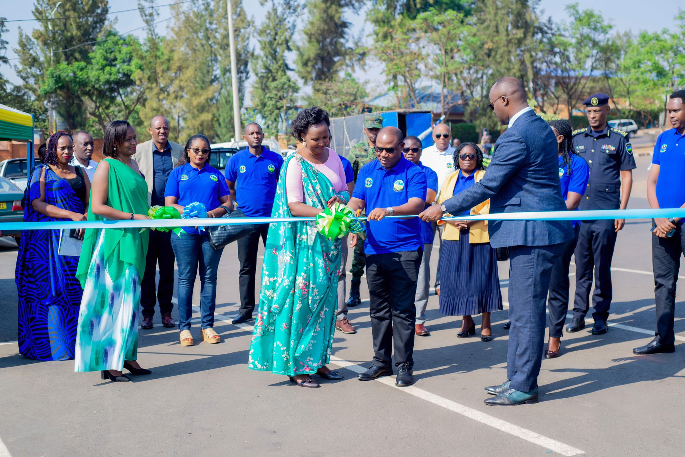
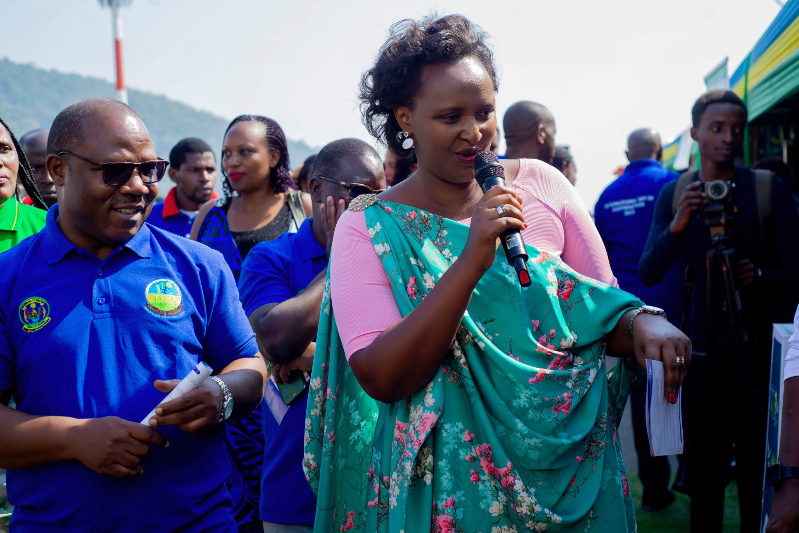
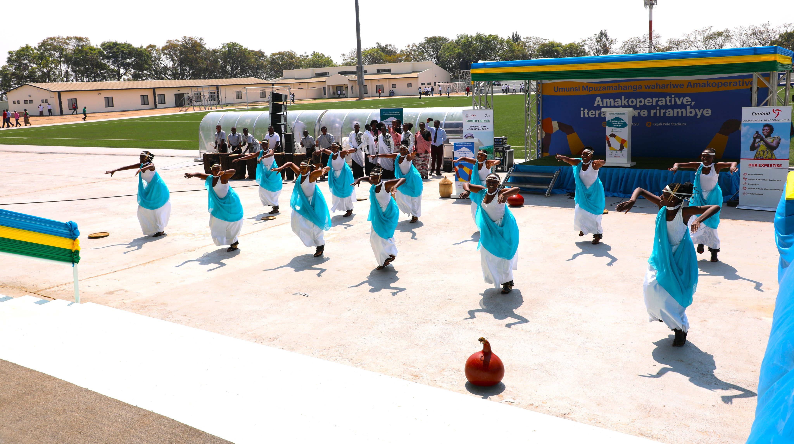
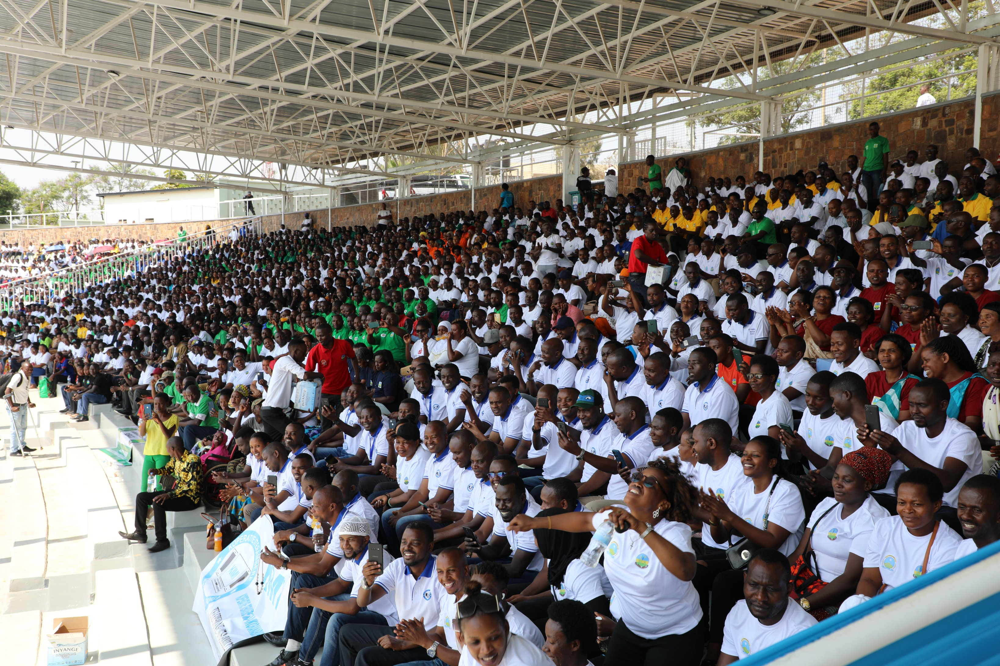
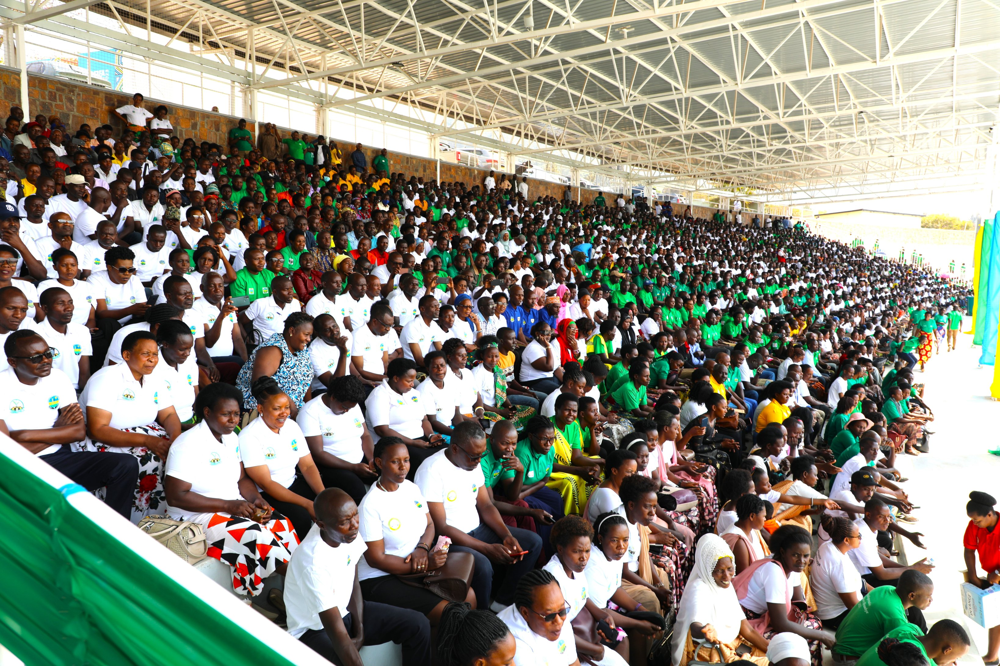
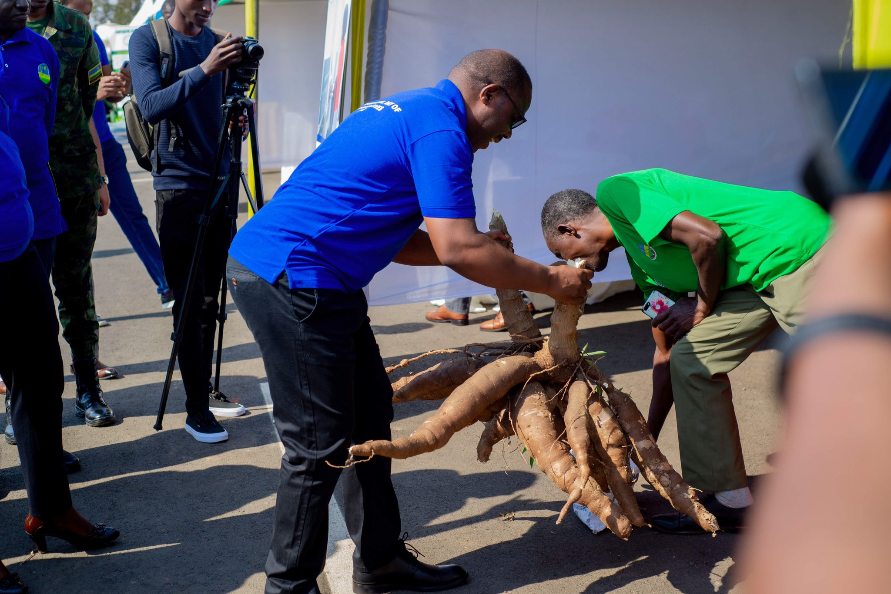
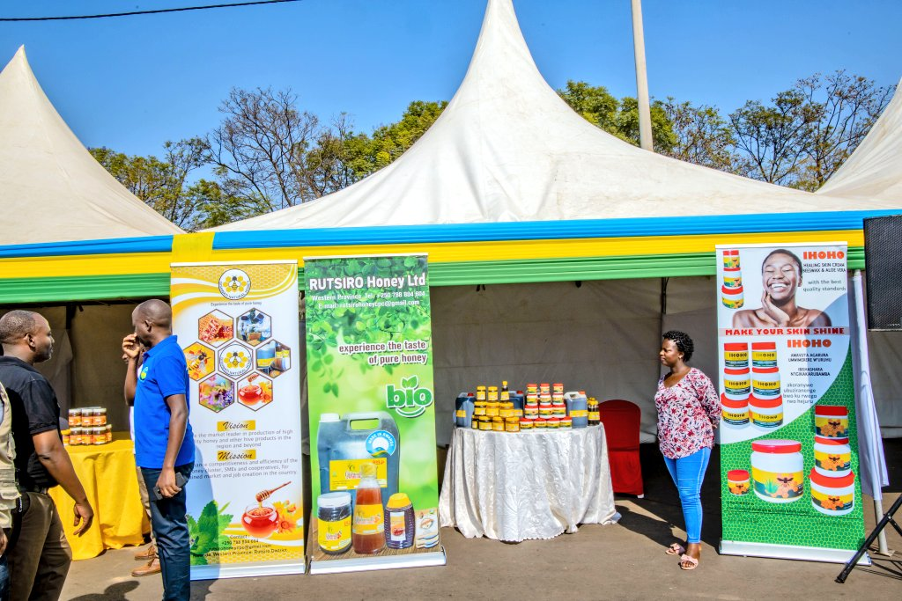
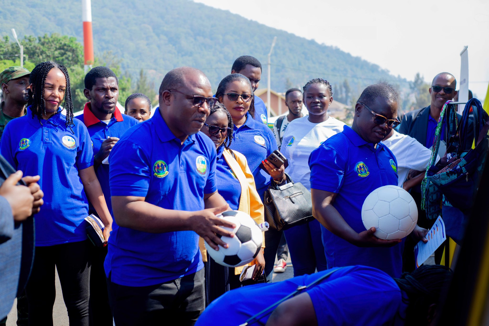

Kuri uyu wa Gatanu, Abanyamuryango basaga ibihumbi bitatu bibumbiye mu makoperative atandukanye mu Rwanda ndetse na bamwe mu bayobozi mu nzego za Leta zitandukanye bizihije umunsi mpuzamahanga wahariwe Amakoperative.

Iki gikorwa kandi kiri kuba hanamurikwa bimwe mu bikorwa n'aya makoperative byiganjemo umusaruro ukomoka ku buhinzi, byombi byabereye kuri Kigali Pele Stadium.

Bamwe mu bayobozi batandukanye bibukije bamwe mu bahagarariye aya makoperative ko atari uturima twabo ahubwo bagomba gukora uko bashoboye abaturage bayibumbiyemo bagatezwa imbere nayo muri rusange.

Ibi biravugwa mu gihe hirya no hino mu gihugu rimwe na rimwe hari abaturage bakunze kumvikana bataka ibihombo baterwa n'imicungire mibi y'amakoperative ku buryo bahora mu bihombo.

Abasesengura ubukungu bavuga ko amakoperative agira uruhare mu iterambere ry'ubukungu bw'igihugu mu gihe habayeho kuyacunga neza.

Ibi birajyana n'uko hari amwe mu bakoperative yamaze kuzamura ibyiciro by'umutungo ku buryo hirya no hino hari ibigo by'imari iciriritse bishamikiye ku makoperative ndetse bikaba bigira uruhare mu gutanga inguzanyo no ku bandi baturage.

Kugeza ubu mu Rwanda, abaturage basaga miliyoni eshanu bari mu makoperative agizwe n'abikorera, abafite ubumuga, urubyiruko, abasaza ndetse n'abakecuru.

