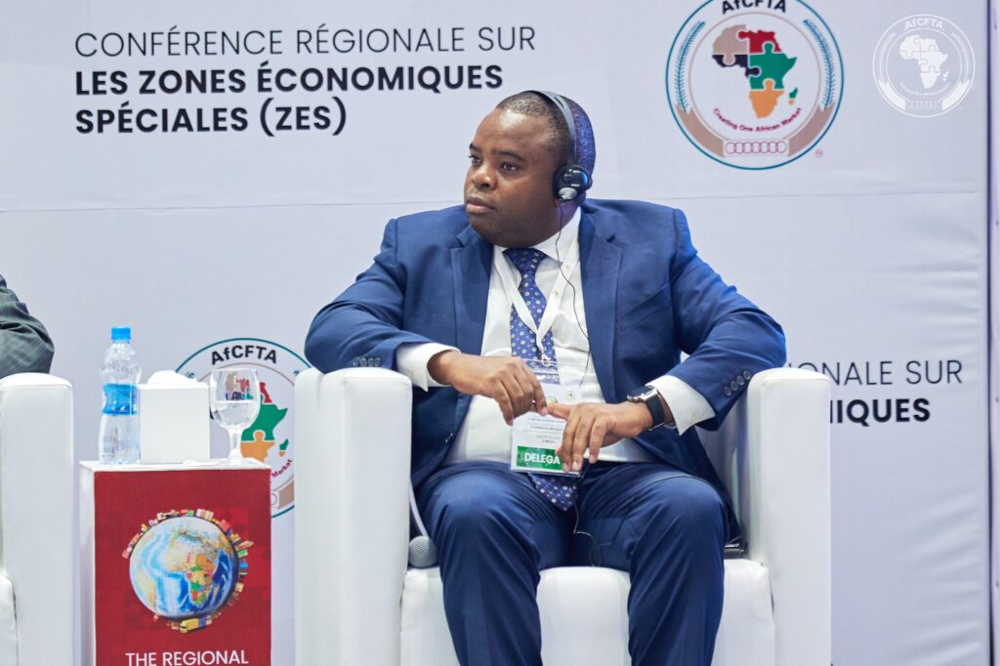
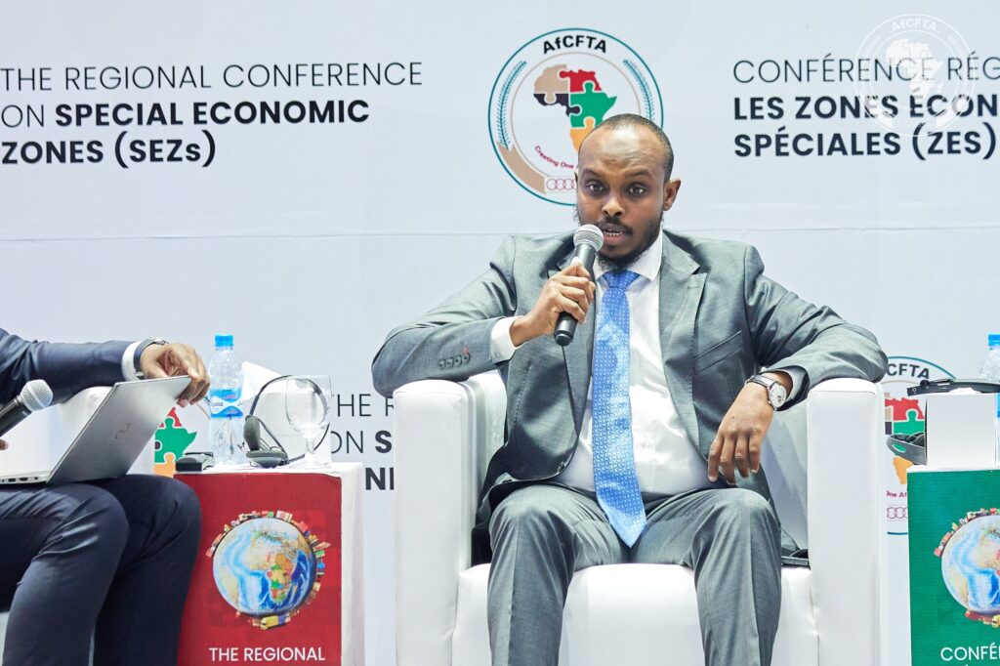
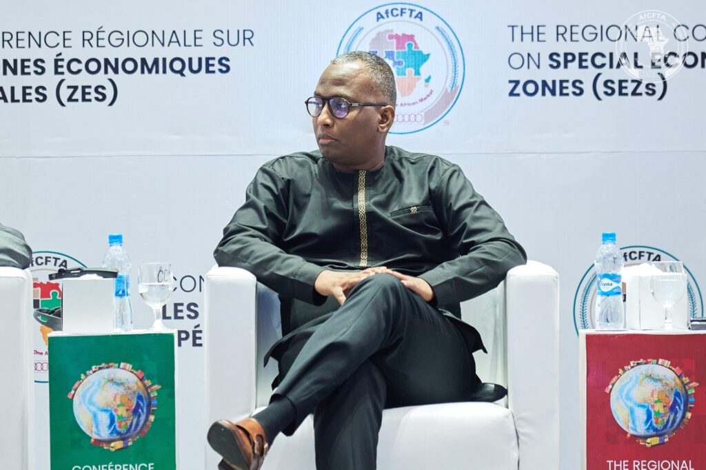
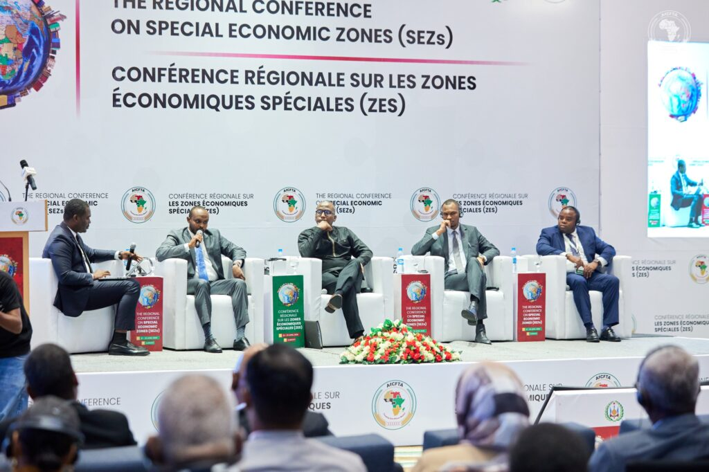
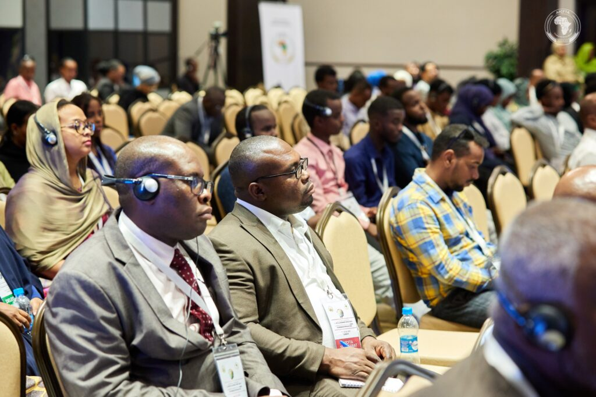
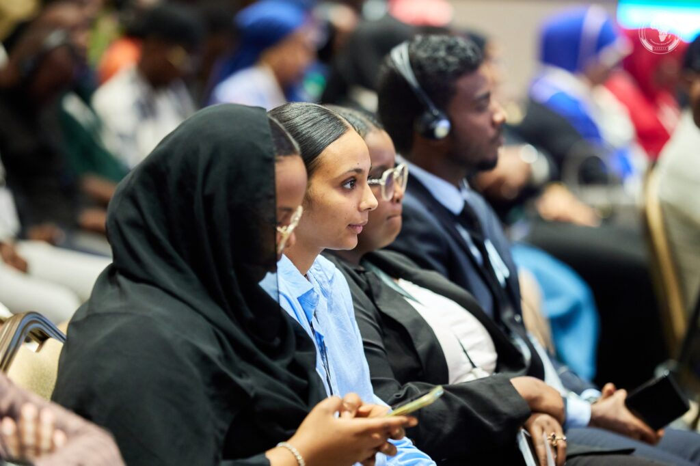
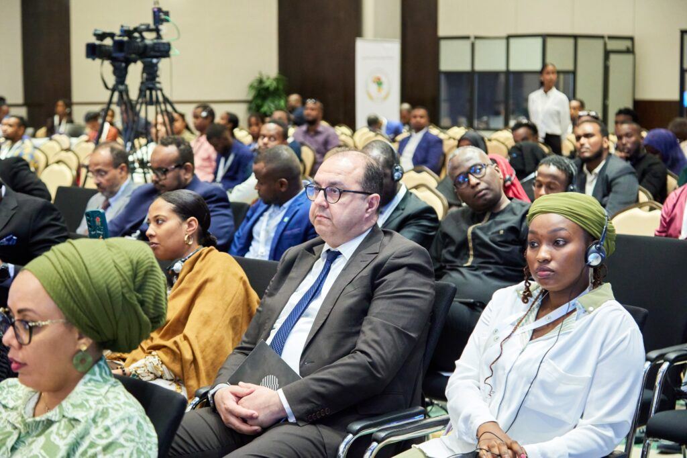

A compelling afternoon panel session at the Regional Conference on Special Economic Zones in Djibouti focused on the critical role of innovation, technology, and skills development in driving the success of SEZs and broader economic growth across Africa.

The discussion centered on how these three elements can be leveraged to transform SEZs into dynamic hubs of economic activity and contribute to the overall prosperity of the continent.

Njoroge Francis Gitau, Manager of Special Economic Zones in Kenya, emphasized the need for a comprehensive approach to innovation. "It is very critical they don’t see innovation only but also it’s right in the whole sector. Innovation, science, and technology are critical aspects," Gitau stated. He highlighted Kenya's commitment to developing its human capital, noting, "We offer training to the youth in Kenya, we understand the issue around capacity building, we ensure we have centers for where to offer trainings."

\[caption id="attachment\_1377" align="alignnone" width="1024"\] Njoroge Francis Gitau, Manager of Special Economic Zones in Kenya\[/caption\]

Kenya is a key player in the AfCFTA, with a significant portion of its exports destined for other African countries. The AfCFTA is expected to boost Kenya's intra-African trade by reducing tariff and non-tariff barriers, and to improve prospects for export diversification, particularly in manufactured goods.

The panelists explored various strategies for fostering innovation and technology adoption within SEZs. Mr. Warsama Mohamed Bouh, CEO of the Port Community System in Djibouti, discussed Djibouti's proactive measures. He cited Djibouti's partnership with Rwanda and information exchange initiatives, explaining, "Having access to information, it helped Djibouti improve logistics with Ethiopia, and that led to visibility and transparency."

\[caption id="attachment\_1380" align="alignnone" width="1024"\] Mr. Warsama Mohamed Bouh, CEO of the Port Community System in Djibouti\[/caption\]

Mr. Samatar Abdi Osman, CEO of the Centre of Technology and Innovation in Djibouti, provided a broader perspective on the African landscape. "We talk about SEZ, we have about 200 in Africa, we have about 30," He also stressed the importance of a proactive and solution-oriented mindset.

\[caption id="attachment\_1379" align="alignnone" width="1024"\] Mr. Samatar Abdi Osman, CEO of the Centre of Technology and Innovation in Djibouti\[/caption\]

Djibouti's strategic location gives it a vital role in facilitating trade under the AfCFTA. Its ports and free zones are crucial for enhancing regional integration and supply chain connectivity. Djibouti has also been actively involved in AfCFTA initiatives, recognizing the agreement's potential to strengthen its trade and logistics sectors.

Rwanda has also demonstrated a strong commitment to the AfCFTA. It was among the first countries to ratify the agreement and has been a key advocate for its implementation. Rwanda's partnership with Djibouti, focused on information exchange and logistics, exemplifies the kind of collaboration that the AfCFTA aims to foster.

The discussion underscored that the successful integration of innovation and technology requires a supportive policy environment and a focus on developing relevant skills. Mr Ba Bocar, Vice President of the Pan African Youth Union, emphasized this point, stating, “We need politics, policies, and the concentration of policy that will help with the skills; it is time for us to have pride in Africa, we have this wonderful economy that will develop in Africa."

\[caption id="attachment\_1378" align="alignnone" width="1024"\] Mr Ba Bocar, Vice President of the Pan African Youth Union\[/caption\]

The panel session highlighted that by prioritizing innovation, technology, and skills development, and by actively participating in the AfCFTA framework, African nations can maximize the potential of SEZs to drive industrialization, attract investment, and create sustainable economic growth.

The panel session highlighted that by prioritizing innovation, technology, and skills development, African nations can maximize the potential of SEZs to drive industrialization, attract investment, and create sustainable economic growth.

**African Updates**
