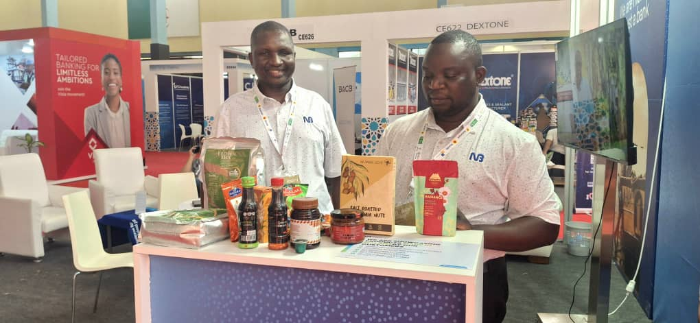
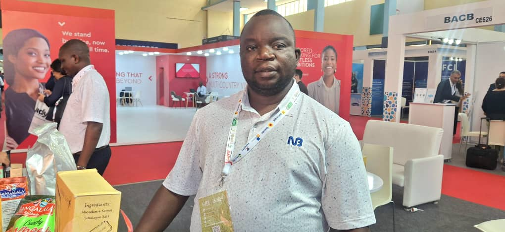
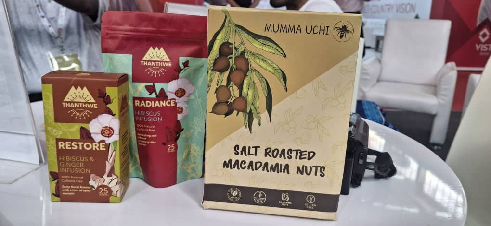
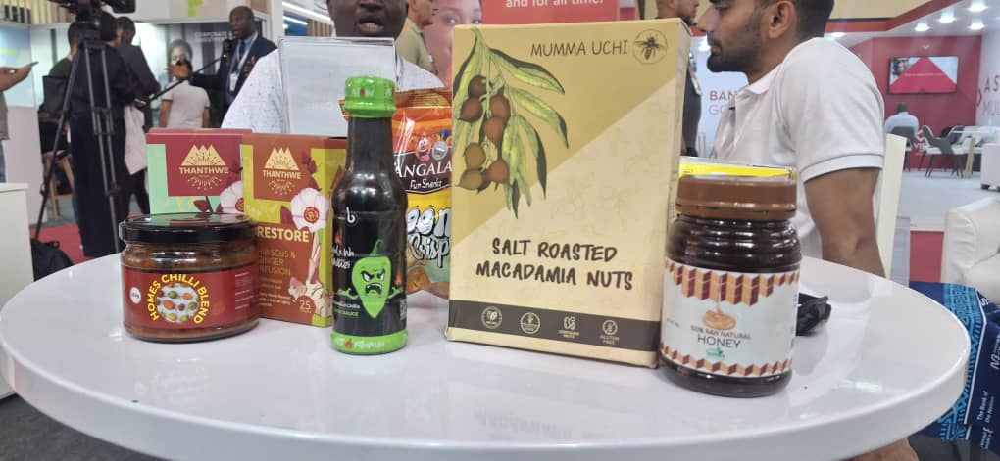
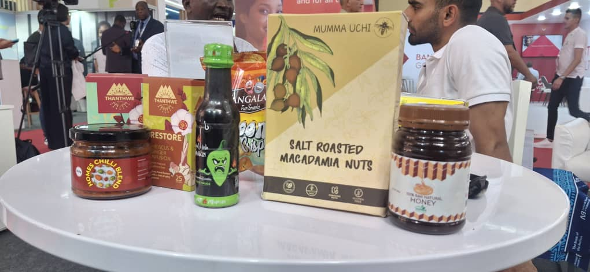
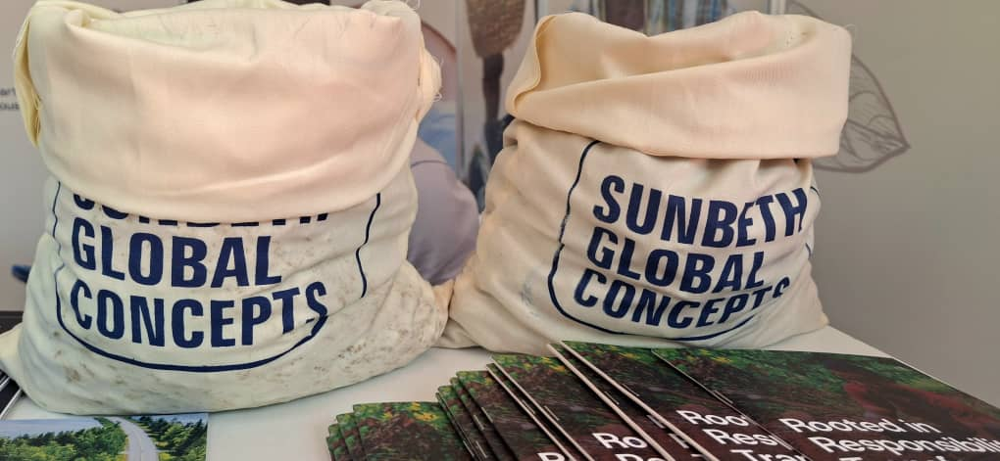
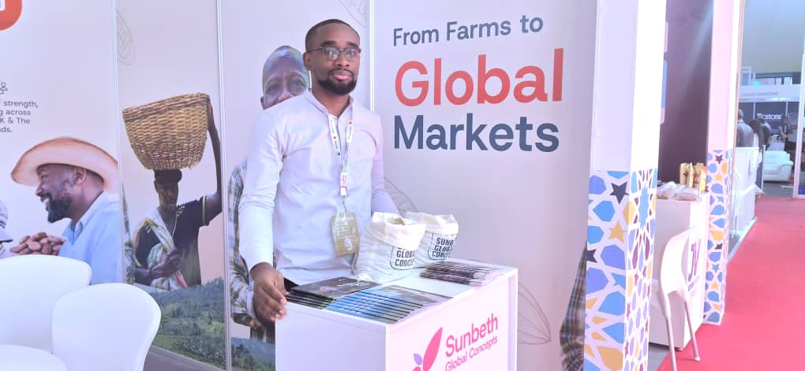

The African farmer is moving from subsistence to business. This message came out strongly at the Intra-African Trade Fair (IATF 2025) in Algiers, where Agro-processing companies from Malawi and Nigeria presented their work.

The National Bank of Malawi PLC joined the exhibition to show how local banks are backing small and medium enterprises (SMEs). The bank is supporting farmers in rice, tea, macadamia, honey, potatoes, and chili processing.

“We finance the whole value chain, from production to processing and finally to market,” said Mr. Chimweme Chijere, Business Development Manager at National Bank of Malawi. He added that African banks must play a big role in food security by giving farmers access to funds and trade tools.

The bank believes exhibitions like IATF 2025 are important. “It is our role to help Malawian producers connect to the African market under AfCFTA, People must know that Malawi has quality products that can compete worldwide.” he said.

Nigeria was also represented through Sunbeth Global Concepts, a major Agro-export company. The firm sources cashew, sesame, soybeans, and cocoa, exporting to Europe, Asia, and America.

For Sunbeth, the key to food security lies in fair farmer payment. “We pay farmers on time so they can reinvest in seeds and harvest. Many young people avoid farming because it looks unprofitable. We want to change that.” said Mr. Abdussamad Abdurrahman, Communications Manager at Sunbeth.

The company has already distributed thousands of hybrid cocoa seedlings that are resistant to disease and mature in three years instead of five. This, Mr. Abdussamad said, helps boost yields and protect farmers from crop loss.

Experts at the fair stressed that Agro-processing is vital for Africa’s growth. According to the African Union, SMEs form the backbone of the economy, creating jobs for women and youth. With AfCFTA, farmers can now trade beyond their borders and keep more value within the continent.

Both Malawi and Nigeria firms said they expect new partnerships after the fair. They also called for more African investment in agriculture, processing, and innovation.

“Beyond feeding ourselves, we must build value chains that serve Africa and the world,” Mr. Abdussamad said.

IATF 2025, now in its fourth edition, opened in Algiers on September 4 and brings together governments, financiers, and private firms to push intra-African trade. Agriculture has been one of the strongest themes at this year’s fair with focus on avoiding hunger and ensuring food security for the continent.

\[caption id="attachment\_1426" align="alignnone" width="1020"\] Mr. Chimweme Chijere, Business Development Manager at National Bank of Malawi\[/caption\]

    

**African Updates**
