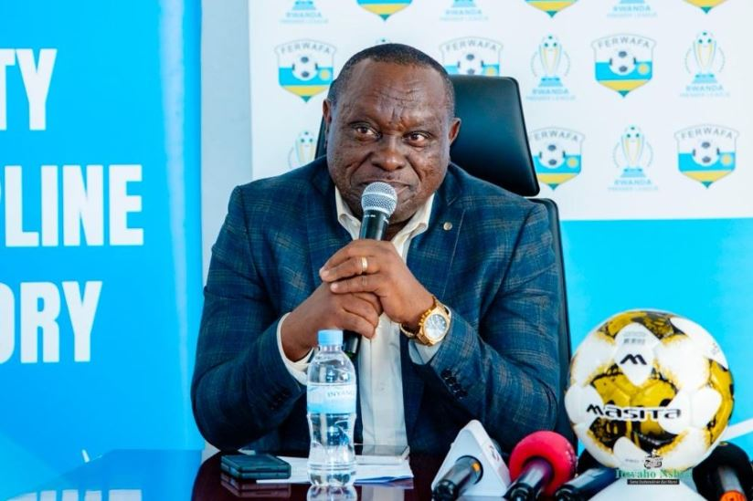

Umuyobozi wa Rwanda Premier League (RPL), Mudaheranwa Yussuf, yatangaje ko buri kipe ikina Shampiyona y’icyiciro cya mbere mu Rwanda izahabwa nkunganire ya miliyoni 4.5 Frw, kubera imikino itandatu y’inyongera izakinwa nyuma yo kwemererwa gukina kwa makipe atatu yo muri Sudani yahungabanyijwe n’intambara.

Ibi byemejwe nyuma y’uko Ishyirahamwe ry’Umupira w’Amaguru mu Rwanda (FERWAFA) ku itariki ya 24 Ukwakira 2025, ryemeye ko Al-Merrikh SC, Al Hilal Omdurman, na Al Ahli Wad Madani zituruka muri Sudani, zifatanya n’amakipe y’u Rwanda muri uyu mwaka w’imikino. Ibi bije nyuma y’uko muri Sudani intambara hagati y’ingabo za Leta n’inyeshyamba za RSF imaze imyaka ibiri ihungabanya ibikorwa byose bya siporo.

Mu kiganiro n’abanyamakuru kuri uyu wa mbere, Mudaheranwa yavuze ko iyi nkunganire igamije gufasha amakipe yo mu Rwanda gukomeza gukora neza muri shampiyona yongerewe imikino.

“Kuva amakipe yacu azakina imikino y’inyongera itandatu, buri imwe izahabwa miliyoni 4.5 Frw kugira ngo izabashe kwikemurira ibibazo by’ingendo n’imyiteguro,” Mudaheranwa Yussuf, Chairman wa Rwanda Premier League.

Nyuma yo kwakira ayo makipe mashya, Rwanda Premier League igizwe n’amakipe 19, ibintu bitari bisanzwe kuko ubusanzwe igizwe n’amakipe 16. Mu mikino ibanza, amakipe yo muri Sudani azakina nk’abakina ibirarane, naho mu mikino yo kwishyura hakazajyaho gahunda yihariye ituma buri munsi wa shampiyona habaho ikipe imwe iruhuka.

Nubwo yakiriye ayo makipe, Mudaheranwa yemeje ko nta na kimwe kizitabira guhatanira ibihembo by’amakipe umunani ya mbere, kuko ibihembo byateguriwe amakipe y’u Rwanda gusa.

“Ayo makipe azitabira irushanwa nk’abandi bose ariko ntazinjire mu mafaranga y’ibihembo. Ibyo bihabwa amakipe 16 yo mu Rwanda gusa,” Mudaheranwa Yussuf.

\[caption id="attachment\_1485" align="alignnone" width="824"\] Mudaheranwa Yussuf, Umuyobozi wa Rwanda Premier League (RPL)\[/caption\]

Amategeko ya RPL agena ko ikipe itemerewe kugira abanyamahanga barenze umunani (8) mu bakinnyi bayo. Aya mategeko azakurikizwa no ku makipe yo muri Sudani. Abakinnyi bafite ubwenegihugu bwa Sudani bazafatwa nk’abenegihugu mu mikino, mu gihe abandi bakomoka mu bindi bihugu bazabarwa nk’abanyamahanga.

FERWAFA ivuga ko iyi gahunda yo kwakira amakipe yo muri Sudani ifite intego yo “gufasha ubufatanye bwa siporo ku mugabane wa Afurika” ndetse no gutanga umusanzu mu gukomeza ubuzima bwa siporo mu bihugu byugarijwe n’intambara.

Biteganyijwe ko ayo makipe azagera mu Rwanda mu mpera z’iki cyumweru, nyuma yo kubona uburenganzira bwa CAF (Confederation of African Football), kandi azatangira gukina mu cyumweru gitaha.

 

**Divine Mutoni / African Updates**
