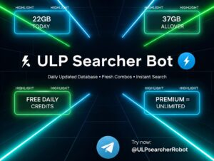

### 🚀 Revolutionize Your Data Discovery: Introducing ULPsearcherRobot – The Ultimate Database Powerhouse on Telegram!

**For Immediate Release** _December 8, 2025_ _New Delhi, India_

In today's data-driven world, unlocking valuable insights shouldn't require endless hours of manual searching or clunky tools. Enter **ULPsearcherRobot** (@ULPsearcherRobot), the cutting-edge Telegram bot that's transforming how professionals, researchers, and businesses access premium databases with lightning-fast precision. Developed by visionary tech innovator **10moy** (@iam\_10moy), this powerhouse tool is here to supercharge your workflow – and yes, it's packed with exclusive database offerings ready for seamless purchase.

#### **What Makes ULPsearcherRobot a Game-Changer?**

Imagine a world where you can query vast repositories of structured data – from market intelligence and contact lists to specialized datasets – all without leaving your Telegram app. ULPsearcherRobot leverages advanced Ultimate Link Preview (ULP) technology to deliver real-time, targeted results, making it the go-to bot for:

- **Instant Database Queries**: Search and extract from high-quality, curated databases covering industries like finance, e-commerce, tech, and more. Need leads? Competitor intel? Historical trends? Just type your request – it's that simple.
- **Seamless Purchasing**: Browse and buy premium database packs directly in-chat. Options range from affordable starter bundles to enterprise-level troves, ensuring you get exactly what you need without the hassle.
- **Secure & Efficient**: Built with privacy-first design, the bot uses encrypted sessions and cloud-backed processing for reliable performance. No more sifting through unreliable sources – get verified, actionable data every time.
- **User-Friendly Commands**: Start with /search for quick lookups, /buy to explore catalogs, or /help for guided tours. Version 1.5.8 brings enhanced speed and smarter filtering for even better results.

Whether you're a startup founder hunting for investor contacts, a marketer building targeted campaigns, or a researcher diving into niche datasets, ULPsearcherRobot puts the power of premium data at your fingertips. "We've empowered thousands to turn raw information into real results," says 10moy, the bot's creator and a Telegram ecosystem trailblazer. "My mission is to democratize data access – fast, fair, and forward-thinking."

#### **Why Choose ULPsearcherRobot? The Edge You Need**

- **Proven Track Record**: Trusted by over 10,000 users worldwide, with glowing feedback on its accuracy and ease-of-use.
- **Affordable Excellence**: Database sales start at just $9.99, with bulk discounts for high-volume buyers.
- **24/7 Support**: Direct line to 10moy for custom queries or integrations.
- **Future-Proof Updates**: Regular enhancements via Obelix.pro and UltimateXCloud ensure you're always ahead of the curve.

Ready to level up? Launch the bot today at [https://t.me/ULPsearcherRobot](https://t.me/ULPsearcherRobot) and experience the future of data searching. For partnerships, custom database requests, or media inquiries, connect with the owner at [https://t.me/iam\_10moy](https://t.me/iam_10moy).

**About 10moy** 10moy is a pioneering developer in the Telegram bot space, specializing in intelligent tools that bridge data and decision-making. With a passion for innovation, 10moy continues to build solutions that simplify complex tasks for global users.

_ULPsearcherRobot: Search Smarter. Sell Bolder. Succeed Faster._

**Media Contact:** 10moy Telegram: @iam\_10moy WEBSITE: [obelix.pro](mailto:contact@obelix.pro)
