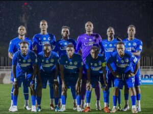
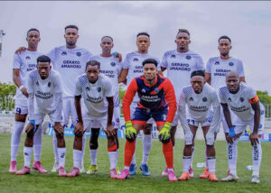

<!--more-->Kuri uyu wa gatanu I saa cyenda zamanywa kuri kigali pele stadium Ikipe ya A.S Kigali yakiraga umukino wumunsi wa 6 wa shampiyona wayihuzaga na Police FC, umukino ukaba urangiye ntakipe ibashije kureba mu izamu ryindi.

Ibivuye muri uyu mukino bisa nibitari byitezwe na benshi kuko aya makipe yombi yahuye harimo ikinyuranyo kinini ku rutonde rwa shampiyona aho A.S Kigali yakiriye umukino yariri ku mwanya wa cumi nagatanu namanota ane mugihe police FC yari iyoboye urutonde rwa shampiyona namanota 16.

A.S kigali mu mikino itanu yaherukaga gukina yatsinzemo umwe, itsindwa itatu inganya umwe. Ni mugihe POLICE FC mu mikino itanu yaherukaga yatsinze ine inganya umwe.

Imikino imaze kuba ibiri ikurikirana police FC inganya kuko inaherutse kunganya na Mukura victory Sport. police FC yatangiye urugendo rwa shampiyona ifite umuvuduko yanatanganga icyizere cyo kuzahagarika Amakipe akomeye muri shampiyona y’Urwanda nka APR FC na Rayon Sport ikaba yongeye gukomwa mu nkokora na AS Kigali.

Police FC yakinnye uyu mukino idafite umusore wayo byiringiro lague wakuwe ku rutonde numutoza Ben Moussa nyuma yuko avuye mu mwihorero akagaruka atinze nubwo uyu mukinnyi we avuga ko ari kubwimpamvu zuburwayi.

Umukino wo kuri uyu munsi usize AS Kigali izamukaho imyanya itatu rutonde kuko ivuye ku mwanya wa cumi nagatanu ubu ikaba iri ku mwanya wa cumi nakabiri namanota atanu nimugihe kandi kurundi ruhande Police fc ikomeje kuyobora urutonde rwa shampiyona namanota cumi narindwi ikaba ikurikiwe na rayon sport ifite cumi natatu.

 

**Mutoni Divine / African Updates**
