Muri congere y’abacungamari bo mu karere ka Afurika y’iburasirazuba EACOA iteraniye I Kigali mu Rwanda abo bacungamari bahawe umukoro wo kugira uruhare mu gushyira mu bikorwa gahunda y’amasezerano y’isoko rusange AfCFTA

ibyo ni ibyagarutsweho mu kiganiro cyatanzwe kuri uyu wa gatatu tariki ya 17 mata, 2024 cyagarukaga ku mahirwe n’imbogamizi  Bihari ku masezerano y’isoko rusange ry’afurika.

Antoine Kajangwe umuyobozi Mukuru ushinzwe Ubucuruzi n’Ishoramari muri minisiteri y’ubucuruzi n’inganda mu Rwanda, yagarutse ku masezerano y’isoko rusange ry’afurika yashyiriweho umukono I Kigali mu Rwanda mu 2018, avuga ko agamije guhuriza hamwe isoko rigari ry’afrika binyuze mu guhahirana kw’ibihugu bigize umugabane.

Kajangwe Yavuze ko uyu munsi hari bimwe mu bihugu byatangiye kungukira kuri aya masezerano y’isoko rusange ry’afurika kuko ibirmo u Rwanda byatangiye kujyana bimwe mu bicuruzwa byabyo ku isoko ry’ibindi bihugu.

Yashimangiye ko imiryango yo mu karere ibihugu birimo nk’iwa afurika y’iburasirazuba EAC igomba kubakira kuri AfCFTA kandi ko mugihe iyo miryango yakubahiriza intego zayo ntakabuza ko afurika izahurira ku isoko rimwe.

\[caption id="attachment\_1153" align="alignnone" width="1198"\]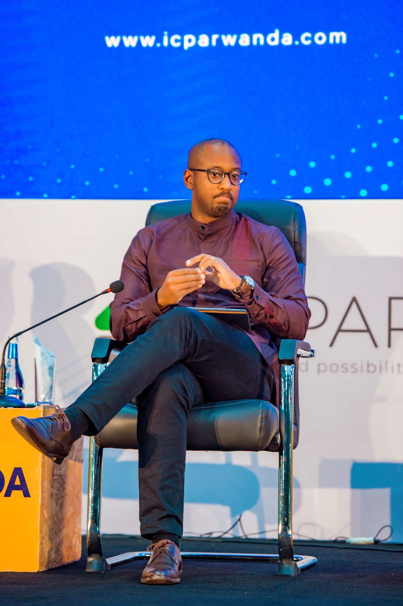 Antoine Kajangwe umuyobozi Mukuru ushinzwe Ubucuruzi n’Ishoramari muri MINICOM\[/caption\]

Bwana Olivier Rwamasirabo yavuze ko hari imbogamizi zo guhahirana zirimo n’ikibazo cy’umutekano icyakora ashima ko amavugurura y’umuryango w’afurika yunze ubumwe yahaye umurongo icyo kibazo nko gushyiraho igisirikare gihuriweho n’ibihugu binyamuryango.

Rwamasirabo, yavuze ko afite inzozi zo kuzabona umugabane wa afurika uhahirana mu mpande zose nkuko biteganywa n’amasezerano y’isoko rusange ry’afurika.

\[caption id="attachment\_1154" align="alignnone" width="1198"\]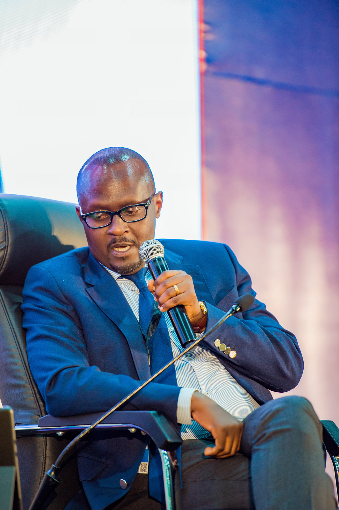 Mr Olivier Rwamasirabo\[/caption\]

Abitabiriye ibyo biganiro basabye ko abikorera bafata iya mbere mu gushyira mu bikorwa ibyemezo biba byafashwe na za leta mu kworoshya ubcuruzi.

Amasezerano ashyiraho isoko nyafurika avuga ko 90% y’ibicuruzwa bizakurirwaho imisoro mu gihe biri gucuruzwa hagati y’Umugabane wa Afurika kandi byahakorewe, intego igomba kuzaba yagezweho nibura mu mwaka wa 2034.

Biteganijwe ko icyo gihe Afurika izaba ituwe na miliyari 1.8 z’abantu, bavuye kuri miliyari 1,3 bariho uyu munsi, ndetse rigatanga imirimo irenga miliyoni 100 hirya no hino.

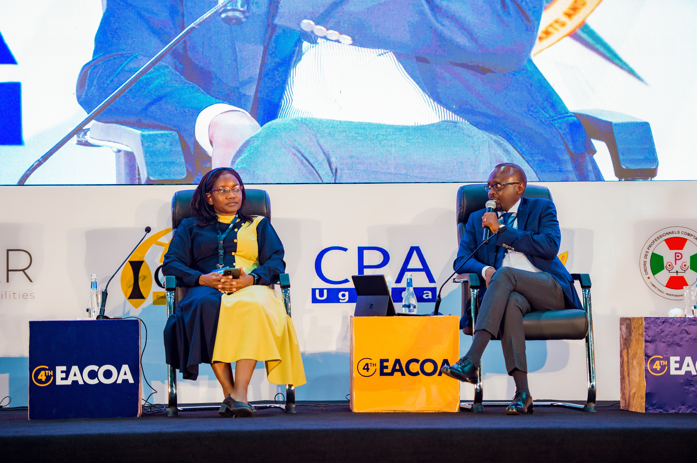

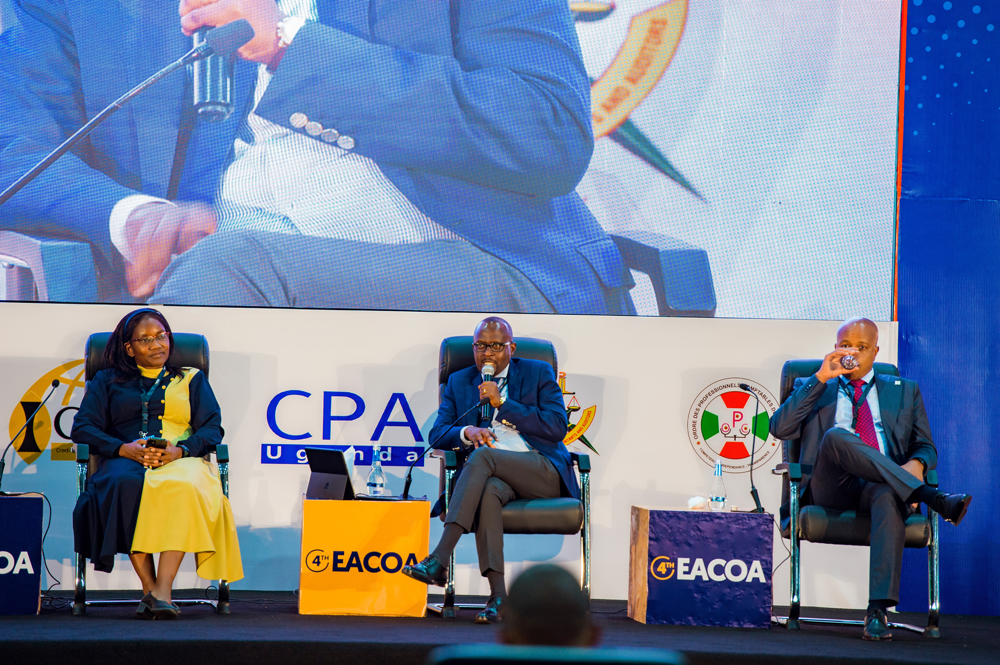

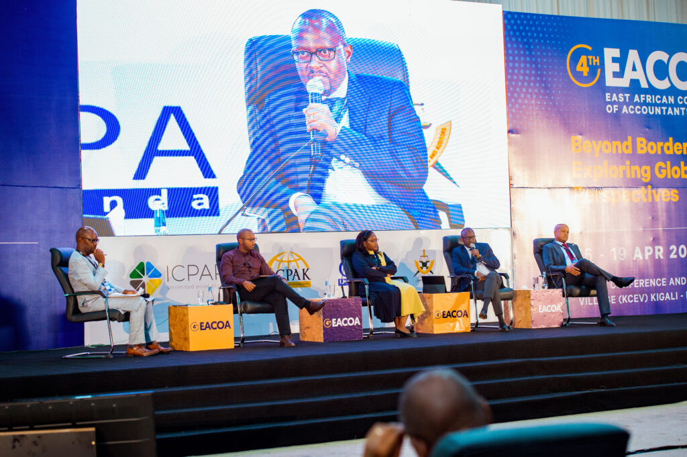

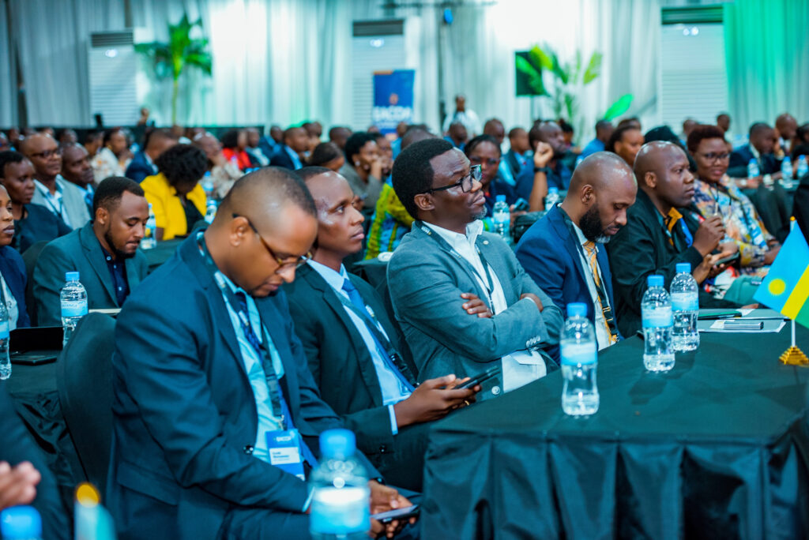

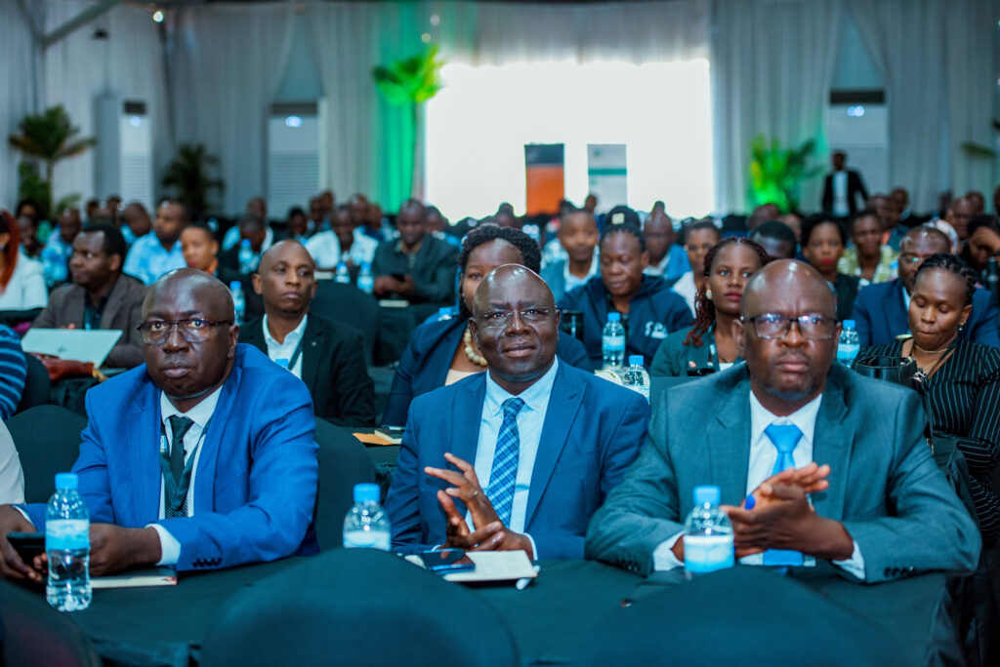

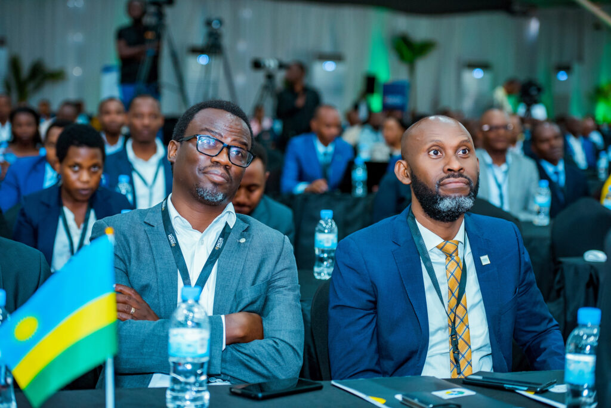

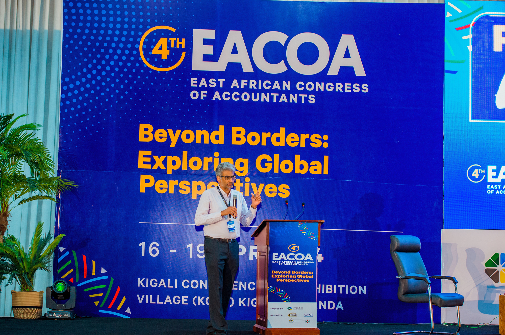

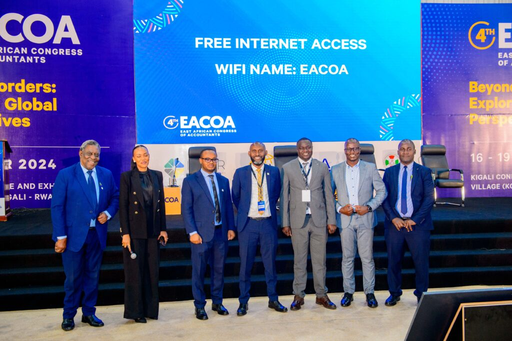

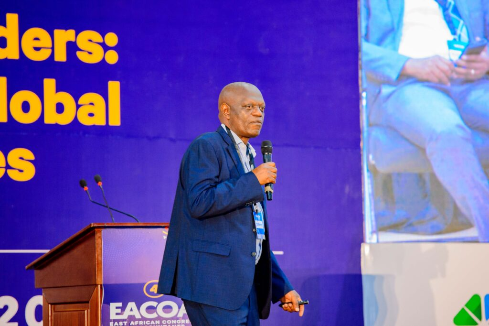

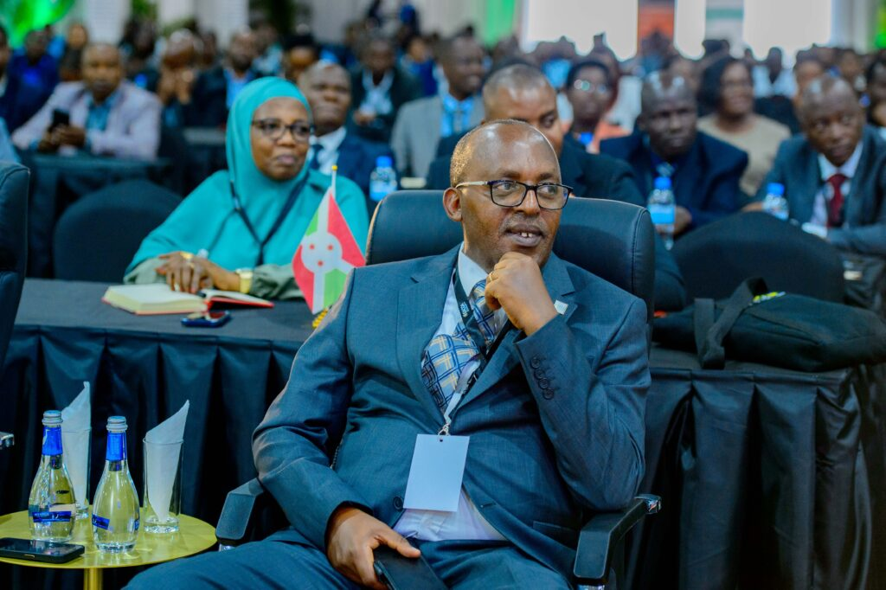

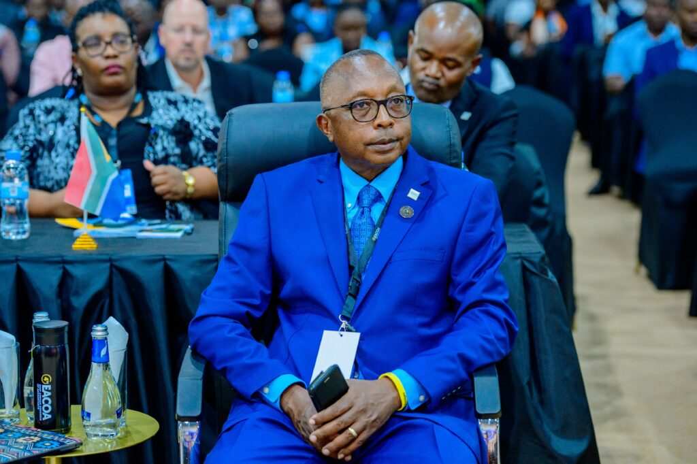

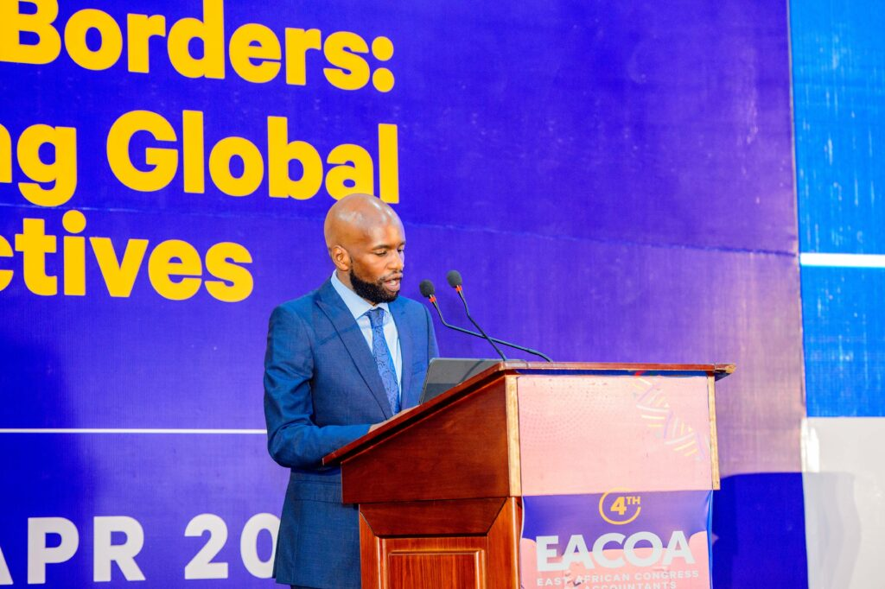

 

**African Updates**
