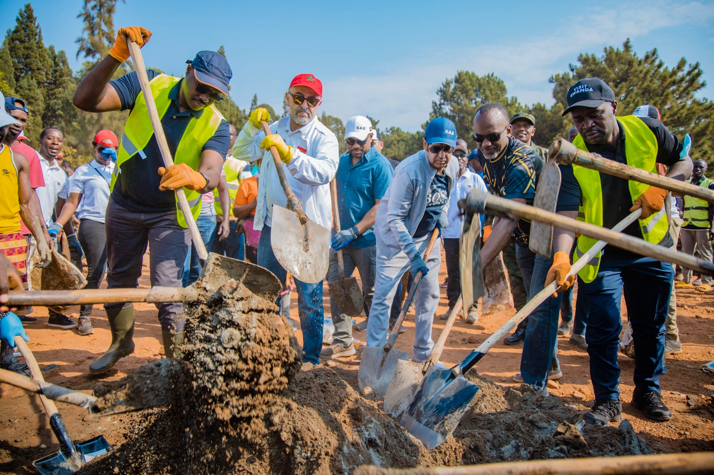
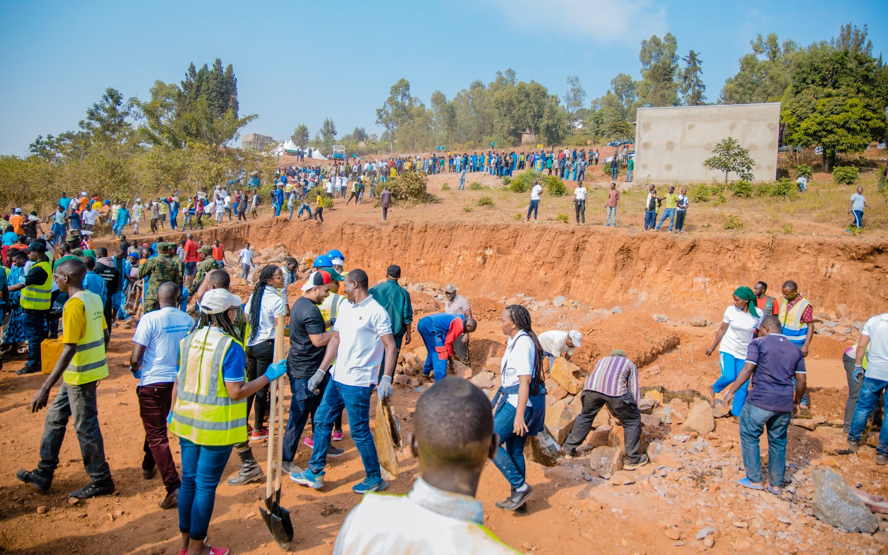

Bamwe mu baturage bavuga ko kwegerezwa amarerero hafi yabo, ari kimwe mu bizafasha abana babo mu bijyanye n'uburezi n'uburere ndetse no kugira imikurire myiza.

Kuri uyu wa Gatandatu bamwe mu bahagarariye ibihugu byabo mu Rwanda n’abandi bayobozi bifatanyije n’abo baturage mu gikorwa cyo kubaka irerero ry'ikitegererezo mu Murenge wa Kimisagara.

Ni irerero ririmo kubakwa mu Mudugudu wa Sangwa, Akagali ka Kimisagara, rifite ubushobozi bwo kwakira abana 240.

Hubatswe umusingi w’inyubako zaryo ndetse hahangwa umuhanda urigeraho.

Abatuye muri aka gace kegereye umusozi wa Mont Kigali bavuga ko iri rerero rikenewe kuko ababyeyi  bagiraga ikibazo cyo kubona aho basiga abana mu gihe bagiye mu mirimo.

Bamwe mu bahagarariye ibihugu byabo mu Rwanda ndetse na Minisitiri wa Siporo mu gihugu cya Mali n’itsinda ayoboye bari mu Rwanda, mu rwego rwo kwitabira imikino ya Basketball yo ku rwego rw’Afurika mu bagore, nabo bifatanyije n’abaturage muri iki gikorwa cyo gutangira kubaka iri rerero.

Minisitiri Abdoul Kassim Ibrahim Fomba na Ambassadeur wa Leta Zunze Ubumwe z’Abarabu mu Rwanda Hazza AlQahtani bahuriza ku kuba umuganda ari igikorwa gifite agaciro gakomeye.

Umuyobozi w’Umujyi wa Kigali, Pudence Rubingisa avuga ko ibikorwa byose biba bigamije kuzana impinduka nziza ku muturage

Biteganijwe ko mu kwezi kwa 9 uyu mwaka irerero ryatangiye kubakwa rizaba ryuzuye, rikazatwara agera kuri miliyoni 30 z’amafaranga y’u Rwanda.

