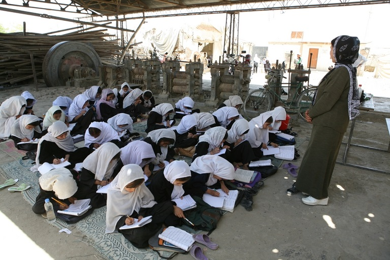
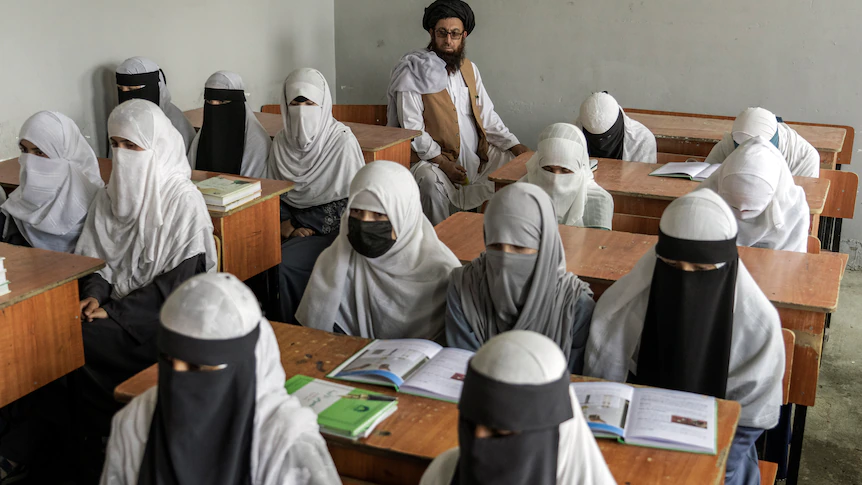

Muri afganistan abatanga serivise mu nzu zita ku bwiza bw’abagore batangiye gufunga imiryango bashyira mu bikorwa itegeko ry’abatalibani. Baavuga ko ari uburyo bwo gukomeza gusubiza inyuma umukobwa bagasaba amahanga kugira icyo yabikoraho.

Kuva kuri uyu wa kabiri abafite ibikorwa byatangaga serivise mu nzu zita ku bwiza bw’abagore batangiye kubika ibikoresho abandi bafunga imiryango. Ni nyuma y’icyemezo  cyafashwe numutwe w’abataliban bayoboye icyo gihugu bategeka ko izo nzu zifungwa burundu.

Ni icyemezo cyakiriwe nabi n’abatangaga izo serivise biganjemo abagore bavuga ko ari umugambi w’abatalibani wo gukomeza gukandamiza abagore ndetse baabsubiza inyuma.

Uretse guhagarika ibyo bikorwa abagore aho muri afganistan ntibemerewe gutwa ibinyabiziga, kujya mu mashuli yisumbuye na za kaminuza, ntibemerewe kandi kugera ku bibuga bikinirirwaho imikino itandukanye cg ahandi ho kwidagadurira, inzu zikorerwamo imyitozo ngororamubiri zizwi nka gym ndetse n’ibindi.

Si ibyo gusa kuko Kuva mu kwezi kwa 8, 2021 ubwo abatalian ageraga I kabul bongeye gutegeka abagore n’abakobwa kwitwikira umubiri wose mu gihe bari mu ruhame. Uyu munsi rero  ngo kuba boneye guhagaika aho bamwe bari bateze amakiriro ngo ni ikibazo kibakomereye . uyu yitwa angela alizadeh asanzwe akora ibijyanye n’ubwiza yaganiriye n’ikinyamakuru CGTN

> **_"Nta burezi nta kaminuza, n’amashuli yarafunzwe. Ibintu byose byarahagaritswe  ubu byanyobeye ndibaza aho najya cg icyo nakora. Ubu nihe nakura icyo gutungisha umuryano wanjye:_**

Hagati aho ariko umutwe w’abataliban uvuga ko ngo guhagarika ayo ma salon ari uburyo bwo kurengera imiryango ikennye itabashaga kuyajyamo ariko kandi ngo abenshi mu bakora ibyo ntibahuza n’amahame ya islam nkuko byatangajwe na minisiteri ifite kubungabunga umuco mu nshingano.

Mu bihe bitandukanye kandi ikibazo cy’uburenganzira bw’abakobwa n’abagore cyakunze kuvugwaho icyakora nubu ntikirabonerwa umuti cyane aho muri afganistan.

mu nama mpuzamahanga yita ku iterambere ry’abagore Women deliver 2023 iherutse kubera I Kigali mu Rwanda iki kibazo cyongeye kugarukwaho na Sabana basiji rashikh washinze ishuli ry’abakobwa bo muri afganistan SOLA aha yagarukaga ku bibazo bikomeye igihugu cye gifite.

> **"Ikibazo cy’imbere mu gihugu ni ukko afganistan ari cyo gihugu cyonyine kuri uyu mubumbe aho bibujijwe n’amategeko ko umwana w’umukubwa yakwiga amashuli yisumbuye**
> 
> **Birababaje kandi biteye isoni kuba ndi kuvuga ibintu nkibyo. Bikwiriye kwitabwaho ndetse isi yose ikabimenya ko afganistan nkigihugu usanga umwana w’umukobwa abujijwe kuba yabona bimwe mu bintu by’ibanze ku burenganzira bwa muntu .**
> 
> **indi mbogamizi ya 2 turi guhura nayo  ituruka hanze ni uburyo abantu babona afganistan, kumva ibivugwa n’abataliban ko abagabo, abasore, basaza bacu bose batiteguye kuba babona bashiki babo bajya ku ishuli. Uyu ni umwaka wacu wa 2 hano mu Rwanda, bivuze ko ari umwaka wa 2 w’amashuli.**
> 
> **Ubwo twashyiraga hanze imyanya y’abanyeshuli twifuza muri iki gihe ku myanya 25 yari ihari mu ishuli twakiriye inyandiko 2000 zabanya afganistan basaba kuza kwiga baturutse mu bihugu 20 byo hirya no hino ku isi. Ibyo ubwabyo bikwiye kukwereka ko imiryango y’abanyafganistan ababyeyi, basaza na bashiki babo biteguye gushyigikira abakobwa babo ku kiguzi icyo aricyo cyose."**
> 
> Aba Taliban basubiranye ubutegetsi mu 2021 icyo gihe bavugaga ko nta mahame asubiza ahasi abakobwa azagarukaho icyakora bidateye 2 bagenda bakaza ingamba nubwo nuyu munsi imiryango mpuzamahanga itandukanye ntacyo ibikoraho.
