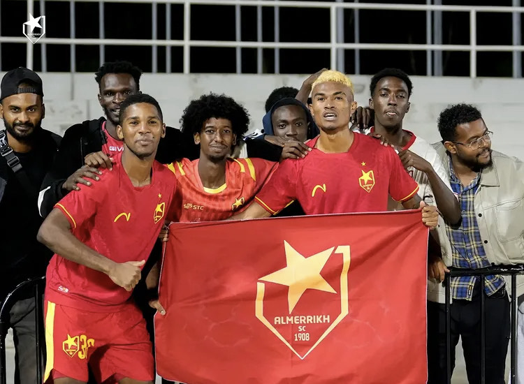

Ku mugoroba wo kuri uyu wa Mbere kuri Kigali Pele Stadium, Kiyovu Sports yakiriye Al Merrikh mu mukino w’umunsi wa shampiyona warangiye Kiyovu itsinzwe ibitego 2-0.

Al Merrikh itozwa na Darko Novic wahoze muri APR FC, ikaba ari imwe mu makipe abiri yavuye muri Sudani yemerewe gukina Shampiyona y’u Rwanda. Yabashije kwandikisha intsinzi ya mbere muri shampiyona, itsinda Kiyovu Sports mu mukino utari woroshye.

Ibitego byombi byatsinzwe mu gice cya kabiri n’abakinnyi ba Al Merrikh, Daouda Ba na Mohammed Teya. Igitego cya mbere cyinjiye ku munota wa 68, naho icya kabiri kinjira ku munota wa 87, bituma Al Merrikh ibona amanota atatu ya mbere kuva yagera mu Rwanda.

Ku ruhande rwa Kiyovu Sports, yaherukaga gutsindirwa na Gasogi United. Ibi byatumye iguma ku mwanya wa munani n’amanota 10, bikomeza kuyisubiza inyuma ku rutonde rw’agateganyo.

Amakipe yombi aturutse muri Sudani akomeje kwitwara neza, dore ko na Al Hilal iherutse gutsinda A.S Kigali ibitego 2-0. Byitezwe ko aya makipe yombi azatanga umukoro ukomeye mu makipe yo mu Rwanda kubera urwego ruri hejuru. Ku rundi ruhande, aya makipe asanzwe mu Rwanda yo yishimira uyu mwihariko kuko bizafasha kuzamura ireme n’urwego rw’imikino ya shampiyona muri rusange.

\[caption id="attachment\_1530" align="alignnone" width="750"\] Abakunzi bya Almerrikh bari baje gushyigikira ikipe yabo.\[/caption\]

**Mutoni Divine / African Updates**
