Kuri uyu wa kane tariki ya 04 Nyakanga, 2024 u Rwanda ruri kwizihiza umunsi w’ubwigenge. Mu birori bibereye ijisho biri kubera kuri Stade Amahoro I Remera mu mujyi wa Kigali.

Byitabiriwe n’abahagarariye ingabo mu bihugu birimo Uganda, Tanzania, Sierra Leone na Kenya. Hari abaturage baturutse mu bice bitandukanye by’igihugu.

\[caption id="attachment\_1249" align="alignnone" width="1257"\]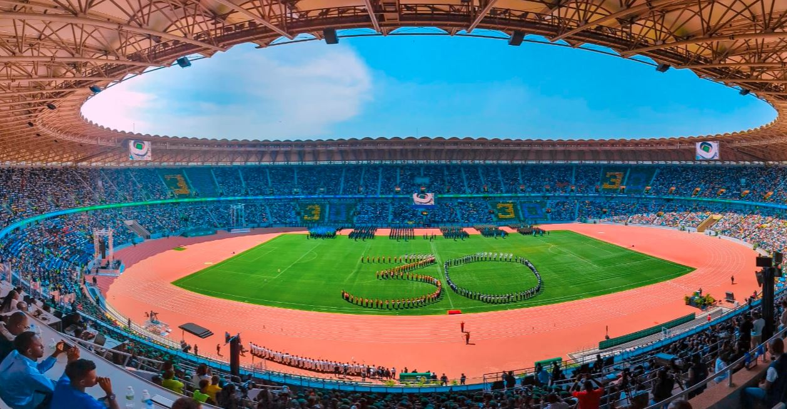 Ibirori byo kwizihiza imyaka 30 ishize u Rwanda Rwibohoye\[/caption\]

\[caption id="attachment\_1250" align="alignnone" width="1197"\]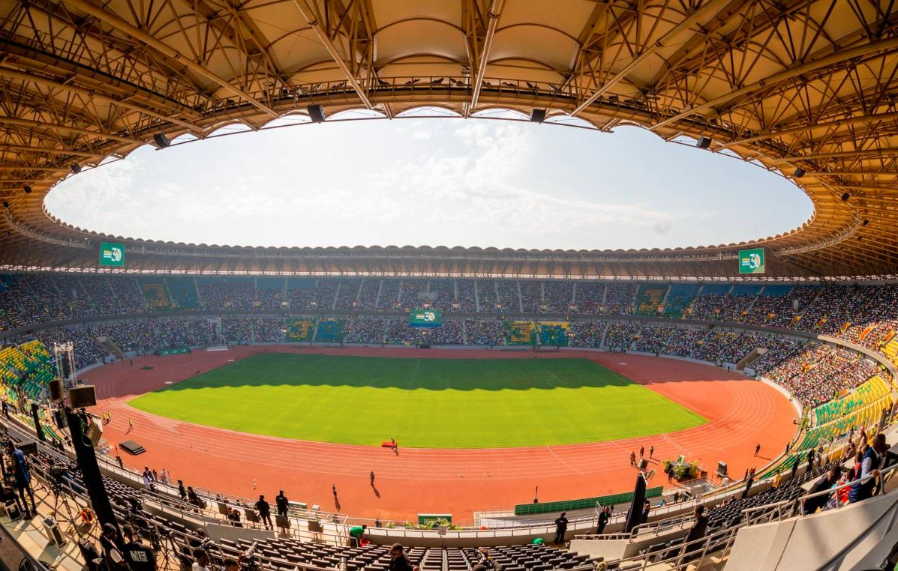 Ibirori byabereye muri Stade Amahoro ivuguruye\[/caption\]

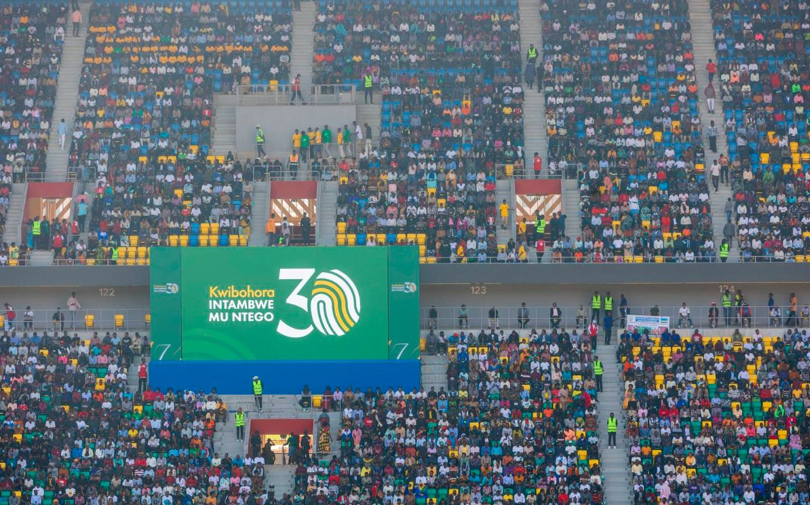

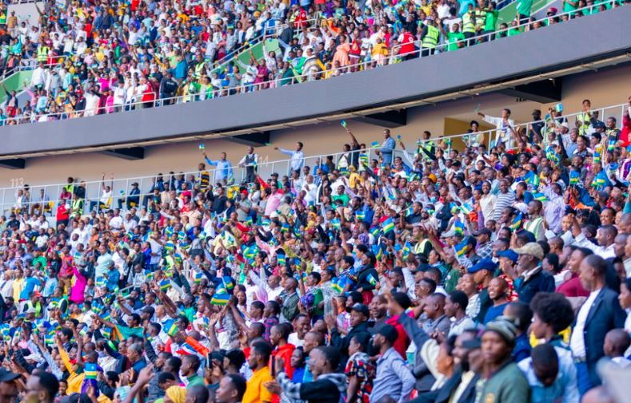

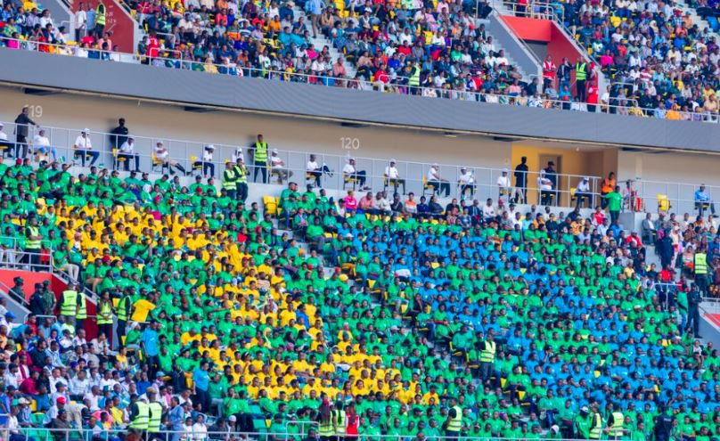

\[caption id="attachment\_1254" align="alignnone" width="806"\]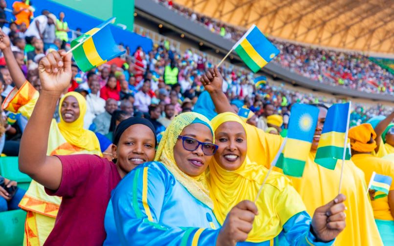 Ababyitabiriye baje baberewe\[/caption\]

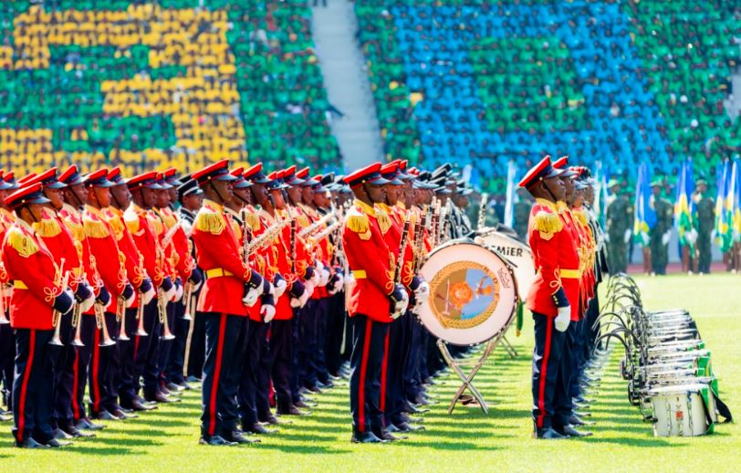

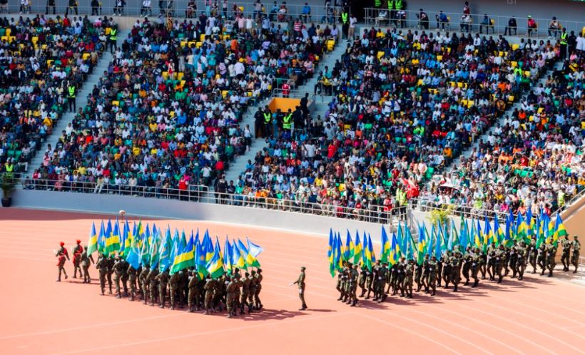

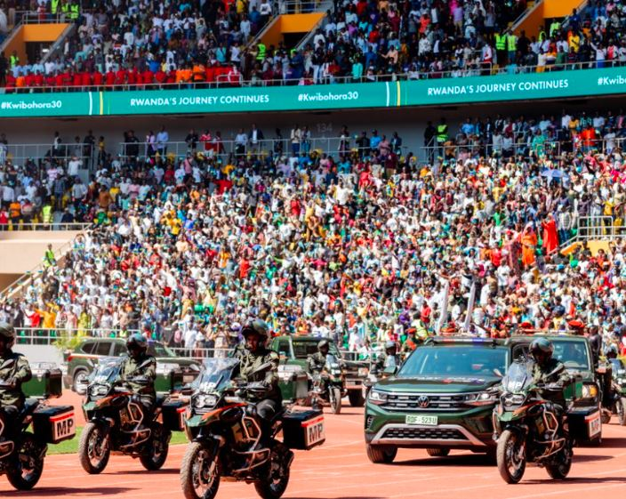

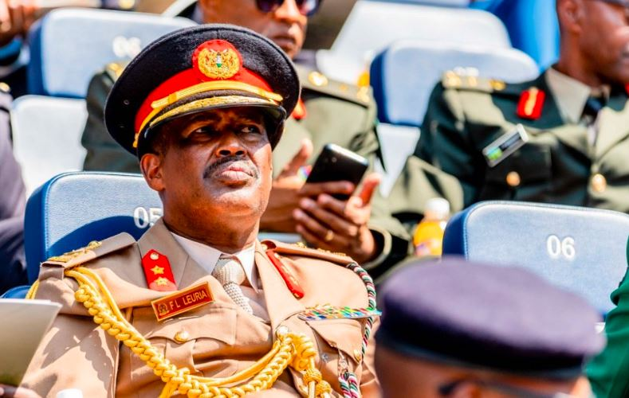

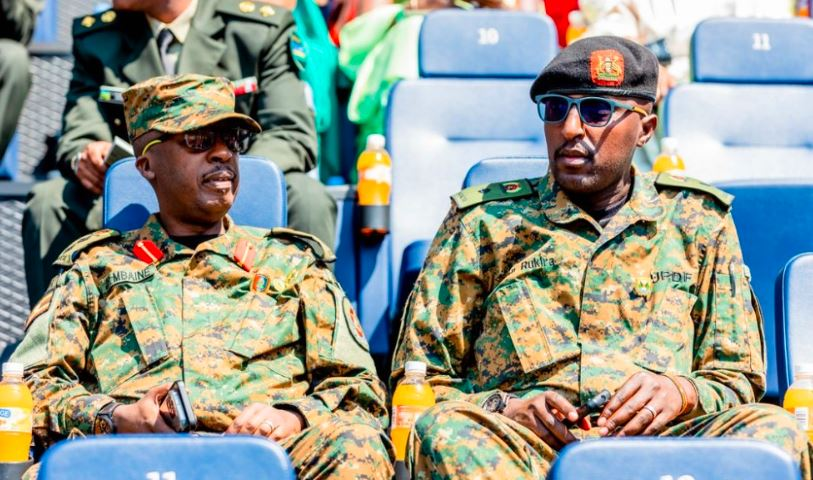

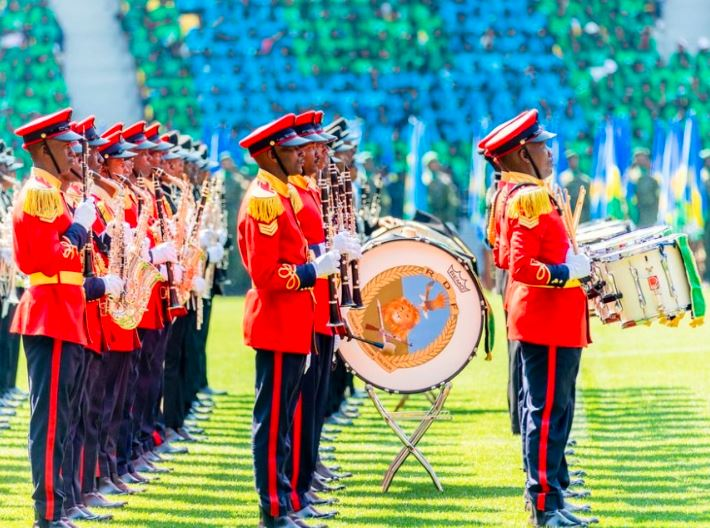

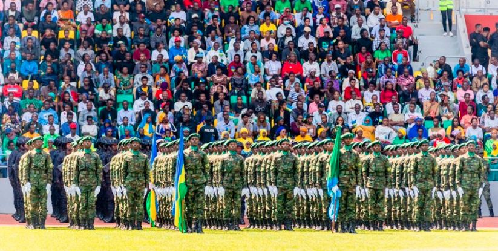

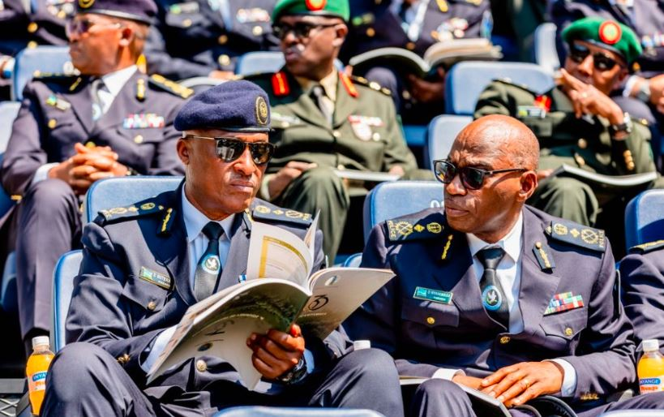

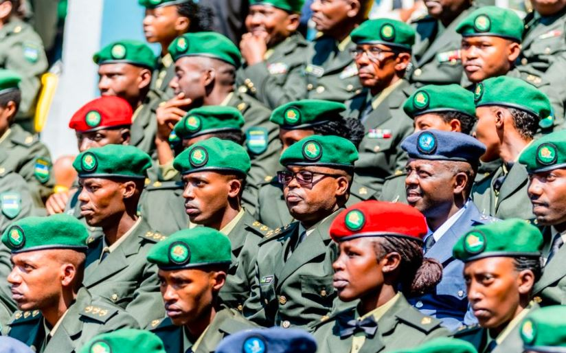

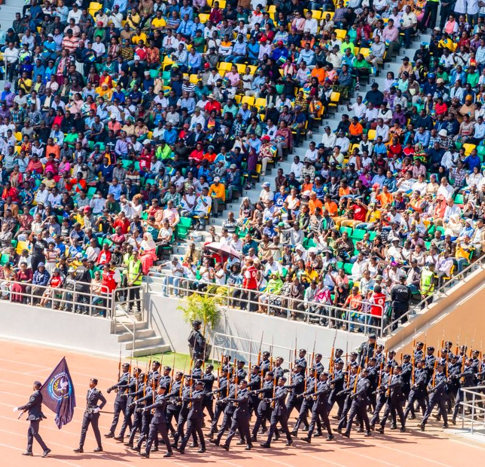

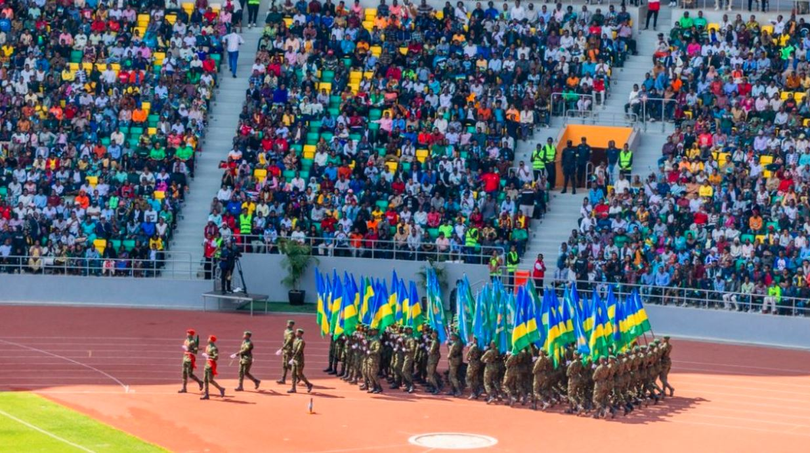

**African Updates**
