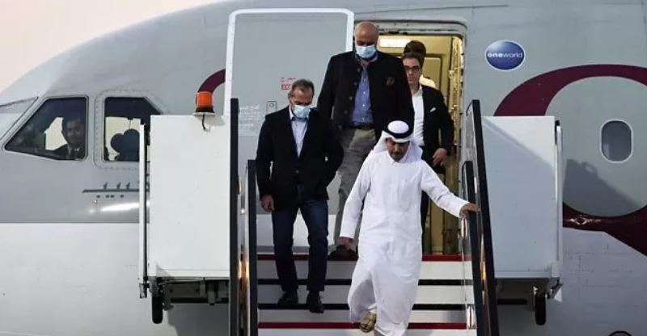

Abanyamerika batanu ndetse n’abanya Iran batanu barekuwe nyuma y’amasezerano yo guhana imfungwa yagezweho hagati y’ibihugu byombi.

Ni ubwumvikane bwagizwemo uruhare na Qatar guhera muri gashyantare umwaka ushize ndetse bemeje ko miliyari esheshatu z’amadorari za iran yari yarafatiriwe muri koreya y’epfo asubizwa iran binyuze muri bank y’I Doha.

Icyakora Amerika ivuga ko abaturage bayo bari bafungiwe impamvu za politike dore ko ibyo baregwa by’ubutasi bidafite ishingiro

Hagati aho kandi abanya iran batanu bari bamaze igihe bafungiwe muri amerika bazira kurenga ku bihano bya amerika barekuwe nyuma y’ubwo bwumvikane nubwo bitaramenyekana niba basubira muri iran.

Perezida Joe Biden wa Amerika yashimangiye ko abaturage be barenganaga ati ‘bamaze imyaka mu gahinda, kutamenya ndetse n’umubabaro’

Abakurikirana politike z’ibihugu byombi bavuga ko gufungura izo mfungwa ku mpande zombie ari insinzi cyane kuri Perezida Biden witegura kwiyamamariza indi manda . ku ruhande rwa Iran naho bivuze ikintu gikomeye kongeraho na miliyari esheshatu z’amadorari basubijwe yari amaze igihe yarafatiriwe.

