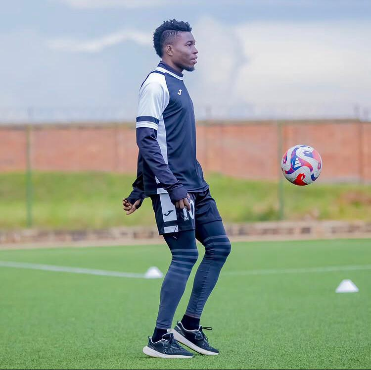
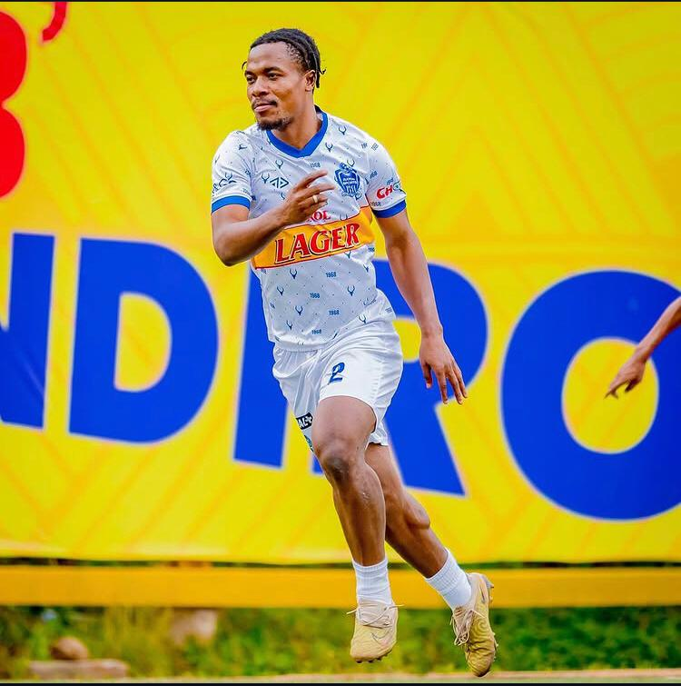
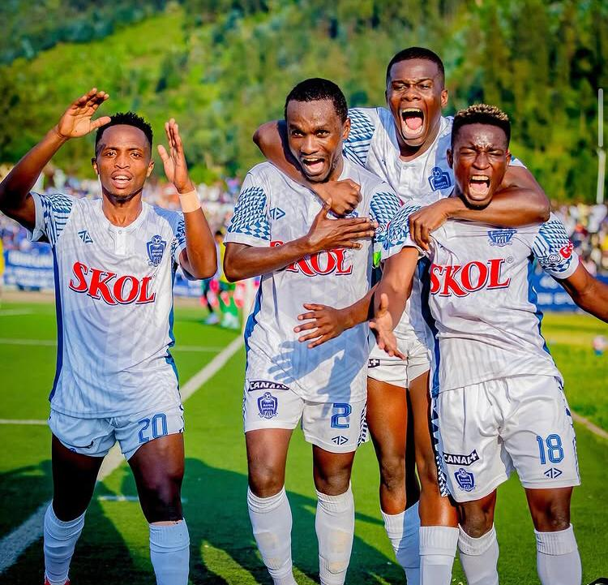
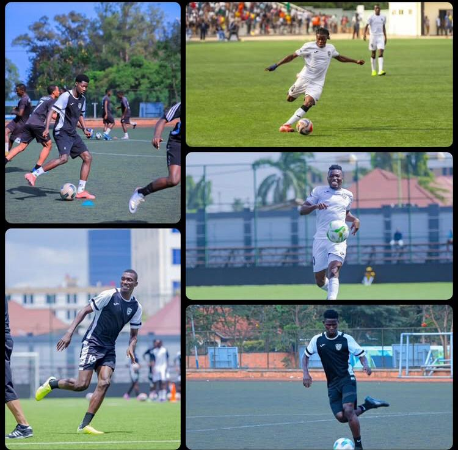

Kuri uyu wa Gatandatu tariki ya 8 Ugushyingo, saa cyenda z’amanywa, kuri Stade Amahoro i Remera, nibwo ikipe y’Ingabo z’Igihugu APR FC izakira umukino uzayihuza na Rayon Sports FC. Uyu mukino w’amakipe yombi uzwi cyane ku izina rya _“_A Thousand Hills Derby” Derby y’u Rwanda rw’imisozi igihumbi.

Ni umwe mu mikino ikunzwe kurusha indi yose mu Rwanda, ukunze kurangwa n’impaka nyinshi mu bafana, n’imyiteguro iri ku rwego rwo hejuru ku mpande zombi.

Nubwo bimeze gutyo, ikipe ya APR FC yakunze guhesha ishema abafana bayo mu myaka ishize, kuko imaze gutwara ibikombe bitandatu bya shampiyona bikurikirana, mu gihe Rayon Sports itarabona na kimwe muri iyo myaka. Mu mikino itanu iheruka guhuza aya makipe, APR FC yatsinzemo umukino umwe, banganya ine (4), naho Rayon Sports nta n’umwe iratsinda.

Ku rutonde rwa shampiyona kugeza ubu, APR FC iri ku mwanya wa munani n’amanota 8, ikagira n’umukino w’ikirarane, mu gihe Rayon Sports iri ku mwanya wa kabiri n’amanota 13. Mu mikino itatu iheruka, Rayon Sports yose yarayitsinze, naho APR FC itsinda umwe inganya ibiri.

Umutoza wa APR FC, Taleb Mourad ukomoka muri Maroc, mu kiganiro yagiranye n’abanyamakuru kuri uyu wa Gatatu i Shyorongi, aho iyi kipe isanzwe ikorera imyitozo yavuze ko mu byatumye batitwara neza mu mikino iheruka harimo imisifurire itaragenze neza, ndetse no kubura abakinnyi ngenderwaho.

Yagarutse ku bakinnyi barimo Memel Dao uri mu mvune, Cheick Djibril Outtara umaze amezi abiri arwaye, ndetse na Ronald Sekiganda wari ufite ikarita itukura.

\[caption id="attachment\_1494" align="alignnone" width="750"\] Gibril Outtara wongeye kugaragagara ku myitozo, nyuma y'amezi abiri arwaye\[/caption\]

Inkuru nziza ku bafana ba APR FC ni uko Ronald Sekiganda yamaze kugaruka mu kibuga, ndetse rutahizamu Djibril Outtara na we yatangiye imyitozo nyuma y’igihe kinini arwaye.

Kapiteni wa APR FC, Niyomugabo Claude, yasabye imbabazi abafana ku mikino iheruka itagenze neza, abasezeranya ko muri iyi _derby_ bazabereka impinduka, bakongera kwishimira ikipe yabo.

Ku ruhande rwa Rayon Sports, Abeddy Bigirimana na we yamaze kugaruka mu myitozo, akaba yiteguye gukina uyu mukino ukomeye.

\[caption id="attachment\_1491" align="alignnone" width="750"\] Abedi Bigirimana umukinnyi wa Rayon Sport FC\[/caption\]

Kugeza ubu, imibare ya shampiyona ntabwo iri ku ruhande rwa APR FC. abakurikirana ruhago yo mu Rwanda bakomeje kwibaza niba APR FC ikomeza kwihesha ishema imbere ya mukeba wayo, Cyangwa niba Rayon Sports, imaze igihe kinini itabasha gutsinda APR FC, izakuraho ako gahigo.

\[caption id="attachment\_1492" align="alignnone" width="750"\] Abakinnyi ba Rayon Sport FC mu myitozo\[/caption\]

\[caption id="attachment\_1493" align="alignnone" width="750"\] Abakinnyi ba APR FC mu myitozo\[/caption\]

**Divine Mutoni / African Updates**
