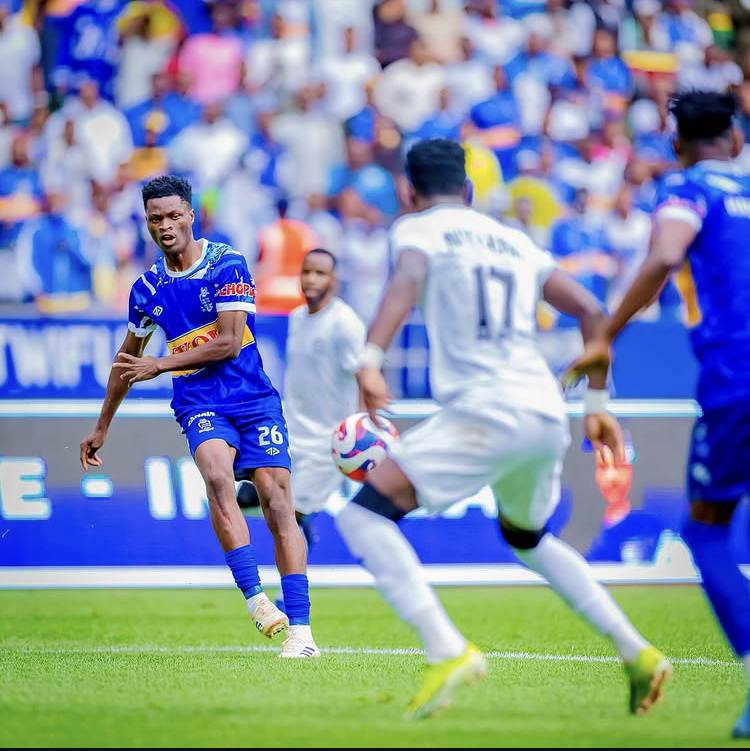
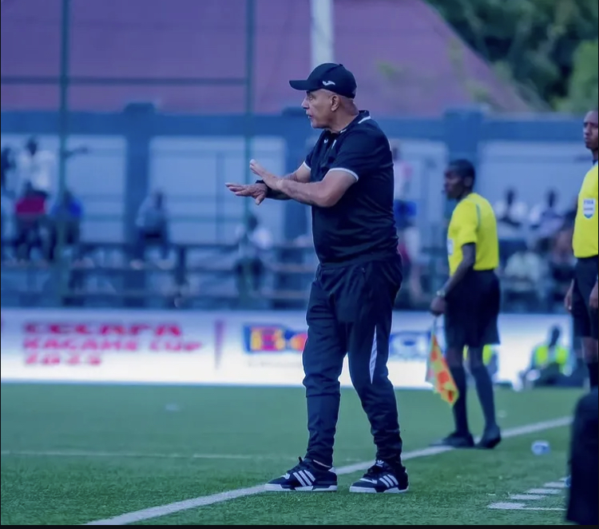

Kuri uyu wa Gatandatu, Tariki ya 8/11/2025 ni bwo hakomezaga imikino y’umunsi wa karindwi wa shampiyona, aho APR FC yari yakiriye umukeba wayo, Rayon Sports, kuri Stade Amahoro i Remera ibasha kubona intsinzi imbere y’abafana bayo, itsinda ibitego bitatu ku busa (3-0).

Ni umukino wari utegerejwe n’abakunzi benshi b’umupira w’amaguru mu Rwanda, kuko aya makipe yombi ari yo afite abafana benshi kandi ahora arangwa no guhangana gukomeye, buri yose yumva igomba gutsinda.

APR FC, itari iri mu bihe byayo byiza kuko mu mikino ine iheruka gukina yari ifite amanota umunani yatsinze ibiri, inganya indi ibiri ibintu bitavugwagaho rumwe n’abakunzi bayo bamwe bakagaragaza kutishimira imitoreze ndetse n’imisifurire y’imikino yabo.

Ku rundi ruhande, Rayon Sports yo mu mikino itatu iheruka gukina ntiyari yaratsinzwe n’imwe, ari na byo byatumye abakunzi bayo bizera ko uyu munsi bashobora gutahana intsinzi.

Gusa iyi kipe yakinaga idafite umutoza mukuru, aho yatozwaga n’umutoza wungirije Haruna Feruzi, ndetse yanaburaga bamwe mu bakinnyi bayo bakunze kubanza mu kibuga barimo Asman Ndikumana, ibintu byavuzwe n’abakunzi bayo nk’ibyabayikomye mu nkokora.

APR FC na yo ntiyari yuzuye, kuko yakinaga idafite Gibril Outtara, umaze igihe arwaye, ndetse na Memel Dao uri mu mvune. Ariko yari yagaruye Mamadou Sy na Seidu Dauda Yussif, bari barahanwe n’ikipe ubwo bari mu Misiri mu mikino y’amajonjora ya CAF Champions League, bazira imyitwarire idahwitse.

Nyuma yo guhabwa imbabazi, aba bombi bagarutse mu kibuga bafatanya na bagenzi babo gushaka intsinzi. Ibitego bya APR FC byatsinzwe na Ronald Ssekiganda, William Togui Mel, ndetse na Mamadou Sy

APR FC yahise izamuka ku mwanya wa gatanu ku rutonde rwa shampiyona n’amanota 11.

**Mutoni Divine / African Updates**
