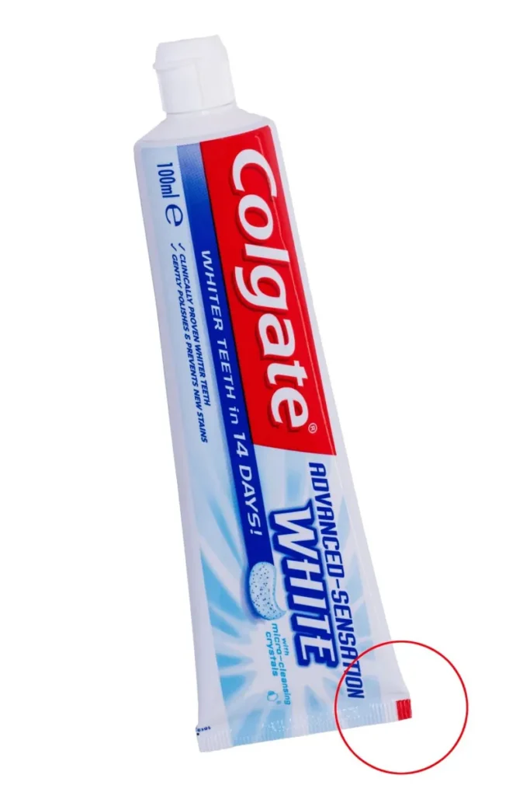
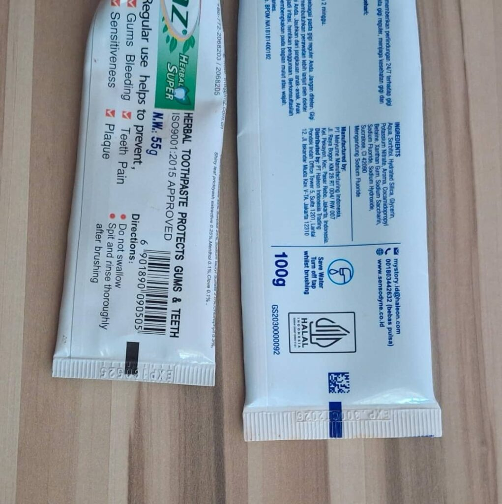

Kwita ku isuku n’ubuzima bwiza bwo mu kanwa ni ingenzi ku buzima bwacu, ndetse iyo bidakozwe usanga biteza indwara zitandukanye kugera no ku ndwara zikomeye zirimo umutima, bikaba byanatuma uyirwaye apfa.

Niyo mpamvu usanga akenshi abantu bakangurirwa kwita ku isuku y’amenyo harimo gukoresha umuti wabugenewe n’uburuso. Ariko se iyo uhitamo umuti w’amenyo ugendera  ku ki?

Hari abibanda ku giciro cyawo, uko wamamajwe hirya no hino. Hakaba n’abandi basoma ku magambo aba yanditseho agaragaza ibyo uwo muti ufasha, nko gukomeza amenyo, kuyagira urwererane, impumuro nsiza, igihe izatakariza agaciro, no kurinda izindi ndwara zitandukanye zifata amenyo.

Uretse ibyo ariko hari iby’ingenzi ukwiye kwitaho mu guhitamo umuti w’amenyo iyo urebeye mu gikoresho umuti w’amenyo uba ufunitsemo ushobora kumenya niba ukoze mu bikoresho by’umwimerere, niba uvanzemo ibinyabutabire cg ugizwe n’ibinyabutabire gusa. Dore uko wabomenya ugendeye ku mabara.

Hasi hakunze kujyaho ibara rimwe, amabara akunze kugaragara ni umutuku, ubururu, icyatsi n’umukara.

**Ibara ry’icyatsi**

Akarongo gafite Ibara ry’icyatsi kagaragara ku gikoresho kiba gipfunyitsemo umuti w’amenyo biba bisa nk’akarongo gaciyeho bisobanuye ko uwo muti ibiwugize ari umwimerere nta kindi kivanzemo, akenshi usanga ihenze cyane kurusha iyindi ku isoko.

**Ibara ry’ubururu**

Akarongo gafite Ibara ry’ubururu kagaragara ku gikoresho gifunzemo umuti w’amenyo bisobanura ko uwo muti ibiwugize birmo iby’umwimerere ndetse hongewemo n’imiti. Iyi nayo usanga iba ihenze ku isoko ugereranyije n’indi.

**Ibara ry’umutuku**

Akarongo gafite Ibara ry’umutuku kagaragara ku gikoresho gifunzemo umuti w’amenyo bisobanura ko uwo muti bimwe mu biwugize birimo iby'umwimerere ndetse n’ibindi byakorewe muri za raboratwari mu ndimi z’amahanaga bizwi nka chemicals. Ku bijyanye n’igiciro uzasanga biri  idahenze ndetse abantu benshi ni yo bakunze kugura kandi ikunze kuba ari myinshi ku isoko.

**Ibara ry’umukara**

Akarongo gafite Ibara ry’umukura kagaragara ku gikoresho gifunzemo umuti w’amenyo bisobanura ko uwo muti ugizwe n’ibinyabutabire yakorewe muri za raboratwari gusa nta kindi cy’umwimerere cyangwa umuti kirimo.

Iyi miti y’amenyo nayo ijya igaragara ku isoko ndetse ibiciro bikunze kuba biri hasi cyane ugereranyije n’indi miti y’amenyo. Abakurikirana ubuzima cyane cyane iby’amenyo bashishikariza abatu kwirinda bene iyi mti y’amenyo kuko hari abo isigira ibibazo by'indwara zo mu kanwa.

Ibyo ni bimwe mu bisobanuro by’imirongo y’amabara akunze kugaragara ahagana hasi ku gikoresho kiba gifunzemo umuti w’amenyo. Uyu munsi nujya ujya kugura umuti w’amenyo ntukarebe gusa ibyanditseho ahubwo ujye unareba ibara ry’umurongo ushushanyijeho kugirango umenye ibiwugize ubone guhitamo.

Icyakora hari izindi mbuga zigaragaza ibitandukanye n’ibi harimo urubuga rwa colgate izwi mu gukora imiti y’amenyo bavuga ko iyo mirongo iba igamije kwereka imashini z mu nganda aho umuti ugarukiye ku buryo bifasha mu gufunga ahagana hasi.

**African Updates**
