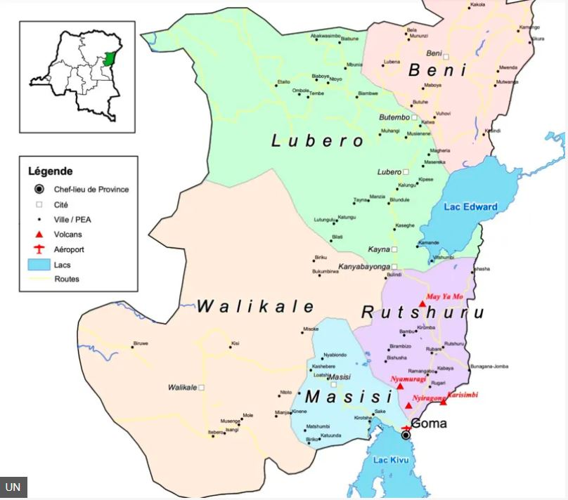

Umutwe wa M23 wasohoye itangazo rishyiraho abayobozi ba gisivile mu duce yafashe igenzura mu teretwari ya Rutshuro muri kivu ya ruguru Mu gihugu cya Repubulika ya Demokarasi Congo.

Iri tangazo ry'umutwe wa M23 urwanira mu burasirazuba bwa Repubulika ya Demokarasi Congo rivuga ko hashyizweho abayobozi ba gisivile ndetse n'abazajya bayobora ama centere nka Bunagana, Kiwanja na Rubare basanzwe bagenzura ziri muri teretwari ya Rutshuro.

Icyo cyemezo bagifashe kandi nyuma y'uko mu minsi ishize umutwe wa M23 wari umaze igihe ugabwaho  ibitero by' indege zintambara ndetse byasize hari abakomando bayo bishwe.

Icyakora Umuvugizi wa M23 Lawrence kanyuka yirinze gutangaza niba mu gace ka Masisi basanzwe bagenzura niba bashyizeho ubuyobozi.

\[caption id="attachment\_1106" align="alignnone" width="808"\] Ikarita igaragaza intara ya Kivu ya ruguru\[/caption\]

**African Updates**
